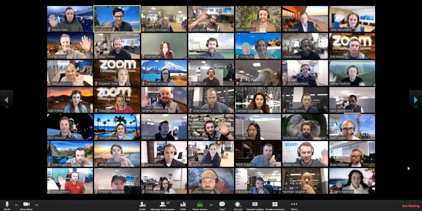
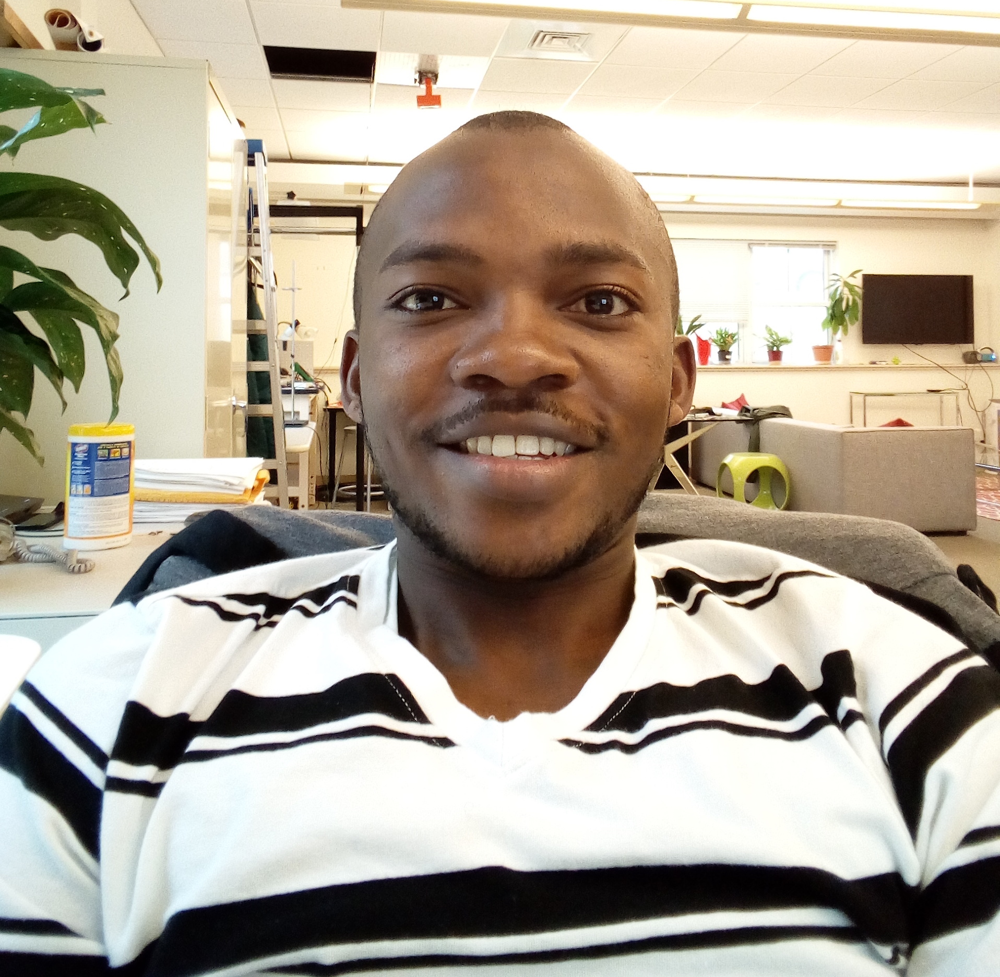

{: .small}

# ORC Description
Participation in a software engineering group project to meet a real-world need. Group members are responsible for all aspects of a software system, including iterative requirements analysis, design, implementation, and testing. The course also stresses customer interactions, documentation, process, and teamwork. The result is a software product of significant scope and significant benefit to a user base.

Open only to students pursuing a major in Computer Science or a modified major with Computer Science as the primary part.  98.01 and 98.02 constitute a two course sequence, and they must be taken in consecutive terms, either fall/winter or winter/spring, normally in the senior year.

{: .fancy}

# Prerequisite

At least two courses from COSC 50-69 or at least three courses from COSC 50-89, or permission of instructor.

# Project Course Overview

In this course you will have the freedom to pitch and develop your own project idea. It is your time to spend two terms to create your own startup product. The first class meetings will be devoted to short technology hackathons, brainstorming sessions, and choosing your product teams. You will be encouraged to be creative and push yourselves technically, but simultaneously to keep your project scope feasible. Often the most successful projects start out as a small, clever idea, while projects that are overly ambitious will prevent you from thoroughly investigating the concept.

Some things to consider while thinking about project ideas:

* 🚀 Novelty: The purpose of this course is to broaden your experience as a developer. It is an opportunity to investigate a novel idea in a team environment, from initial concept, through all stages of design & development, to delivery of a functional final product. Your project must be a fresh idea, introduced solely for this course. It should not be a continuation of an internship, previous course project, or existing startup.
* 📱 Format: You may choose any format relevant to software design & implementation. For example, your team may choose to develop a game, a web or mobile app, or even experiment with IoT.
* 🔨 Impact: Your project should demonstrate a positive impact and offer clear benefit to a user base. Consider themes such as education, research, health care, or environmental protection and improvement. Think outside of what is useful to Dartmouth students - new event apps, social network clones, and marketplaces have been attempted before and you might find it more rewarding to build something that challenges you.

🏄 This class will be an adventure and requires active participation both inside and outside of class.

By the end of second term of this course, you will:

  - 🎛️ experiment with various technologies and push your coding limits to new heights
  - 🏗️ conceptualize, pitch, and design a software product that is interesting, impactful, and fun to build
  - 👩‍👩‍👧‍👦 use software development and design best practices to work on a tight knit and smoothly operating team
  - 💻 use your knowledge of the fundamental concepts and best practices of software development to design a software project from the ground up
  - 🔨 utilize state of the art tools and frameworks to build a complex system
  - 🏆 demo your work to hundreds of people for fame and fortune

## Groups:

Teams will be ~5 members each. Group dynamics and roles will be discussed. Groups will be assigned through a combination of voting on ideas, team member preference and balancing.

## Time Commitment:

Groups are required to establish a team meeting schedule for coding hours throughout the week. Minimum obligation is 10 hours/week outside of class time. Group coding is encouraged.

## Schedule:

There are 2 (COSC98.01+COSC98.02) sequences of this course. You need to take COSC98.01 and COSC98.02 in consecutive terms and cannot mix and match. Section 1 is **19F(98.01) + 20W(98.02)** and Section 2 is **20W(98.01) + 20S(98.02)**.

### Class:

  - **Section FallWinter (19F-20W)**
    - 3B Classes will meet Tuesday and Thursday (4:30-6:20).
    - Thursday class time will used for team meetings and working together.
    <!-- - 3BX will be available for help / team meeting time. -->
    - Location: LSC200
  - **Section WinterSpring (20W-20S)**
    - 3A Classes will meet Monday (3:30-5:20) and Thursday (4:30-6:20).
    - Thursday class time will used for team meetings and working together.
    <!-- - 3AX will be available for help / team meeting time. -->
    - Location: ZOOM (see link on Slack)

Class time will be used for topic hackathons, team meetings, showing your work, and coding together time.  Each project team will also meet separately every week to work and hack together.  At least 10 hours per week is required and will be logged.

{: .fancy .small}
<!-- {: .fancy } -->
<!-- {: .fancy } -->

### Office Hours and Contact:

  - We'll be using [Slack](https://cs98-dartmouth.slack.com) for most communication. Find us there!

  - Open Help/Hack Hours during X-Hour every week.  

  - Instructor: [Tim Tregubov](mailto:tim@cs.dartmouth.edu) 
    [by appointment in Sudikoff 219/007](https://calendly.com/timofei/check-in) 
    {: .fancy .profile} 
    [@tim](https://cs98-dartmouth.slack.com/messages/@tim/) 

  <!-- - TA: [Kate Salesin](mailto:Katherine.A.Salesin.GR@dartmouth.edu) 
    Office hours by appointment 
    {: .fancy .profile} 
    [@kate](https://cs98-dartmouth.slack.com/messages/@Kate/) 
 -->

   <!-- - TA: [Kizito Masaba](mailto:Kizito.Masaba.GR@dartmouth.edu) 
    Office hours by appointment 
    {: .fancy .profile} 
    [@kizito](https://cs98-dartmouth.slack.com/messages/@Kizito/)  -->

## More Logistics:

See [logistics](/logistics)
