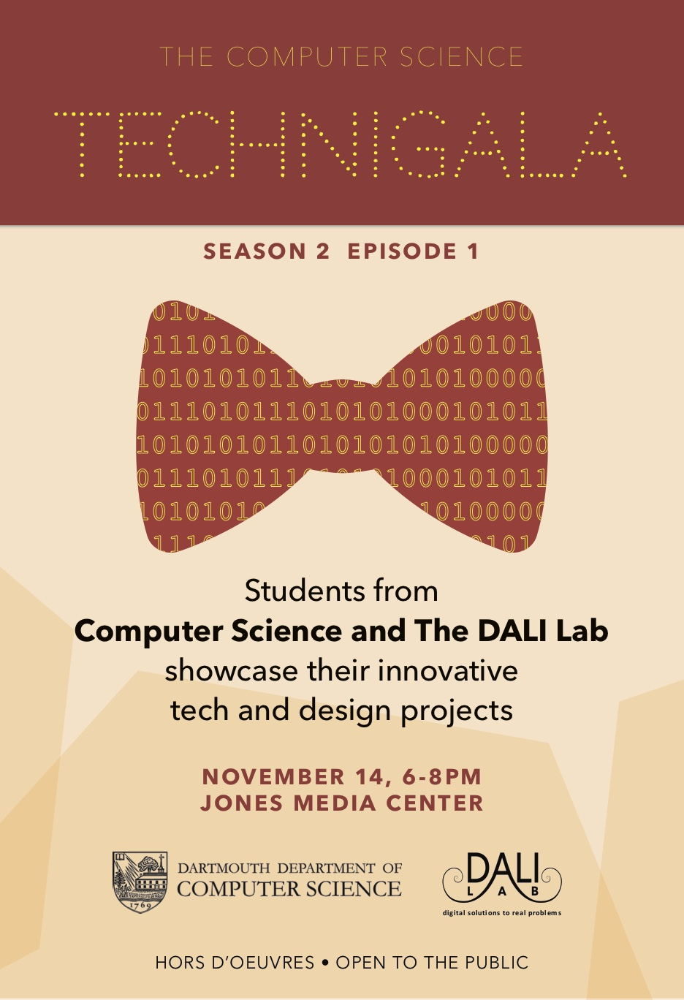

{: .fancy .small}

{: .fancy .medium}

MVP demos and testing of the projects for this term.  The main focus will be on getting user feedback.  Invite friends!  There will be food and drinks!

Please show up early to set up your table.  The event will be science fair style - you will have a table with your project name and either a screen or a stand for a laptop to better demo your awesome projects.

The focus is on demo-ing and getting feedback. Have a feedback form ready and ask questions. Ask specific targeted questions rather than general questions such as "would you use this product?".

Be prepared to verbally
* Motivate the idea
* Show it in action and let people try it out!
* Discuss challenges
* Ask for feedback

{: .fancy .small}
