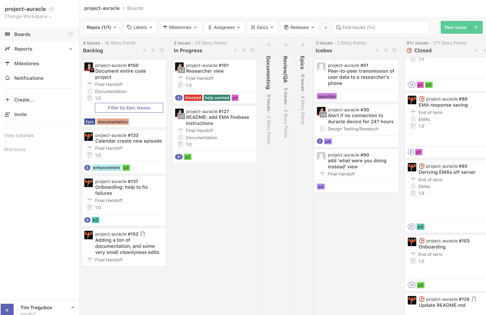
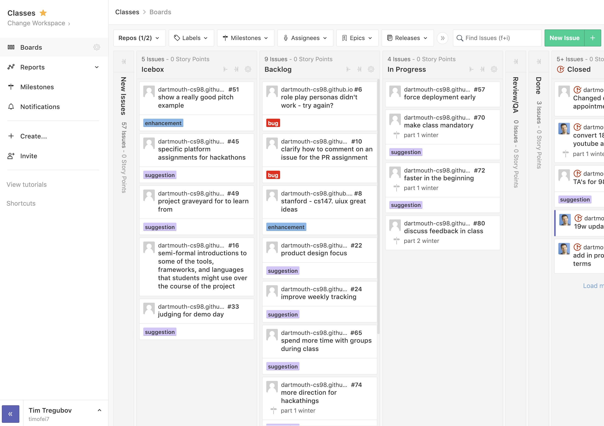
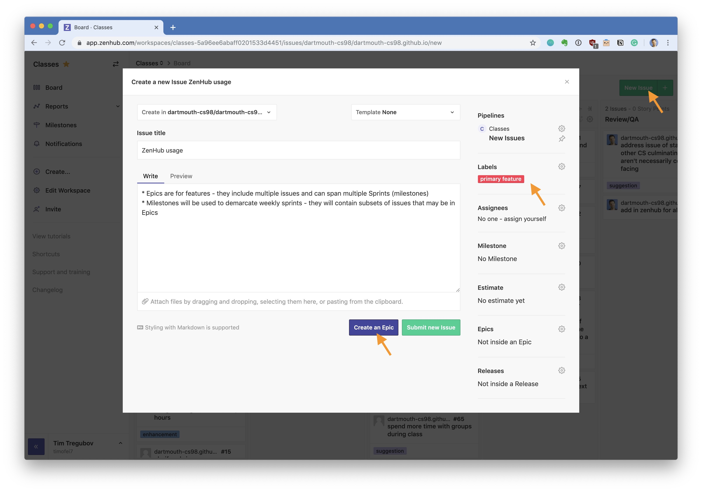
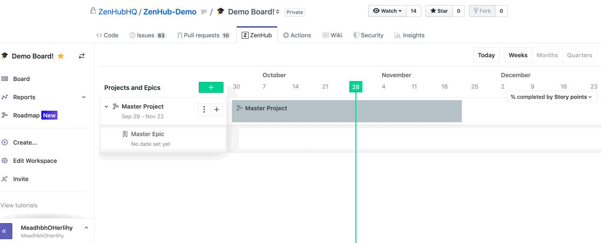
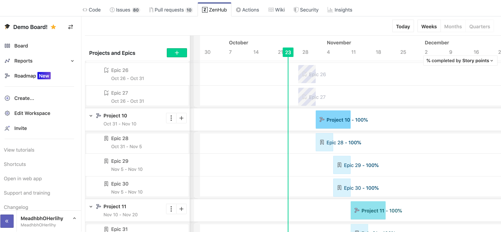
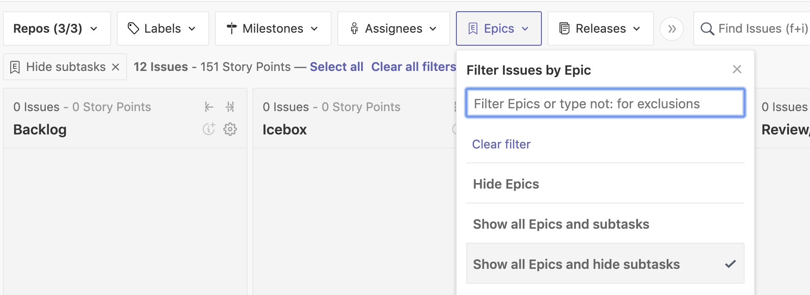

{: .fancy .medium}

## What is a feature spec? 

The feature spec is a document that is a walk-though of your project from the users perspective. It provides a listing of all the features you are envisioning for the product. The feature spec functions as your overall plan for the project. Rather than thinking about it as locking you in, this is an opportunity to think through your product in detail. Think of it as a living document, don’t be afraid to change it later as your ideas about the project mature. It does not need to be an exhaustive document. Joel Spolsky (of Stackoverflow and more recently Trello) has a nice writeup of the why and how of specs here: [joelonsoftware](http://www.joelonsoftware.com/articles/fog0000000035.html) and here's some great general [tips on feature specs](https://medium.com/dali-lab/9-ideas-for-more-useful-feature-specs-7ca5c679ca3c). 

**However**, for our needs — the feature spec will be much simpler: a listing of what you think you need to build this term to be able to prove out your idea. 

## Another document?

**Nope!**

Rather than creating a separate document for this — we're going to use [ZenHub](https://www.zenhub.com/)!  Wait what is this ZenHub thing?! Not another tool!  ❌

## ZenHub! 

<iframe class="fancy" src="https://player.vimeo.com/video/207024351" width="640" height="351" frameborder="0" webkitallowfullscreen mozallowfullscreen allowfullscreen></iframe>

ZenHub is a tool built on top of GitHub Issues to make them better. GitHub issues are decent on their own, but they are hard to keep track of when you have a lot (just a long list) and it is hard to know who is currently working on what, or to assign due dates to things, of if you have multiple repos how to keep track of stuff. ZenHub fixes all of this, and is powered by GitHub issues underneath it all, so you can connect/[close them with Pull Requests](https://blog.github.com/2013-05-14-closing-issues-via-pull-requests/). 

{: .fancy .medium}

There are two different ways to use ZenHub - you can either download a [Chrome Extension](https://www.zenhub.com/extension) and then ZenHub appears in the GitHub interface for you automagically. Or you can log in via [app.zenhub.com](https://app.zenhub.com) - just log in via github, choose **dartmouth-cs98** as your Organization,  change workspace to one named like your repos.  It should already be set up that there is a workspace named for your project that is connected to your repos.  This means that all your issues should now show up (under *Unsorted*). 

🚀 Sign in to [ZenHub](https://app.zenhub.com) now.

### Features of ZenHub:

{: .fancy .medium}
 *(release velocity planning in ZenHub)*

* **cohesive**: all your issues from multiple repos appear in 1 workspace
* **pipeline**:  assignments are different from what is currently being worked on - move an issue to *In Progress* when you are working on it. Feel free to claim or assign others to issues. More on pipelines below. 
* **duedates / milestones**: to assign a date to a group of issues you can create a *Milestone*. We will use Milestones to demarcate weekly Sprints:  sets of tasks with a common due date.
* **epics**: You will use *Epics* to group sets of smaller tasks.  If a single issue seems too big - *convert to epic*.
* **reports**: One you have milestones you can see an estimate of how quickly you'll finish all your tasks.
* **dependencies**: You can make issues dependent on other issues, so if you have a task that requires someone else to do something you can mark that so they know they are blocking you. Very helpful!

### [Default Pipeline Breakdown](https://help.zenhub.com/support/solutions/articles/43000010339-setting-up-your-first-zenhub-workspace): 

{: .fancy .medium}
 *(using ZenHub for class planning)*

* **Unsorted**: 
    **New Issues** land here automatically. You should drag (triage) them out of here as soon as possible.

* **Later**: 
    Later (often called Icebox) represents items that are a low priority in the product backlog. Leaving Issues in the icebox over deleting them helps avoid a cycle of raising duplicate Issues. **Later** Issues should not take up a team member's time or mental bandwidth; putting ideas into the Later Pipeline gets them out of the way and helps teams focus on immediate priorities.

* **Next**: 
    Next Issues are not a current focus, but you will act on them at some point. These are often called Backlog, but we'll simplify and just call that whole stack Nexts.  If an issue doesn't have a Milestone/Sprint assigned, you can consider them part of your “product backlog”. Once you add a Milestone, they become part of your “sprint backlog” (that is, the tasks that you'll complete in an upcoming sprint.) The process of keeping this pipeline organized is known as “backlog refinement”, we'll do something a bit simpler and do all of this during a team retrospective meeting.

* **In Progress**: 
     Issues here should have a good amount of detail, like estimates and requirements, since they're your team's current focus. This is the answer to, “What are you doing now?” Ideally, each team member should be working on just one thing at a time. Tasks here should be ordered by priority with Assignees added.

* **Review/QA**: 
    Use the Review/QA column for Issues that are open to the team for review and testing. Usually this means the code is ready to be deployed, or already is in a Staging environment.

* **Done Issues**: 
    in this pipeline need no further work and are ready to be closed. Having a good ‘Definition of Done’ agreed upon before work starts on an Issue is very helpful here! If there were any objectives or key metrics associated with the Issue, they can be appended prior to closing.

## Huh?

If none of the above made sense, don't worry, it will once you start assigning each other tasks and coding together. 

## First Discuss Plan

🚀 During a team meeting, plan out a development strategy with general feature milestones. Identify minimum viable product (MVP) features and optional stretch goals. Create a list of features that are needed to be able to do some product validation. Remember, at the end of the term you'll need to show something that is testable and viewable by a public audience.

Rather than creating a separate doc and porting things over — who needs the duplicate work 🤦‍ - we'll skip that step and jump right in.  Similarly to how you made your [User Personas](user-personas) into GitHub Issues, we'll be using GitHub to track your main features. 

## Create Epics for Each Feature

[Epics](https://help.zenhub.com/support/solutions/articles/43000010341) are ways of grouping together tasks/issues by subject rather than by due date.  The main idea is that GitHub Issues are small tasks, individually bite sized coding time, but we need something to group them together into larger features that may take a lot more time. That is where *Epics* come in. *Epics* are multi-issue groupings that are perfect for product features. 

Once you've set yourself up with ZenHub - simply follow these steps to create an *Epic* for **each** of your primary features.

1. Go to **NEW ISSUE** in ZenHub.
1. Title is your feature name. Things like: "robot can drive from point a -> point b", "display list of posts stored in db".  Again these are big ticket features - not individual tasks.
1. Description - put in as much of a description as you want to make it clear what this is. Ideally you would follow a [User Story driven template](https://www.zenhub.com/blog/how-to-use-epics-and-milestones/) such as: `As <user persona x>, I want to <do task y> so I can <accomplish goal z>`.  Since your personas are issues you can link even [link them in](https://help.github.com/en/articles/autolinked-references-and-urls) if you want by simply mentioning the issue number `#2`.
1. Label it:
  * [ 🔥 primary feature]
  * [ 💼 secondary feature]
  * [ 🏹 stretch feature]
1. Estimate. Give it an guesstimate of effort 1-40 (1 person hour-ish).
1. Click: **Create an Epic** *(for now you don't need to assign any subtasks)*

{: .medium}

### [ 🔥 primary feature]

These are the primary most important features. The product doesn't have a purpose without these features. These are sometimes the harder things, but the most necessary to start tackling early to get validation. Try to list these in order that they happen in the user experience.

### [ 💼 secondary feature]

These are features that make the product more usable, but can be hacked around if necessary. Things like login/auth might go here (unless you are building a security product).

### [ 🏹 stretch feature]

Self explanatory. Things not quite critical but would be really cool.

## How Many?

There is no rule about how many features you should have. It should make sense for your product. 

Examples could be: 

* onboarding flow
* search and filter
* main algorithm for audio signal processing
* image processing to detect primary colors
* user functionality
* main character design and animation
* enemy player logic
* display list of posts stored in db
* robot drives from point a to point b

## Visualize Timeline in Roadmap

Now, wouldn't it be great to see all these features not in a list but in a beautiful gantt chart format so you can prioritize them a little bit and see what should be done when? 

{: .large}

[Roadmaps](https://help.zenhub.com/support/solutions/articles/43000539465) are exactly that. So now we'll add all our new **Epics** to the **Roadmap** for our project.

{: .large}

For now it is probably easiest to have them all at the root level and not worry about grouping them together into *Projects* (for instance if you had a Mobile app and a VR app - those might be different *Projects*, feel free to organize that way).  Regardless, what you definitely should do at a minimum, is give them dates.

🚀 Add in all your epics to the *Roadmap*. 
🚀 For each epic select an approximate date range. 
🚀 Take a screenshot of your Roadmap and attach it to the canvas submission. 

## To Turn In:

* ZenHub URL
* Screenshot of Roadmap

{: .medium_small}
