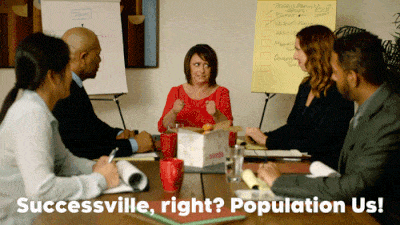

{: .fancy .medium}


## Part A
Instructions:
* Complete all of Part A by yourself (this should take ~10 minutes). 
* Once everyone on your team is finished with Part A, go around and share your responses to the two Role questions.
* You may use [HackMD](https://hackmd.io) to work with the templates below and then you'll upload them to github wiki per the directions below. Simply copy/paste the markdown template into hackmd and you'll see what it looks like.

### I. Why are you making me do this?

This is a loooong 🕐 project. Ideally, you will enjoy working on this project. While the content of the project will certainly factor into your enjoyment, team dynamics will play an equal part.

The purpose of this worksheet is to prime you to consider ways in which you can actively contribute to your team beyond just doing the tasks assigned to you. Beyond technical experience, you as a person, your life experiences, perspectives, and energy, will all contribute to your team.

This worksheet also acts as a charter: a mutually-agreed-upon set of rules for team operation and “algorithms” for resolving team conflicts.

As you work with your team going forward, I want you to be mindful of being **inclusive**. If you are friends with some of your teammates, be especially mindful of this, since friends tend to form subgroups. When you have an idea to share, try to address the entire group. When you need feedback, seek opinions from the entire group.

There will naturally be louder and quieter members of your group. If someone isn’t contributing their thoughts, they may feel like they can’t get a word in edgewise or no one cares what they think (even if it seems like they are just shy from your perspective). **Ask them what they think!** If others interrupt, intervene and give the first person back “the talking stick,” so to speak. Think of it as **your** responsibility that everyone’s voice is heard.

### II. Roles

Your team is like an ecosystem: every team member will find a niche, or an environment where they are most energized and productive. 

First, I’d like you to think about your technical niche. These are areas where you think you can make substantial contributions to the product. Try to think broader than specific frameworks or languages (though you can use them to elaborate on a broader point): think about what types of problems you enjoy solving or what skills you want to get out of this class.

Remember there are many faces to developing a finished product: research, hardware, software, user interface design, user testing, marketing, etc.

Here are some examples:
* *Since I like drawing and painting in my free time, I want to take responsibility for making sure our user interface is beautiful. I have skills in Adobe Photoshop and Illustrator, so I can also make any images or icons we need.*
* *I enjoy gathering tools for my toolbelt, so I want to be the first one to volunteer to learn new web frameworks and find their quirks.*
* *I think the web is a hellscape, and I want to stay as far away from it as possible. I will volunteer for any offline tasks, like machine learning or computer graphics.*
* *I’m a neat freak, so I want to make sure our code is well-organized and that my team members use proper code etiquette. I can write up a “best practices” document for our team to abide by.*
* *I’m a masochist, and I want to be the one who helps my teammate track down a really tough bug they’ve been stuck on for a week.*

Next, I’d like you to think about your personal niche. These are areas where you think you can make substantial contributions to your team.

Here are some examples:
* *I want to be a mediator in team disagreements or conflicts, making sure both sides are heard and a fair resolution is made.*
* *I want to be a source of inspiration, bringing big ideas to the table and forcing us to think outside our laptops once in a while.*
* *I want to be the one who surprises my team by bringing pizza to our team meeting after a rough week.*
* *I want to be a ghost, quiet for most of the day but reliably haunting the repo with my contributions.*


Copy the form and fill it out for yourself!   We'll add these to the [Part B](#part-b) after you are done.


```
**Team Member Name**
My leadership style (**bold** one): 
Analyst & Architect  /  Driver  /  Spontaneous Motivator  /  Relationship Master

What technical niche would you like to fill?  
(2-5 bullets)
* TODO: Write here...

What personal niche would you like to fill?  
(1-3 bullets)
* TODO: Write here...
```


## Part B
Instructions: Complete all of Part B as a team. 

Create this as a wiki page titled `Group Dynamics Worksheet` in github (more directions below).

```
# Group Dynamics Worksheet

## Team Members:

// TODO: paste in each individuals responses from Part A here
// use Slack to coordinate


## I. Communication
*Pick a tentative weekly meeting schedule that all members of your group are available for. You are required to spend at least 10 hours/week outside of class. Outline a general weekly meeting schedule with at least 1 time that everybody can make. That one meeting must include the entire team in the same room, in person. The rest of the 10 hours may be split into several sessions throughout the week. A nice tool for this is [when2meet](https://www.when2meet.com/).*

### Schedule
* LSC 200 at 3:30 on Mondays
* LSC 200 at 4:30 on Thursdays
* Place at Time on Day
* Place at Time on Day

### Responsiveness
*How often should team members be expected to check and respond on Slack?*

## II. Decision Making

### Group
*What types of decisions need to be discussed and approved by the entire group?*

### Individual
*What types of decisions can be made by a single person?*

## III. Conflict Resolution
There are three main types of conflict that tend to occur in group projects:

* **Creative differences**: disagreement on any decisions related to the product
* **Personal differences**: friction between people due to manner or words said
* **Ghosting**: consistent missed deadlines or lack of contribution

Your group should decide on a plan of action to deal with each type of conflict. There can be multiple levels to each plan. Involving the instructors (Tim or Kate) can be part of the plan.

Try to be as specific as possible. 
* A bad plan for Ghosting: “Talk to the person.” (too vague)
* A better plan for Ghosting: “Elect the team member who is closest with that person to check in with them one-on-one. Based on the conversation, reexamine the tasks currently on that person’s plate and revise if necessary. Affirm that they are coming to the next team meeting. At the next team meeting, every team member will make an effort to include the Ghoster in any team discussions.”

### Course of Action
*What will your group do in order to resolve each type of conflict?*

### Escalation
*What are the levels of escalation?*


The End!
```


## Github Markdown Files and Repo

If you haven't set up a team repo — let's do that now. We'll be using github classroom to autoprovision repositories and set up teams.

*Every member* on your team **must** use github classroom to set up the teams correctly and automatically.  Choose your term and section below:

<!-- * [CS98 Sequence 1 starting in 18F](https://classroom.github.com/g/ufxi8lbB) -->
* [CS98 Sequence 2 starting in 19W](https://classroom.github.com/g/pSIwnWcg)

The first person on your team will name the repo and the team name. Each consecutive person will click on the same github classroom link above and simply choose the repo and team to be granted permissions. Please use this as it keeps everything organized and in one place.  Once your team is created and you have all gone through the classroom link you will be able to create additional repositories as necessary within the cs98 github organization.

## GitHub wiki

We'll be using github wikis to keep track of some project documentation. If you haven't used it before [here's how](https://help.github.com/articles/about-github-wikis/). And some tips on using [markdown](https://guides.github.com/features/mastering-markdown/).

🚀 [Initialize your wiki now](https://help.github.com/articles/about-github-wikis/).

And then use the template above to start a page!

## Realtime? 

If you want to collaborate together on markdown files in realtime — rather than having one person type everything in, here's a cool free tool: [HackMD](https://hackmd.io).   Just copy/paste from here into github wiki when you are done. 


## To Turn In:

  * github repository URL to wiki page you created
  * make sure everyone on your team has clicked the github classroom link and is on the github team

