{: .fancy .small}

## Quick Logo

Logo's can be both difficult and easy to come up with.  There are [7 different types of logos](https://99designs.ca/blog/tips/types-of-logos/), but some of them are easier than others to create.   Use some of the [icons in the Design Templates](https://www.figma.com/file/9jbm8rHDqoEpXZTLnXp7To/Evericons?node-id=0%3A1) project.  Play around with colors and voila you will have a logo.

### Edit Fonts

One way to get quick wordmarks is to edit a font. Try taking your team/product name and type it in some font in Figma, then edit the contours of the letters/move them around/zoom in.

🚀 Right click on text -> **Outline Stroke** will convert it to an editable shape.

{: .fancy .medium} 

Now you can play around with it and make it your own. Move the letters around, overlap pieces, etc. 

### Boolean

You can also combine different shapes and letters together.  [Boolean operations in Figma](https://help.figma.com/article/65-boolean-operations) are exactly what you would think they are.  You can take any number of shapes and union, subtract, intersect, exclude them. 

Let's see this in action with some random shapes from the icon template. 

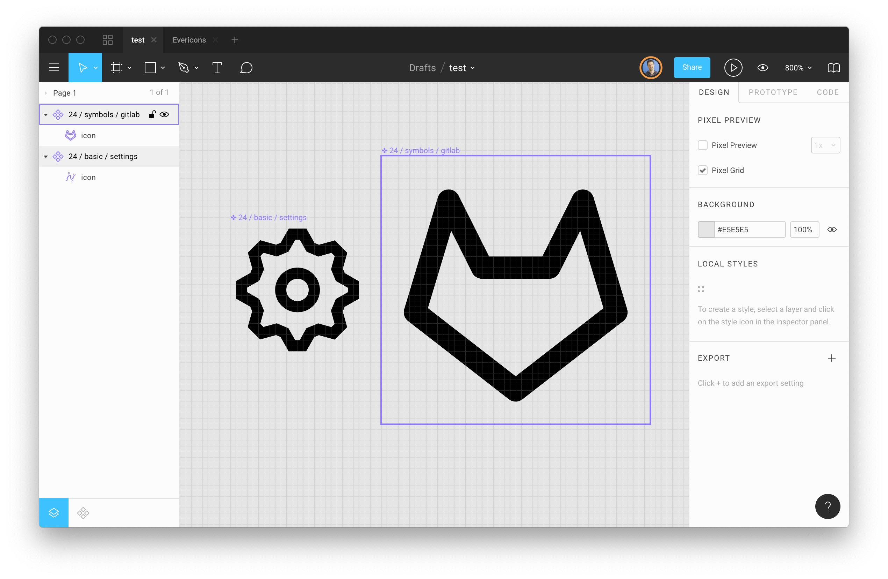{:  .medium} 

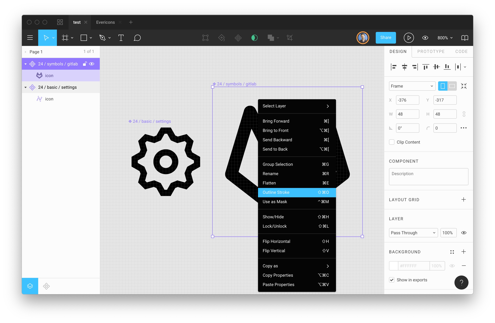{:  .medium} 

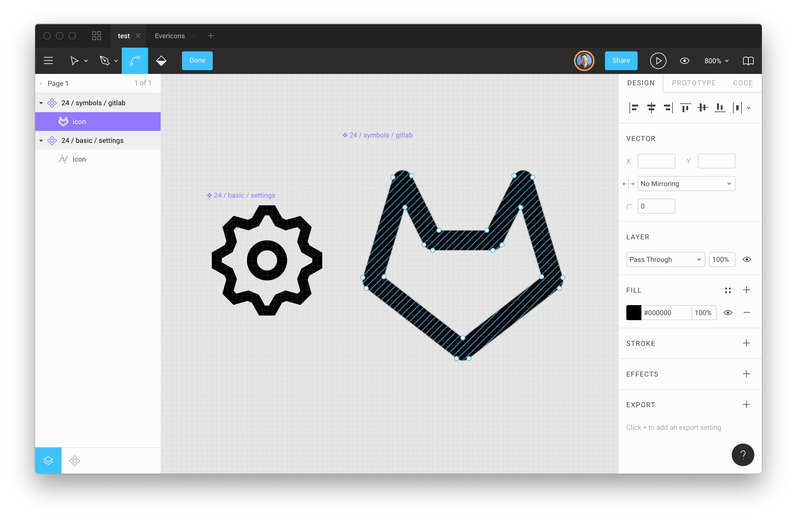{: .fanc .medium} 

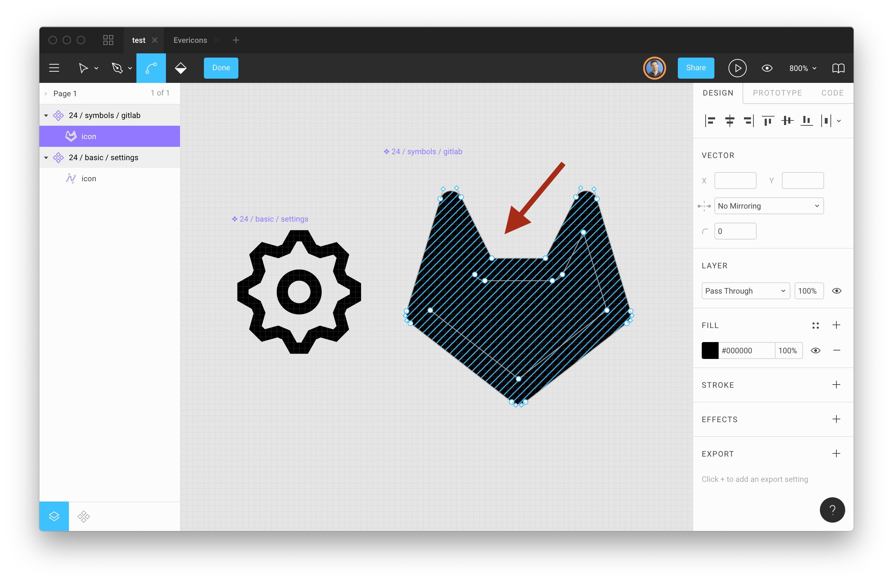{:  .medium} 

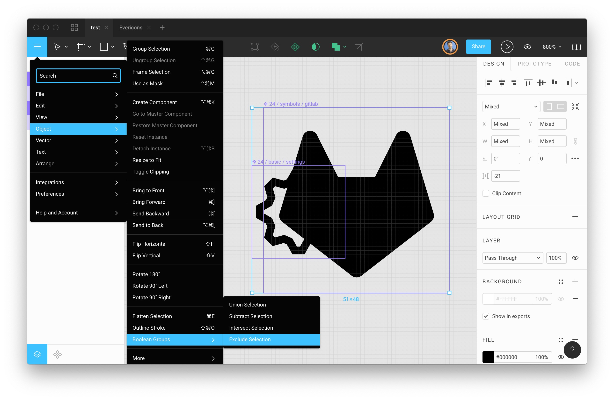{:  .medium} 

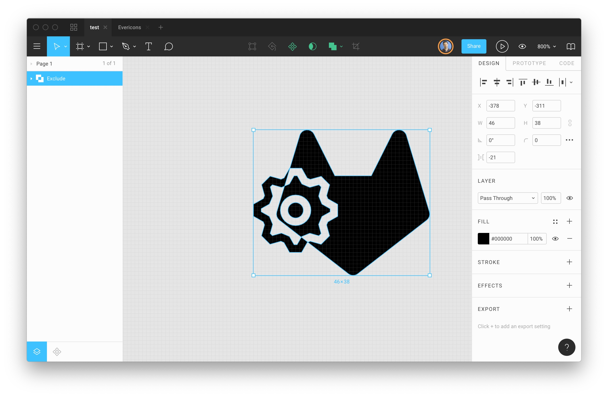{:  .medium} 

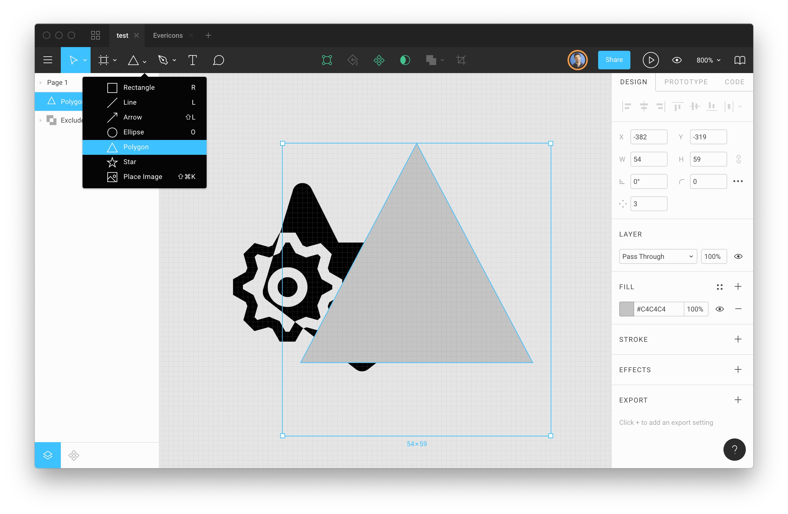{:  .medium} 

### Masking

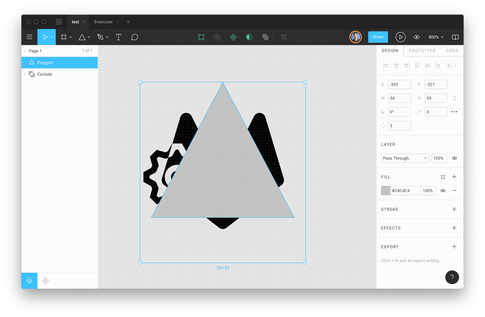{:  .medium} 

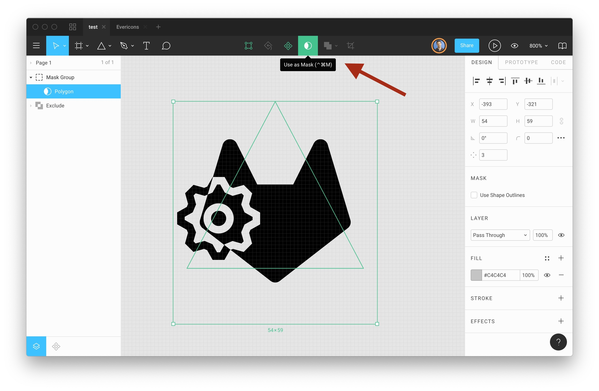{:  .medium} 

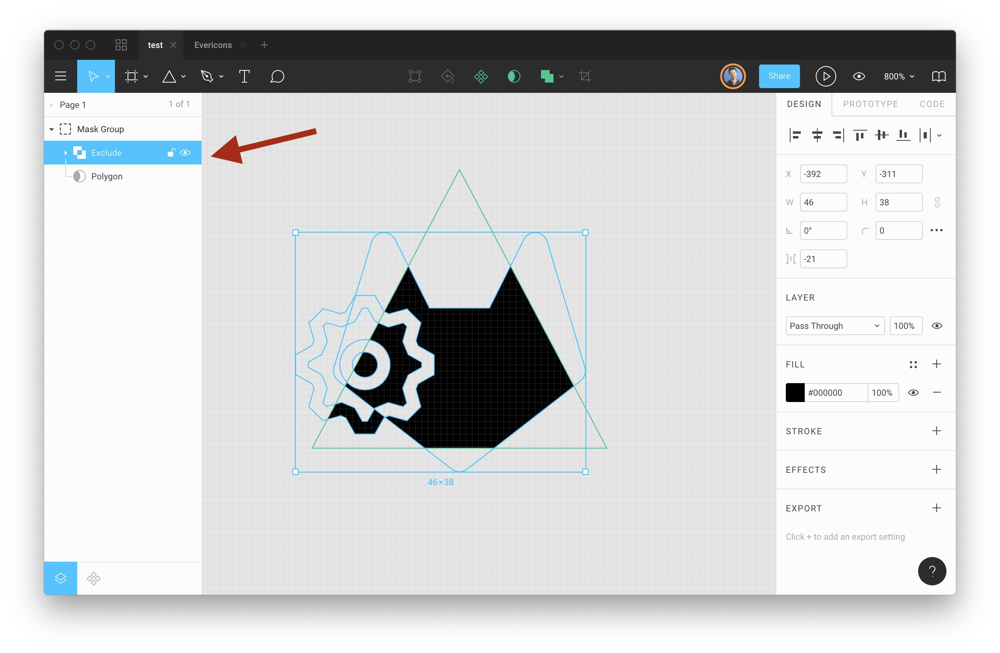{:  .medium} 

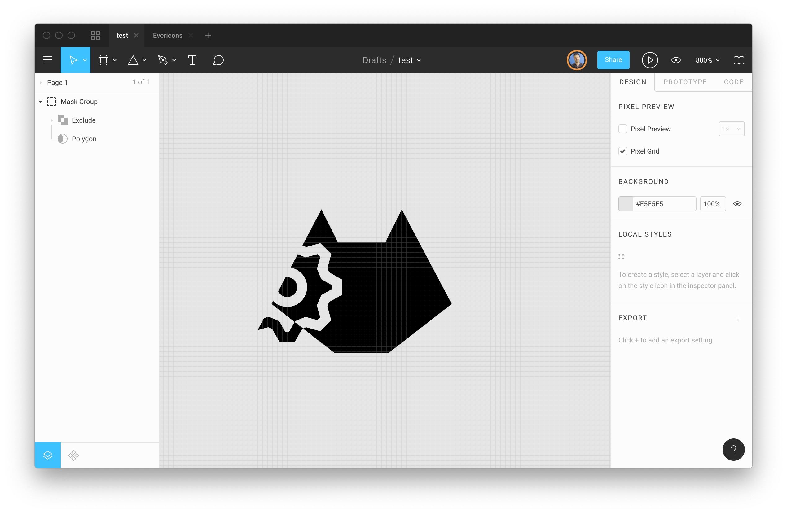{:  .medium} 

## Colors, etc

You may use other effects and drop shadows and colors in your logo.  But you will need a simple outline version of your logo as well for when we use these with heat-transfer vinyl. 

Additionally, simple contrasty abstract shapes for logos are often the the quickest way to get something that is pleasing and acceptable with spending millions on a logo design firm. 

[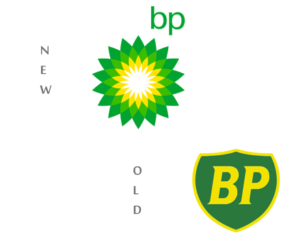{:  .small}](https://www.bp.com/en/global/corporate/who-we-are/our-brands/the-bp-brand.html)

How much you say?  $210,000,000 (rebranding and marketing)

## Export as single SVG

No

## Tees & Vinyl

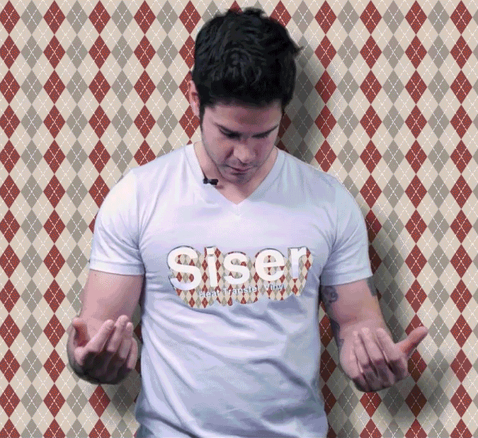{: .fancy .small}

For the end of this term - we're going to try printing out t-shirts for every team. These will be in a particular format that we'll send out a tutorial on.  For now you can draw some sketches, and start working on something in Figma. Pro tip: it will eventually need to be only solid shapes of one color to be cut out in [vinyl](https://www.instructables.com/id/Vinyl-Cut-Heat-Transfer-T-Shirts/). 

## To Turn In:
* 