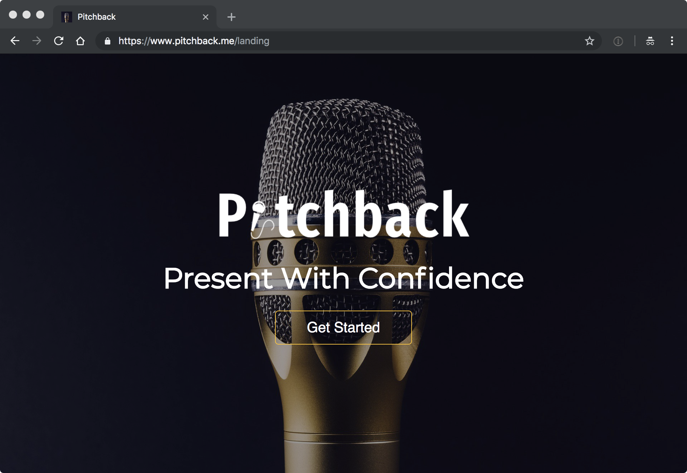
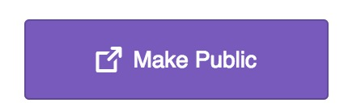

[{: .fancy .large}](https://www.pitchback.me/)

Pitching will happen in on an online platform this year built by a Dartmouth '17!

## Setup

Go to:  https://www.pitchback.me/

❗only works in recent versions of [Chrome](https://www.google.com/chrome/browser/
)!

Use this platform to record takes of your pitch.  Once you have a take you are happy with make sure to make it public!

{: .mini}

## The Idea

* Motivate idea / the problem, tell a story! Everyone loves stories.
* Propose either:
  * a potential solution
  * OR pose a problem you want to attempt to solve without a solution
  * OR even just a topic that you think might be interesting to brainstorm around
* Discuss any insights you might have into the problem

You can use a short slide deck but keep it very visual with *at most 10 words* on any individual slide!

Please, don't be shy, your idea is great! Pitch cause you care. Pitch for the practice. Pitch to make a difference. Pitch to inspire!

Some thoughts:
* There are [lots of fascinating apis](https://www.programmableweb.com/) out there: from beer reviews to machine learning, and vision apis, to fictional datasets. Could you integrate some of these to enhance your idea?
* Games, could you take some known game and make it a site or mobile app?
* Is there an existing product that you want to clone but with a special take.  Uber for puppies, airbnb for breakfast sandwiches, cryptocurrencies for goldfish?
* Your ideas can be serious, world changing, or completely silly.  The point is to enjoy building something cool.

Once teams are created around these pitches, you will have an opportunity to brainstorm a bit more as your team so these don't lock you in.

## To Turn In:

* upload pitch deck to pitchback.me
* record a **less than 3 minute** video on pitchback.me and make sure "make public"
* your names
* working title
* max 8 word tagline
* URL to your pitchback.me 'take'
