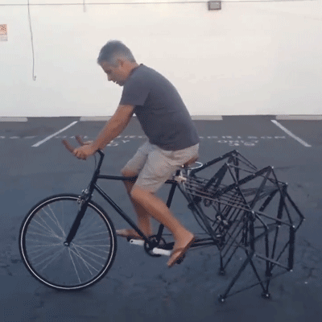

{: .fancy .small}


## State of the Art Research

As we work on an idea toward a [Project Proposal](project-proposal/), first mission critical thing is to do some research. 📝 What is the state of the art?

All to often people jump on an idea and skip doing any due diligence on it.  This is not to say that if the product or idea already exist that it is time to abandon it, but that there are lessons to be learned from any previous work done in related areas.

🔬This is a critical stage in any project. 

You want to look at any prior work that might be related. Regardless of the product there may be consumer or commercial variants that you can learn from.  And more importantly, you want to find sources (articles, papers, blogs, etc) that might inform what you are building.  If you want to do face recognition, find a tutorial or paper that discusses a particular technique.  If you are doing something educational,  is there research that validates your approach?  If you want to create a new human computer interface, what work has been done before that you can extend? 

Once you have a direction for your product.  Each of you should do some research.  Even if you feel that you know exactly what you are doing — you need to show that you have thought it through. 

❓ Wait how does this relate to competitive research or market research? 

Good q! What we want is a more generalized research phase that encompasses market + competitive + scientific methods + background.


## Go Forth and Find Sources

Your mission is to **each** find `>=5` unique sources: articles, research papers, white papers, blog posts, competing products, apps, all count. 

Each should relate to your idea in some of the following ways: 

* **Method**: this source contains methods that relate to the problem you are trying to address. This does not necessarily need to be a technical method (e.g. computational technique) and can include things such as particular user interactions (e.g. swipes are shown to be better than clicks in certain applications). 
* **Competition**:  a product that is similar to what you might propose to built or in the same field. If you want to build an app for kids to promote financial literacy this might include apps/other solutions for adults or kids that might have similar goals or are just good examples of products for the same audience.
* **Market**: materials on the specific market or problem might fit this category. This could be a source that discusses the scope of the problem you are trying to solve or the number of end users.
* **Background**: any source that provides background on your problem/approach.  You want to create an AR game that helps autistic children feel closer to their caregivers, find sources about autism, oxytocin, and what causes feelings of attachment.

## Relate Thy Sources

Don't just describe related work, relate it!  For each source write a couple sentences about how it specifically relates to your problem.  What are differences from your approach, what are similarities. How does this technique help you?  


## Compile It

🚀 Create a wiki page: `State Of The Art Research`


```markdown
# State Of The Art Research
## Your Problem Topic

### Source Name | [method|competitive|market|background]  
[link name](http://link/to/source)
submitter: your name

*image if applicable*
how it relates

### Source Name | [method|competitive|market|background]  
[link name](http://link/to/source)
submitter: your name

*image if applicable*
how it relates

```


## To Turn In:

  * github repository URL to wiki page you created
  * there should be at least 5 * # on your team entries
