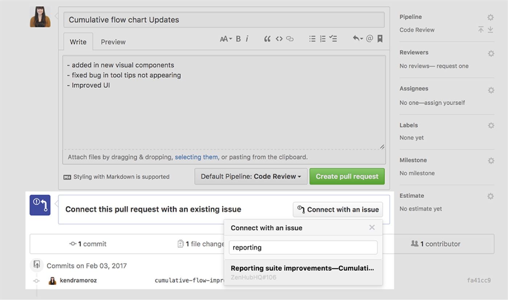

{: .fancy .medium}

This milestone is all about setting up some initial code scaffolding.

## Scaffolding

Now that you have your functionality mapped out let’s start on planning the coding. 

You should have the features all planned out through the user personas and feature spec in ZenHub. How do you want to build it? Plan out what technology you think you want to use and let’s get some code scaffolding ready. The project does have some minimal technical complexity that must be satisfied, but you are free to choose whatever tech stacks you wish.  *Remember no BAAS or PAAS are allowed except for the case of specialized tasks such as computer vision or ML you can initially start with a platform such as Watson/Google Cloud Vision etc.*

You should get some basics of your project up and running.  If your project has a UI try to do a little layout so that you have a main component and a hello world for the frontend and a hello world from the backend. If you have an idea of any modules and libraries you are planning on using, document them and or get them installed in your repos. At this point you should have your project code started and ready to work on.  The frameworks should be set up and running and a local development environment set up for everybody on the team. If you need multiple github repositories - you all should have permissions to create new repositories and add your github team to it.  Note: the preference is to have multiple repositories rather than directories in one repo (say client, server). This is better for keeping track of things in git, and is generally preferred since you may be versioning these separately.

The goal is that everybody has the basic code frameworks up and running in a dev environment on their own machines. This includes: databases, servers, scripts, frontend, etc.  Having a local dev environment is pretty critical for rapid development.  If you need a quick code change to happen such as say a new field represented, you can just change it and test it without messing either with a shared server or waiting for someone else to make the change. 

## Micro-Services Architecture 

You may want to consider a [micro-services architecture](https://dzone.com/articles/microservice-architecture-learn-build-and-deploy-a).  The general idea here is that multiple rather than having say, 1 big server that does everything, you instead split up functionalities.  So you end up with say 1 api server that talks to the database, but you also have a smaller server that does some image processing, and another one that handles machine-learning.  This allows you to work with different platforms more easily and specialize tasks. If a small python [Flask server](http://flask.pocoo.org/) can wrap your main TensorFlow code to provide a classification service that might be easier (and much better) than incorporating it all in one giant server side framework via shell scripts.

{: .medium}<br>
*(example with api->microservices as push model)*

This is an extension of a client-server model, but where you can have servers be clients to your central datastore.  Your API can either contact your micro-services as needed, or your micro-services can use your API as a queue system and pop items off the queue as they come in. 

This may not apply to all projects, but if you want to discuss your architecture in more detail please talk to us.

## Readme

In your project’s main README.md file (you may have multiple repos, but for now just use the repo you’ll be using for whatever is ending up being the frontend) start to outline the tech stack you will using. As you work on the project your README.md file will be a record of the tools you are using and how to get your dev environment running.

Start this doc now:
```markdown

# Project Name

TODO: super short project description, some sample screenshots or mockups that you keep up-to-date.

## Architecture

TODO:  overall descriptions of code organization and tools and libraries used

## Setup

TODO: how to get the project dev environment up and running, npm install etc, all necessary commands needed, environment variables etc

## Deployment

TODO: how to deploy the project

## Authors

TODO: list of authors

## Acknowledgments
```

You don’t have to fill in the whole document for this milestone, but do start on it and fill in what you can. This README is for now the defacto "landing page" for your project. It should be kept up-to-date so that I / anybody can clone your repos and run your project dev environment.  This needs to be updated — this is how I will know how to set up your project to test and how your teammates will know how to get it running as well.


## Git Flow and author name/email

Note: using github will be an essential part of the final project.  We'd like you to use branches and pull requests as you work on the final project together.  You don't necessarily need to do in depth code reviews, but doing git flow with feature branches will help you organize your team and your code. Doing pull requests (PRs) is required and you will be graded on your github code contributions via commits/PRs/issues assigned+closed.

Here is a good tutorial [pull requests](https://yangsu.github.io/pull-request-tutorial/).   

Make sure that your github username and email are set correctly so that we can track your contributions. Your email needs to be [recognized in your commits by github](https://help.github.com/articles/why-are-my-commits-linked-to-the-wrong-user/#commits-are-not-linked-to-any-user).

```bash
git log
```

will show you recent commits and you should check to make sure your email is one that works and is listed as one of your emails in your github settings: https://help.github.com/articles/setting-your-email-in-git/
so that your commits are recognized as belonging to you.  Make sure you have at least 2 commits connected to your github email on this.

🚀 Make sure each team member has made a github pull request to contribute to this as we want to make sure that at this point everybody is comfortable running the starter code and contributing via git.  Yes this a team graded assignment and it is on you to keep each other accountable and submit pull requests.

## ZenHub issues 

🚀 Go ahead and create an Issue for each team member to do a pull request. Assign them.  When you do the [Pull Request link it to that issue](https://www.zenhub.com/blog/github-issue-pull-request-linking/).

{: .fancy .medium}


## To Turn In:
* GitHub URL(s) to your repo on canvas (for grading ease)
* Code scaffolding:
  * some initial starter code
  * working hello worlds for any server/frontend/etc platforms
  * github repos set up with README.md files started
  * demonstrated use by every team member of git branches -> pull requests
