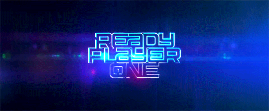

{: .fancy .medium-small}


## Overview 

This is the time to transition to the next sprint!  This will involve a short review and team retrospective and planning next steps. 

You should have an in-person team meeting and resolve all your currently working on tasks as best you can in preparation for this meeting.  All your previous sprint assigned issues and feature pull requests should be reviewed and merged into master so you can demo your work.


### Review

During the meeting you should each demo your week's work to your team. It is nice to use this moment to celebrate accomplishments, clap loudly for your teammates and support each other.

This is a good time to get immediate feedback as well — so try the features out and if there are bugs, put them in ZenHub!

## Retrospective 

Have a time to discuss what is working and what isn't.  Include a summary of this when you submit this!

🚀 Add to your Sprint Retrospectives Wiki Page

Here's a template:

```markdown
* Retrospective on Sprint #_: 
    * members in attendance:
        
        - [x] Jasmine
        - [ ] Alladin
    * what worked well
        * we made progress
        * etc
    * what didn't
        * we didn't make much progress
        * etc
    * self assessment on progress
        * where are you in relation to progress towards finalfinal product? 
          * give an estimate of how far towards your goals you are, do you think you're on track? 
        * lay out *each* of the following weeks till end of term with brief goals for each
          * current week: goals
          * week #: goals
          * week #: goals, etc
```

You'll update this weekly during your sprint transitions! 


## Your Mission for THE LAST SPRINT OF THIS TERM!

This is the last sprint of the term!  Half way through this sprint... your product will be put through its paces at [THE DEMO SESSION](t1-demos)! A working, testable demo is the requirement.  You can leave some room in this sprint for any documentation and [final summary stuff](t1-summary) which is due at the end of the sprint.

This will be your opportunity to test your product and get feedback, so have a testing plan in place.  Don't worry about other documentation until **after** demos.

## Testing Plan 

In preparation for the DEMOs at the end of Term 1, we will need a plan!  You should consider the demos as your final exam for the term, and it is worth a ton of points. This is the moment you are working up to — your time to shine.  During the expo you will present your work to various people, including your instructor.

So, are there any assumptions about your product that you might want to test?  

🚀 Create a Wiki Page `Term 1 Testing Plan` and write down a testing plan.  This is not a long document - terse but thoughtful is good.

Think about what features you want people to try out during the demos - how will you measure their feedback / validate your approach? 

### Some Tips

#### Observation
You’ll want to be able to observe and keep notes on how people use what you’ve built. Keep good observational notes that are more than, “it seemed people liked it”, and more like, “30% of users attempted clicking button 3 when it wasn’t enabled”. *Be creepy*, watch people interact with your product.

#### Questions

Ask users questions, verbally or with a form.

Don’t ask general questions like “would you use this?”. Ask more specific questions that you want resolved. Do you prefer a slider or a dropdown? How would you use this product? You’ll use this feedback to start the next term so this is important. Don’t forget to collect data. 

[Likert scale](https://en.wikipedia.org/wiki/Likert_scale) questions are often used in surveys (usually these are 5 point scales from strongly disagree to agree).  Sometimes you can avoid the middle undecided value and force subjects to either agree or disagree which can be helpful if your subjects are timid. Good Likert questions might look like:  *"I prefer functionality X over Y"*, *"Would feature X improve the product"*, *"logging in is important for this app"*.  Try to have a mix of questions where some you can evaluate numerically and some free form comments.

Avoid asking questions like: *"did you enjoy our product / find it useful"*.  These types of questions often suffer from various [response biases](https://en.wikipedia.org/wiki/Response_bias).  Survey subjects often suffer from acquiescence bias and try to give you the answer they think you want. So the trick is to construct questions that are balanced and ask for specifics.

The goal is to inform your further development — what would be useful to know at the start of next term?  

## Planning / Rake Your ZenHub Garden

Now plan out your next steps.  Add in *Unsorted* new issues, sort them into *Later* and *Next*.  Assign at least 4 issues per person.

During this step you should follow the [Rake Your ZenHub Garden](wiring-start-sprint#rake-your-zenhub-garden) steps. You'll do this every week.

1. 🚀**Create New Sprint Milestone**
1. 🚀**New Bugs**
1. 🚀**Update Epics/Roadmap**
1. 🚀**New Subtasks**
1. 🚀**Process All Issues**
1. 🚀**Assign Subtasks**


## To Turn In:
* submit zenhub link to your workspace
    * showing new assignments
    * and all of your previous sprint finished!
* submit wiki page link to your retrospective