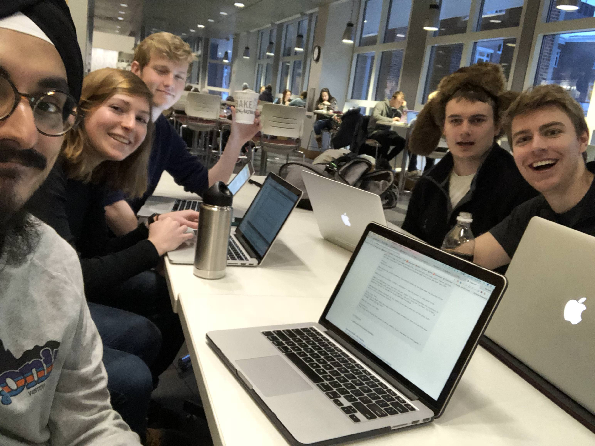
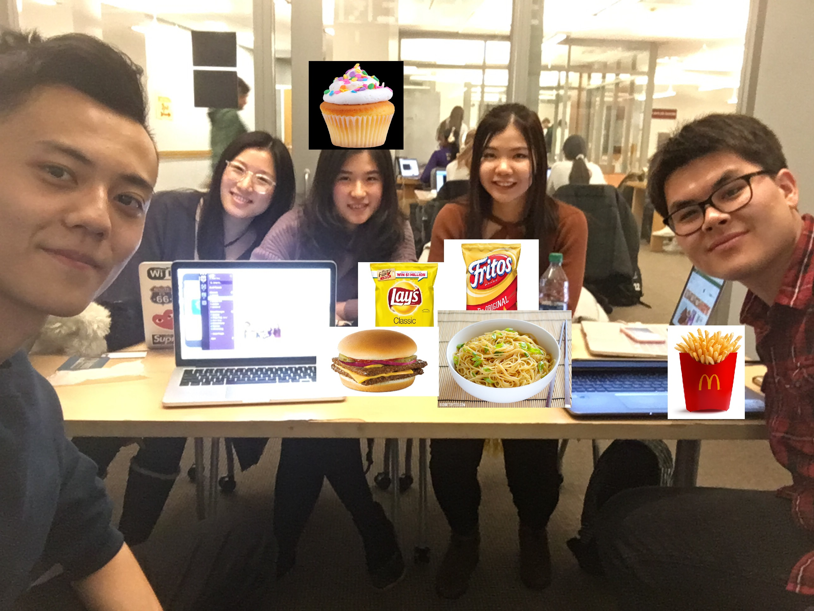
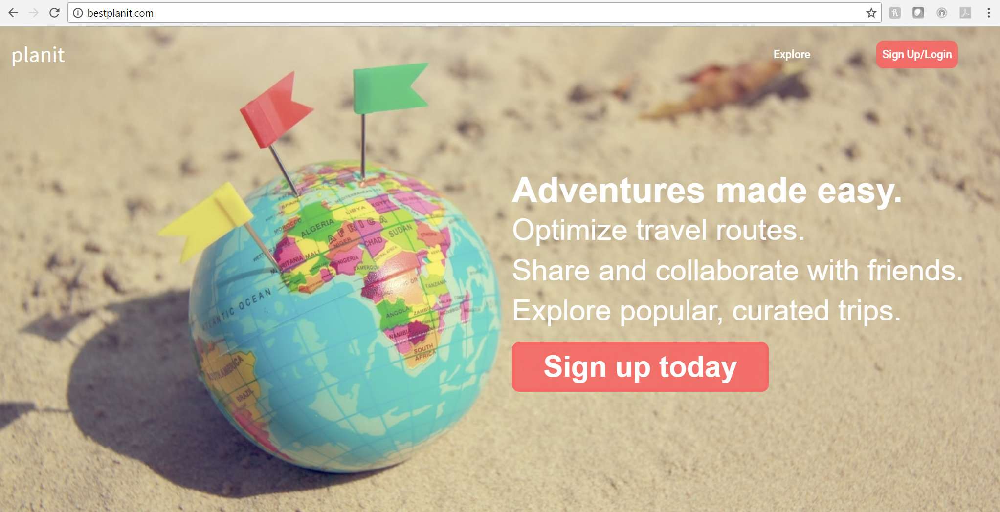
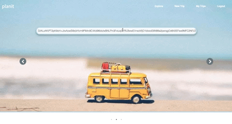
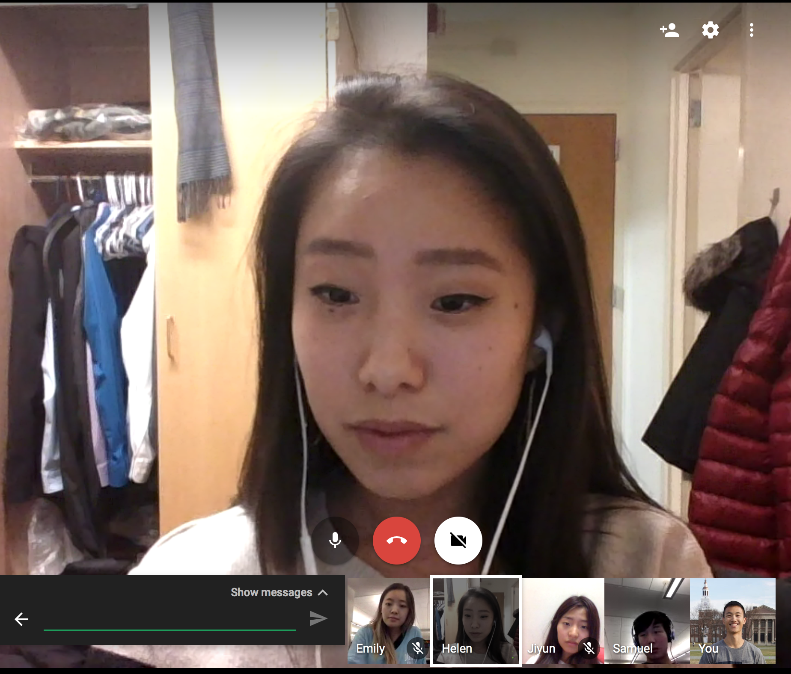
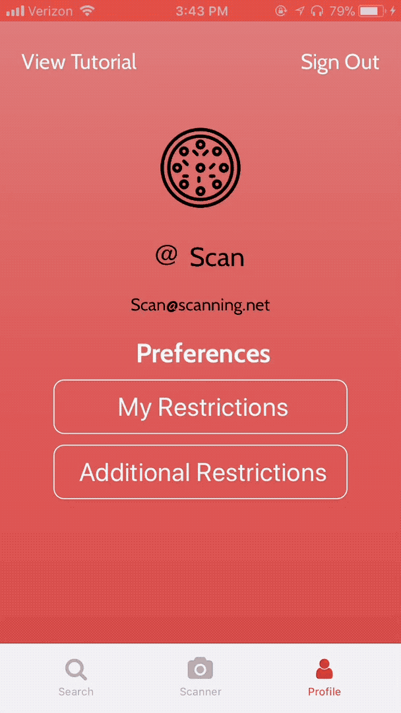
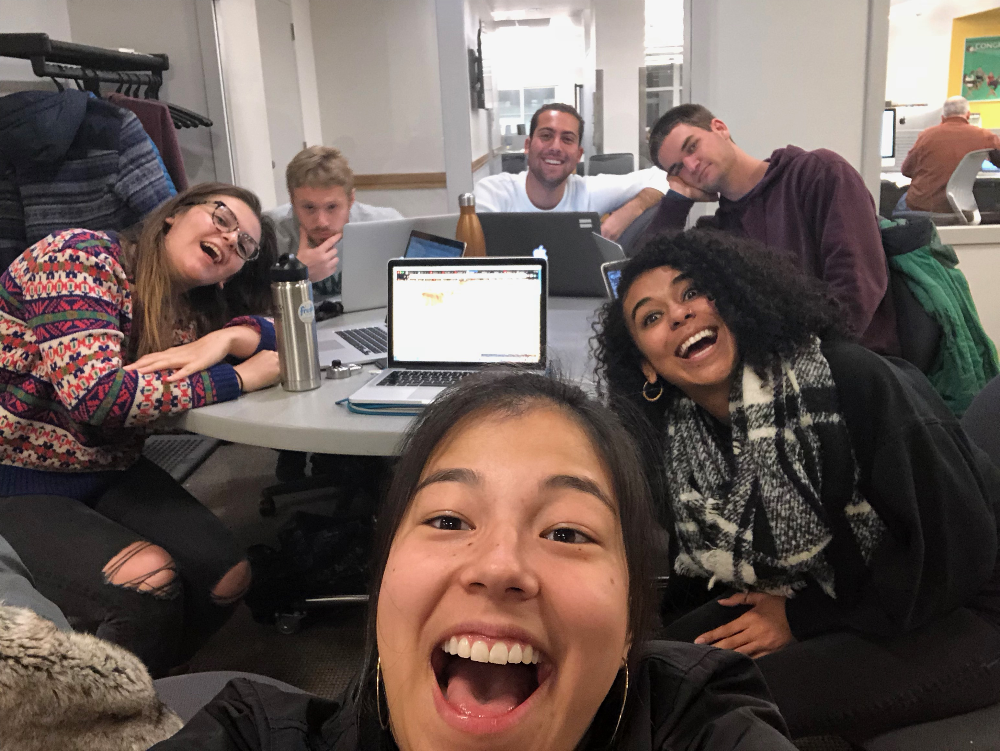
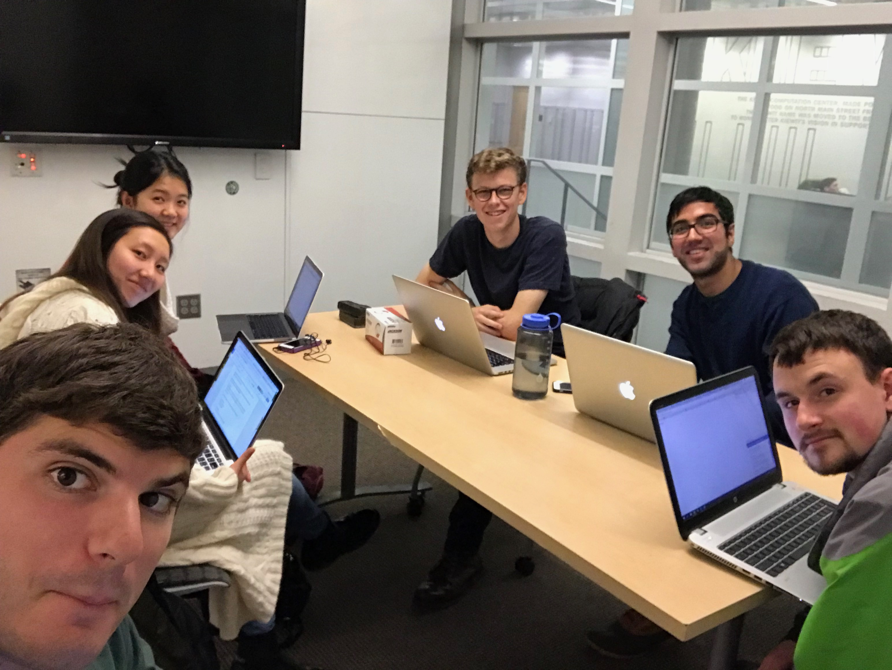
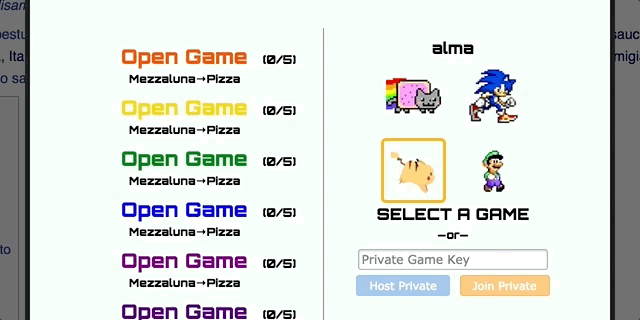

# MeshCash 17F-18W #

> In natural disasters or any situation in which networks are down or not reachable, it can be difficult to access funds that are stored in a bank account. People still need access to their funds or at least a way to keep a record of transactions that will be updated and settled when a user has access to a network. MeshCash is our answer. MeshCash is an iOS app based on a mesh network, which will allow for effective communication without reliance on wifi/cellular network. Users will use local WiFi or Bluetooth to connect to nearby devices. Users can then “pay” one another even while not connected to a cell network and receive/send the actual funds once reconnected to a network. The rest of the world will be updated once a member/members of the mesh are able to connect.
>
> * Stack: iOS, Flask, MySQL
> * [screenshots](https://imgur.com/a/z3eqP)
> * [github (private)](https://github.com/dartmouth-cs98/17f-meshcash)
> * not currently in app store
>
> {: .small .fancy}
> {: .small .fancy}
> {: .medium .fancy}

# MiAM: Make It A Meme! 17F-18W #

> MiAM is a social media app in which users can generate memes easily, share them freely under their username or anonymously, remix/re-edit likable memes, follow favorite meme-masters, and participate in meme battles. The app also has a reward system and keeps track of the user profiles and their meme battles.
>
> * Stack: React Native, Express.js, MongoDB
> * [github](https://github.com/dartmouth-cs98/17f-miam)
> * [app store](https://itunes.apple.com/us/app/miam-make-it-a-meme/id1352121568?mt=8)
>
> {: .small .fancy}
> {: .small .fancy}
> {: .small .fancy}
> {: .small .fancy}
> {: .medium .fancy}

# Planit 17F-18W #

> Planit is a web application that allows users to create a fully fleshed-out itinerary for an upcoming trip. It also gives users the capability to save trips, collaborate on trips with other people, and browse other people’s trips that have been made publicly available.
>
> * Stack: React, Phoenix, MySQL, various APIs
> * [github](https://github.com/dartmouth-cs98/17f-plan-it)
> * offline due to server costs
>
> {: .medium .fancy}
> {: .medium .fancy}
> {: .medium .fancy}
> {: .medium .fancy}

# Scannibble 17F-18W #

> Scannibble is an app with a barcode/ingredient list scanner and a personalized restriction profile! The scanner brings up the ingredients inside of the scanned food and cross-references it with your dietary profile, so you know whether or not it is safe to eat. Additionally, users can add other temporary restrictions and filter items by the combined dietary restrictions so you can shop for your friends as well!
>
> * Stack: React Native, Flask, MySQL
> * [apple app store](https://itunes.apple.com/US/app/id1310872500?mt=8)
> * [github (private)](https://github.com/dartmouth-cs98/17f-scannibble)
> * offline due to server costs
>
> {: .small .fancy}
> {: .small .fancy}
> {: .medium .fancy}

# WhoAmI 17F-18W #

> Our product allows users to authenticate their social media accounts, and then we use these sites APIs in order to collect the relevant user data and perform the necessary data cleansing and computation to prepare the data for search and visualizations. This includes computation of activity data, average likes over time and commonly used words. In addition, we use Watson Image Recognition in order to index images for search, and Watson Personality Insights in order to build an overview of a user's personality for a specific platform.
>
> * Stack:
> * [whoami.surge.sh](https://whoami.surge.sh/)
> * [github (private)](https://github.com/dartmouth-cs98/17f-smr)
>
> {: .fancy}
> {: .medium .fancy}

# WebAdventure 17F-18W #

> WebAdventure is a Chrome Extension that provides a unique and fun way of interacting with Wikipedia via a game format. Players compete against each other in a version of the "Wiki Game." For each player, the objective of the game is to reach the "goal" page before any other player does. Live updates of other players and power-ups and power-downs throughout the Wikipedia pages make for a competitive and exciting experience!
>
> * Stack:  Chrome Extension, jQuery, React, Express, MongoDB, Socket.IO, Neo4J graphDB
> * [get it here](http://cs98.me/17f-webadventure/)
> * [github (private)](https://github.com/dartmouth-cs98/17f-webadventure)
>
> {: .medium .fancy}
> {: .medium .fancy}
> {: .medium .fancy}
> {: .medium .fancy}
