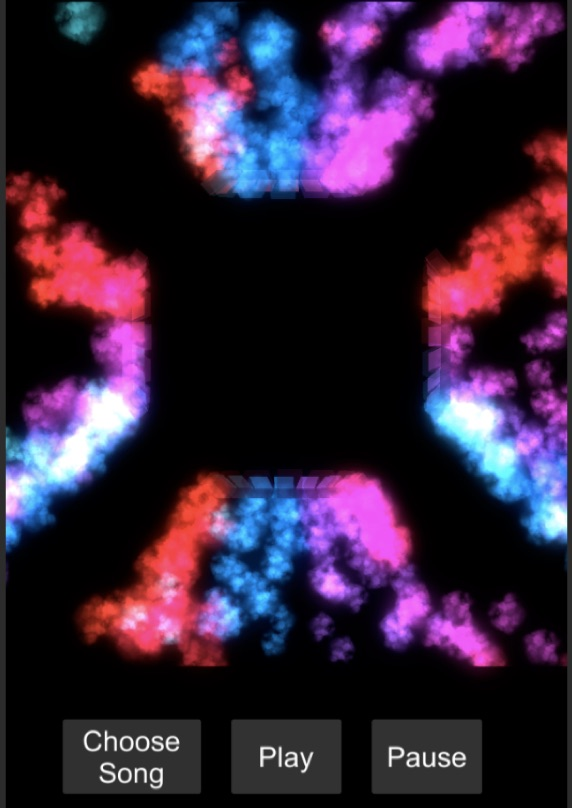
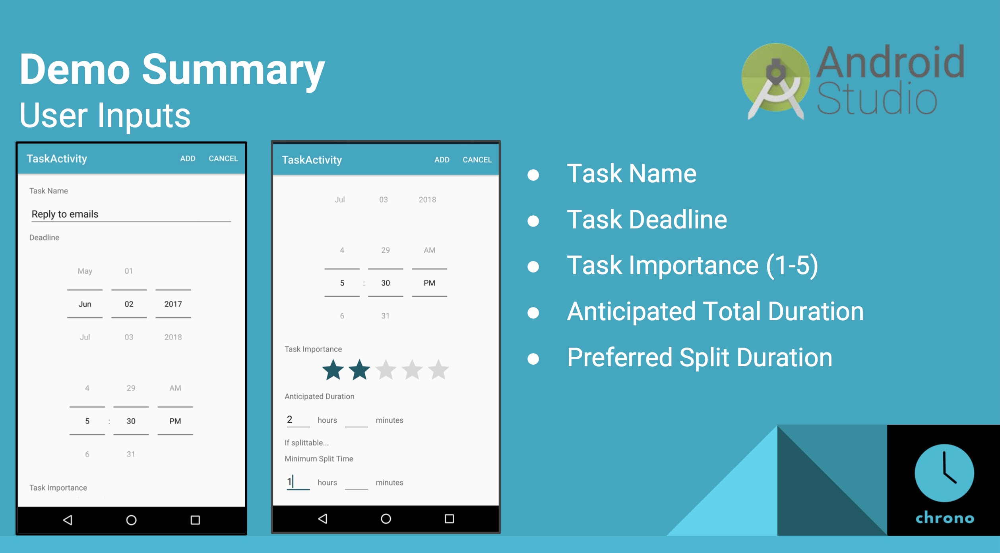

# Blitz.Chat 17W-17S #

> A Better Blitz
>
> * Stack: Meteor, Mongo, React
> * [blitz.chat](http://blitz.chat)
>
> {: .medium .fancy}

# BorrowIt 17W-17S #

>  iOS App to revolutionize the sharing economy and simplify lend and borrowing items
>
> * Stack: iOS Swift, Firebase PAAS*
>
> {: .medium .fancy}
>

_* BAAS platforms such as Firebase are not allowed in current iteration of CS98_

# Burrowed Time 17W-17S #

> A way to check on your friends and family in a noninvasive, convenient, and accessible way
>
> * Stack: AWS Lambda, AWS RDS, AWS API Gateway, iOS Swift
>
> {: .medium .fancy}
>

# Catch 17W-17S #

> A VR gamification platform for educational content allowing players to 'catch' good/correct content and let bad content fall.
>
> * Stack: Unity3d, GameSparks PAAS*, HTML5
>
> {: .medium .fancy}
>

_* BAAS platforms such as GameSparks are not allowed in current iteration of CS98_

# HOLO 17W-17S #

> A suite of holographic applications /platform utilizing an innovative pyramid projection surface.
>
> * Stack: Unity3d
>
> {: .small .fancy}
>

# Notist 17W-17S #

> Notist’s goal is to facilitate the process of acquiring, synthesizing and annotating online information about any topic, for anyone who is looking for a more interesting and principled way to browse the web.
>
> * Stack: Express, Node, Mongo, Chrome Extension API, HTML5, JS
> * [notist.io](https://notist.io/)
> * [video demo](https://www.youtube.com/watch?v=o2DjriZ_V34)
>
> {: .medium .fancy}
>

# Queue 17W-17S #

> Queue solves a common problem that people face when they are at social gatherings where one person is controlling the music: it allows everybody to contribute to the soundtrack of the party.
>
> * Stack: Node, Mongo, AWS EC2, iOS Swift, Spotify SDK
>
> {: .medium .fancy}
>

# Task Assistant App 17W-17S #

> An app that functions like a personal assistant: given tasks, their deadlines, and some additional information, our app suggests an optimal schedule for completing these tasks.
>
> * Stack: Android
> * [github](https://github.com/kelleylin/Chrono)
>
> {: .medium .fancy}
>
