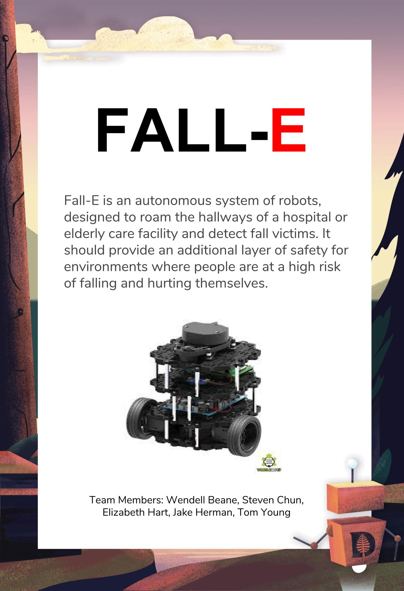
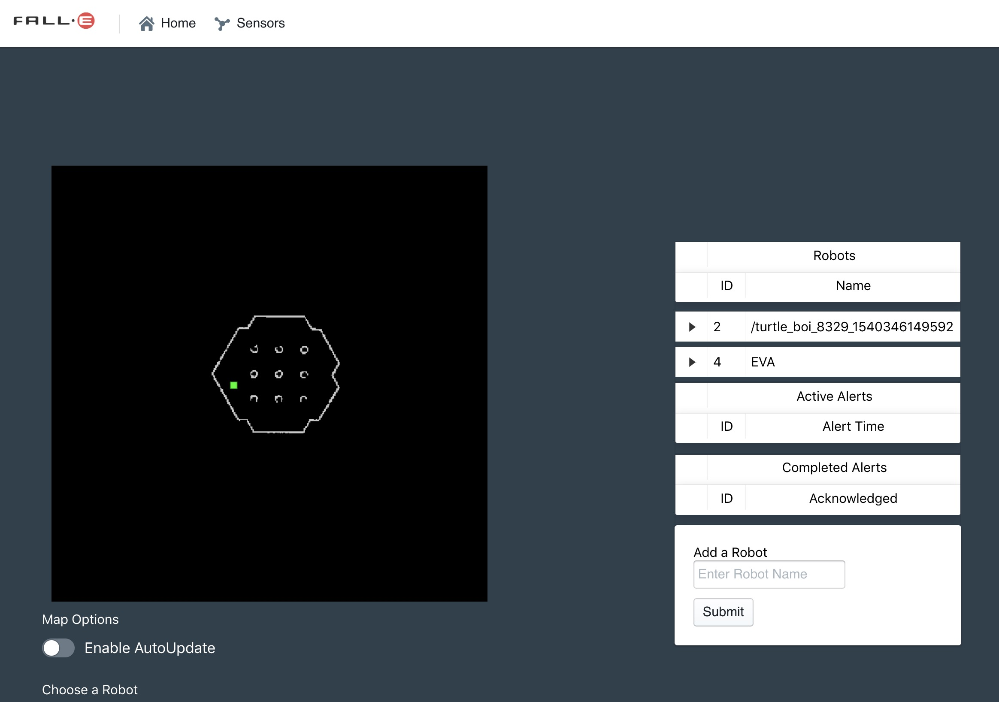
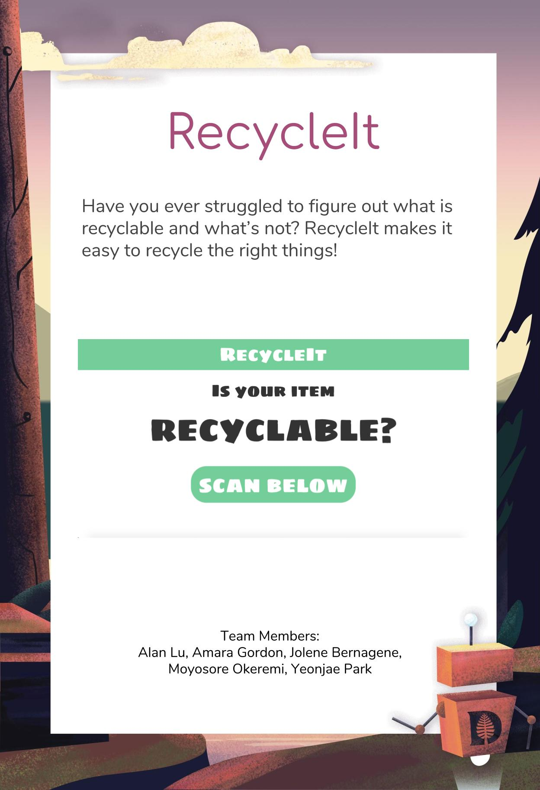
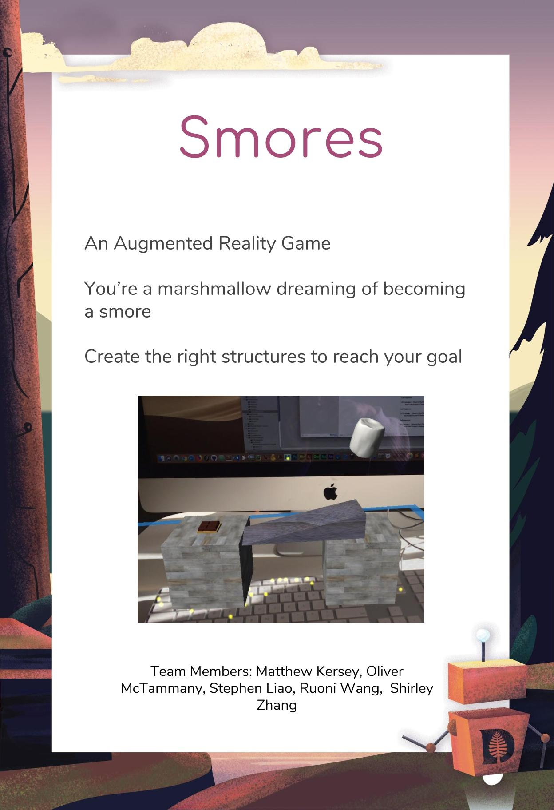
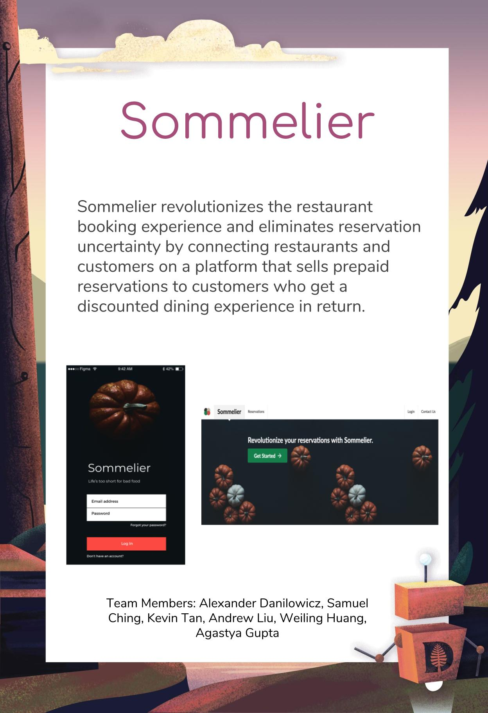
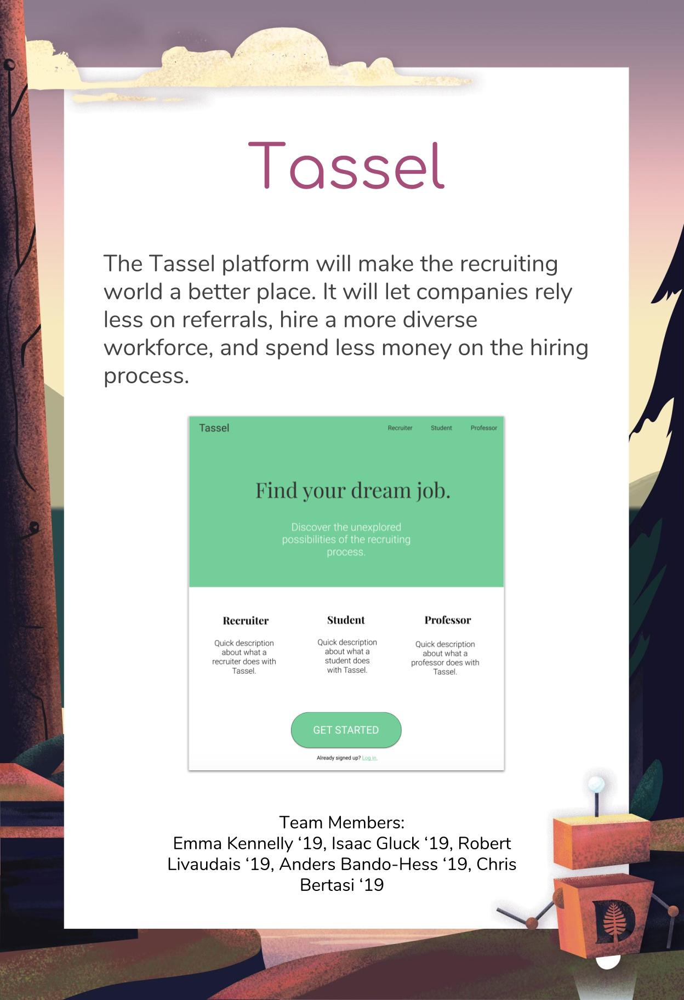
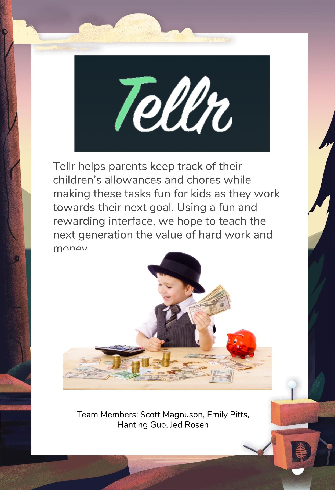

# Fall-E 18F-19W #

> Fall-E is an autonomous system of robots, designed to roam the hallways of a hospital or elderly care facility and detect fall victims. It should provide an additional layer of safety for environments where people are at a high risk of falling and hurting themselves. 
>
> * Stack: ROS, node/express/mongo, React
> * [github web (private)](https://github.com/dartmouth-cs98/18f-fall-e)
> * [github ros (private)](https://github.com/dartmouth-cs98/18f-fall-e-ros-master)
>
> {: .small .fancy} 
> {: .small .fancy}

# RecycleIt 18F-19W #

> Have you ever struggled to figure out what is recyclable and what’s not? RecycleIt makes it easy to recycle the right things! 
>
> * Stack: Raspberry PI, Python, React-Native, OpenCV, node/express/mongo
> * [github mobile (private)](https://github.com/dartmouth-cs98/18f-recycleit-frontend)
> * [github web (private)](https://github.com/dartmouth-cs98/18f-recycleit-monitor)
> * [github api (private)](https://github.com/dartmouth-cs98/18f-recycleit-backend)
> * [github raspberrypi (private)](https://github.com/dartmouth-cs98/18f-recycleit-raspberrypi)
>
> {: .small .fancy} 
> {: .small .fancy}
> <iframe style="border: none;" width="300" height="500" src="https://www.figma.com/embed?embed_host=share&url=https%3A%2F%2Fwww.figma.com%2Fproto%2FFYyrExk1nzz4Jo9yLYO54iEd%2FRecycleIt-Mockups%3Fnode-id%3D0%253A1%26scaling%3Dscale-down" allowfullscreen></iframe>

# Smores 18F-19W #

>An Augmented Reality Game
>You’re a marshmallow dreaming of becoming a smore
>Create the right structures to reach your goal
>
> * Stack: Unity3D
> * [github (private)](https://github.com/dartmouth-cs98/18f-smores)
>
> {: .small .fancy} 
> {: .small .fancy}

# Sommelier 18F-19W #

> Sommelier revolutionizes the restaurant booking experience and eliminates reservation uncertainty by connecting restaurants and customers on a platform that sells prepaid reservations to customers who get a discounted dining experience in return.
>
> * Stack: React-Native, node/express/mongo, React, Redux
> * [github web (private)](https://github.com/dartmouth-cs98/18f-sommelier-frontend)
> * [github api (private)](https://github.com/dartmouth-cs98/18f-sommelier-backend)
> * [github mobile (private)](https://github.com/dartmouth-cs98/18f-sommelier-native)
>
> {: .small .fancy} 
> <iframe style="border: none;" width="300" height="500" src="https://www.figma.com/embed?embed_host=share&url=https%3A%2F%2Fwww.figma.com%2Fproto%2FOSX6FgNYF0vY11cfl1P9qO%2FSommelier%3Fnode-id%3D0%253A1%26scaling%3Dscale-down" allowfullscreen></iframe>

# Tassel 18F-19W #

> The Tassel platform will make the recruiting world a better place. It will let companies rely less on referrals, hire a more diverse workforce, and spend less money on the hiring process.
>
> * Stack: React, Redux, Elixir, Phoenix, Postgres
> * [github web (private)](https://github.com/dartmouth-cs98/18f-tassel-frontend)
> * [github api (private)](https://github.com/dartmouth-cs98/18f-tassel-backend)

>
> {: .small .fancy} 
> <iframe style="border: none;" width="500" height="450" src="https://www.figma.com/embed?embed_host=share&url=https%3A%2F%2Fwww.figma.com%2Fproto%2FaUwZCUORxAAuT7YZ1Eiq0dbv%2FHome%3Fnode-id%3D2%253A2%26scaling%3Dscale-down" allowfullscreen></iframe>

# Tellr 18F-19W #

> Tellr helps parents keep track of their children’s allowances and chores while making these tasks fun for kids as they work towards their next goal. Using a fun and rewarding interface, we hope to teach the next generation the value of hard work and money.
>
> * Stack: React-Native, Flask, MongoDB
> * [github mobile (private)](https://github.com/dartmouth-cs98/18f-tellr-frontend)
> * [github api (private)](https://github.com/dartmouth-cs98/18f-tellr-backend)
>
> {: .small .fancy}
