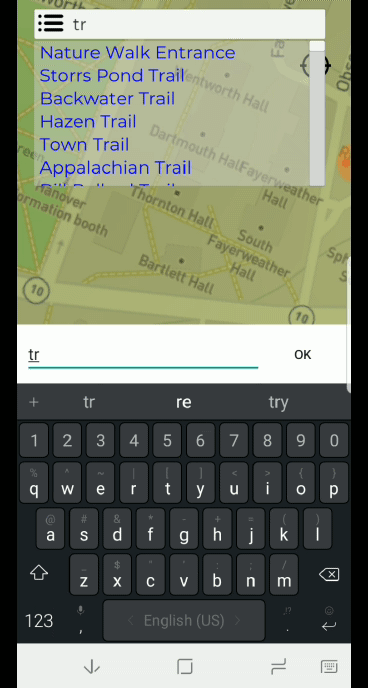
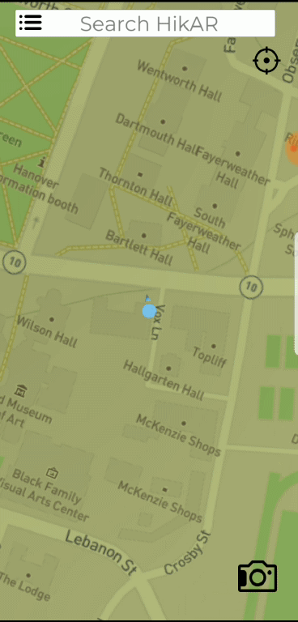
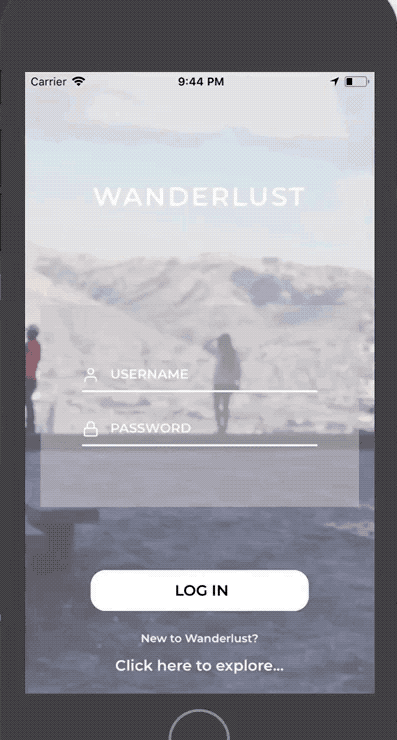
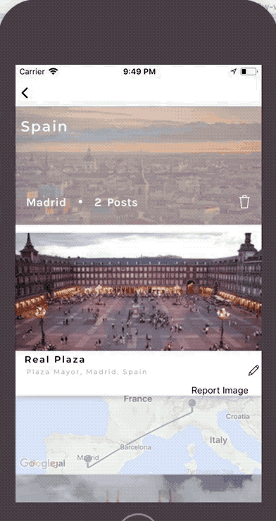

# CoinDuel 18W-18S #

> FanDuel meets cryptocurrency – Teaching people how to invest, one CapCoin at a time. CoinDuel is an iOS application dedicated to educating investors about the volatility and value of cryptocurrencies in a safe setting where they can learn more about the blockchain, as well as learn to perform their own research and generate their own investment theses in order to participate in fun one-week challenge style format games to determine who can pick the best portfolio of currencies.
>
> * Stack: swift iOS, node/express/mongo
> * [apple store](https://itunes.apple.com/us/app/coinduel/id1351969245?mt=8)
> * [github (private)](https://github.com/dartmouth-cs98/18w-CoinDuel-frontend)
> published and playable in app store!
>
> {: .small .fancy}
> {: .small .fancy}
> {: .small .fancy}
> {: .small .fancy}

# HikAR 18W-18S #

> {: .small .fancy}
>
> HikAR is a hiking-focused navigation app that utilizes AR technology to effectively guide the user on their outdoor adventure.
>
> * Stack: Unity3D, node/express/mongo
> * [github frontend](https://github.com/dartmouth-cs98/18w-hikar-frontend)
> * [github server](https://github.com/dartmouth-cs98/18w-hikar-backend)
> * not currently published
>
> {: .small .fancy}
> {: .small .fancy}
> <blockquote class="imgur-embed-pub small" lang="en" data-id="XOHdBMq"></blockquote>

# Monad 18W-18S #

> Monad is an engaging online AI BOT building platform where players design, implement, compete, and compare AI agents, while simultaneously honing their programming skills.
>
> * Stack: react/js, docker, python, node/express/mongo
> * [published at playmonad.com](http://playmonad.com/)
> * [github](https://github.com/dartmouth-cs98/18w-si32)
>
> {: .medium .fancy}

# PaintTheTown 18W-18S #

>  PaintTheTOwn is a a location-based, AR painting app that pins users against each other in an exciting, "color the world," competition. Users will be able to travel from location to location covering their favorite POI's in silly and fun buckets of paint. As cities are being filled in, users will earn points and unlock new ways to out paint the opposing teams. Users can compete in challenges (both individually and as a team), compete against one another, or just have fun painting buildings and visiting POIs without the competitive nature.
>
> * Stack: Unity3D, node/express/mongo
> * [github (client)](https://github.com/dartmouth-cs98/18w-paintthetown)
> * [github (server)](https://github.com/dartmouth-cs98/18w-paintthetown-backend)
> * not currently published
>
> {: .medium .fancy}
> {: .medium .fancy}
> {: .medium .fancy}
> {: .medium .fancy}
> {: .medium .fancy}

# RunningMates 18W-18S #
> {: .small .fancy}
>
> RunningMates is a mobile application that utilizes Strava's API to compile personal fitness data to connect individuals looking for new connections with others who share their passions for running. This application uses state-of-art data analytic techniques to provide users with the best recommendations of other runners in their area, based on their skill levels and preferences.
>
> * Stack: swift iOS, node/express/mongo
> * [github (app)](https://github.com/dartmouth-cs98/18w-runningmates)
> * [github (server)](https://github.com/dartmouth-cs98/18w-runningmates-backend)
> * not currently published
>
> {: .small .fancy}
> {: .small .fancy}
> {: .small .fancy}
> {: .small .fancy}

# Wanderlust 18W-18S #

> Wanderlust is a social media travel platform built for millennials. Targeting a younger demographic of traveler, Wanderlust provides a medium for users to log the trips that they've gone on, keep track of their friends' activity, and explore new places to visit in the future. Its automated processing of image metadata simplifies the cataloging process, and the implementation of its views provide an aesthetically pleasing visualization of potentially unorganized data. Additional in-app functionalities allow users to maintain full control of their information by enabling the editing and creation of albums without requiring re-upload, while recommendations allow users on active trips to explore the region around them.
>
> * Stack: react-native, node/express/mongo
> * [github (frontend)](https://github.com/dartmouth-cs98/18w-wanderlust)
> * [github (server)](https://github.com/dartmouth-cs98/18w-wanderlust-backend)
> * not currently published
>
> {: .small .fancy}
> {: .small .fancy}
> {: .small .fancy}
> {: .small .fancy}
> {: .small .fancy}
> {: .small .fancy}
