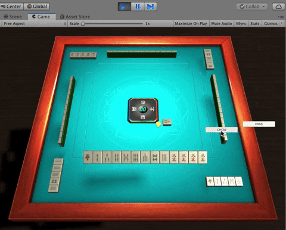
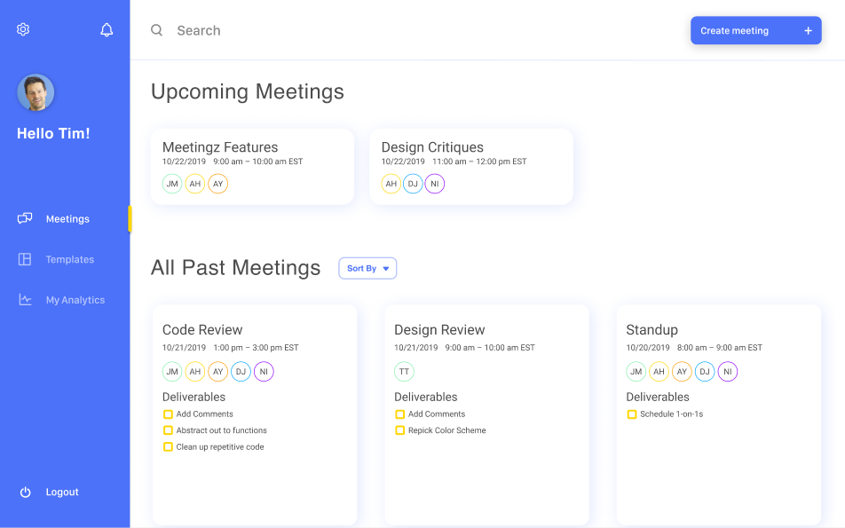
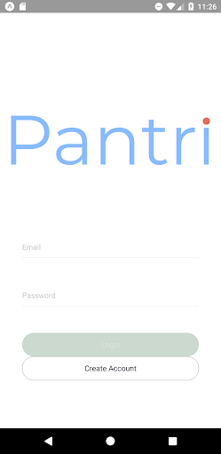
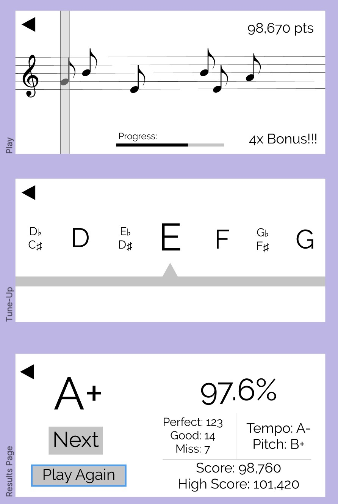

# CookAlong 19S-20W #

> How might we make learning to cook an accessible experience with technology? We propose creating an AR application that will walk users through recipes step by step, providing detailed visual instructions such as how to dice ingredients.
>
> * Stack: Unity3D, C#, MagicLeap, Java Spring
> * [github main repo (private)](https://github.com/dartmouth-cs98/19f-cookalong)
> * [github backend (private)](https://github.com/dartmouth-cs98/cookalong-backend)
> * [github frontend (private)](https://github.com/dartmouth-cs98/cook_along)
>
> <iframe style="border: none;" width="800" height="450" src="https://www.figma.com/embed?embed_host=share&url=https%3A%2F%2Fwww.figma.com%2Fproto%2Fi3JMHf301Ecpcxmtx3pwmp%2FMock-up%3Fnode-id%3D1%253A3%26scaling%3Dmin-zoom" allowfullscreen></iframe>

# DineItUp 19S-20W #

> Welcome to DineItUp: the only app that helps you find the exact meal you're craving. Utilizing user feedback, DineItUp allows you to search for the meal you want based on your own personal preferences. An easy app to review individual dishes of local restaurants. 
>
> * Stack: React-Native,  Express, Node, MongoDB
> * [github frontend repo (private)](https://github.com/dartmouth-cs98/19f-dineitup)
> * [github backend (private)](https://github.com/dartmouth-cs98/19f-dineitup-backend)
> * [github onboarding (private)](https://github.com/dartmouth-cs98/19f-dineitup-onboarding)
>
> <iframe style="border: none;" width="300" height="600" src="https://www.figma.com/embed?embed_host=share&url=https%3A%2F%2Fwww.figma.com%2Fproto%2FKeu0c0L7Yh7HZ3KTGsQ8FM%2FDineItUp%3Fnode-id%3D44%253A2%26scaling%3Dscale-down" allowfullscreen></iframe>

# Duet 19S-20W #

> We want to better understand ourselves and our relationships to each other based on the music we listen to. We're building a web application that visualizes a user's Spotify data and allows them to compare their music to their friends' or community's music in a beautiful, meaningful way.
>
> * Stack: React, Redux, Node, Express, Flask, SQLAlchemy, PostgreSQL
> * [dev deployment](https://cs98-duet.surge.sh/)
> * [github wiki repo (private)](https://github.com/dartmouth-cs98/duet-wiki)
> * [github server (private)](https://github.com/dartmouth-cs98/duet-server)
> * [github frontend (private)](https://github.com/dartmouth-cs98/duet-client)
> * [github frontend (private)](https://github.com/dartmouth-cs98/duet-auth-server)
>
> <iframe style="border: none;" width="800" height="450" src="https://cs98-duet.surge.sh/" allowfullscreen></iframe>

# ForTheGirls 19S-20W #

> For the Girls is a mobile application that connects women in technology based on technical and personal interests and location. Women can choose to be a mentor, mentee or looking for friends. Once women match, they can DM each other to see if they want to meet up in person for coffee or a meal. Through reminders, an events page and personality matching, we hope that the relationships and networks built through the app will last. Our goal is to alleviate feelings of isolation and imposter syndrome through building a strong network of women in technology.
>
> * Stack: React-Native, Expo, MongoDB, Node, Express. 
> * [github backend (private)](https://github.com/dartmouth-cs98/19f-forthegirlsBE)
> * [github frontend (private)](https://github.com/dartmouth-cs98/19f-forthegirls)
>
> <iframe style="border: none;" width="450" height="920" src="https://www.figma.com/embed?embed_host=share&url=https%3A%2F%2Fwww.figma.com%2Fproto%2FqmvQdh5SA5IeXoRDXntZTp%2Fmockups%3Fscaling%3Dmin-zoom%26node-id%3D23%253A0" allowfullscreen></iframe>

# MahjonGo 19S-20W #

> MahjonGo is an iOS multi-player game app that allows users to set up a room and play Mahjong online against their friends. It should give hints and tutorials, and support complicated rules and winning conditions. The product may potentially support functions like chat rooms between players, record-keeping, and strategy analysis.
>
> * Stack: Unity3D, Express, Node, Mongo
> * [github main repo (private)](https://github.com/dartmouth-cs98/19f-cookalong)
> * [github backend (private)](https://github.com/dartmouth-cs98/cookalong-backend)
> * [github frontend (private)](https://github.com/dartmouth-cs98/cook_along)
>
> {: .large .fancy}

# Meetingz 19S-20W #

> Meetings are important, but there are a lot of problems. They often go over their allotted amount of time without coming up with solutions, and they also disregard those who don't feel as comfortable contributing vocally to meetings, thus missing out good ideas. We are building an app that will help inexperienced meeting leaders lead meetings more efficiently by implementing a solution that will interact with the meeting in some way. It will also display statistics about a meeting after the meeting.
>
> * Stack: React, Redux, Node, Express, Mongo
> * [github main repo (private)](https://github.com/dartmouth-cs98/19f-meetingz)
> * [github backend (private)](https://github.com/dartmouth-cs98/19f-meetingz-backend)
>
> {: .medium_large .fancy}

# Pantri 19S-20W #

> Pantri is an combination Alexa skill and mobile app which enables users to easily keep track of the items in their pantry and fridge, so when they shop, they know exactly how much to buy. It will help reduce food waste in households that utilize it.
>
> * Stack: React-Native, Express, Node, Mongo, Flask, Alexa, React, Redux
> * [github submodules repo (private)](https://github.com/dartmouth-cs98/19f-pantri)
>
> {: .small .fancy}

# Perfect Practice 19S-20W #

> Practice Perfect is a mobile app to help musicians (especially young students in school music programs) practice their instruments through games with structured practice and scoring. It can also help music teachers (especially in school music programs) keep their students motivated to practice and making assignments.
>
> * Stack: iOS, Swift, SwiftUI, PostgreSQL, Hapi, Knex
> * [github main repo (private)](https://github.com/dartmouth-cs98/19f-practiceperfect)
> * [github backend (private)](https://github.com/dartmouth-cs98/19f-practiceperfect-api)
>
> {: .medium .fancy}

# Quantum Tetris 19S-20W #

> Quantum Tetris is your traditional tetris game game who has several twists based on the concepts of quantum computing. We want to make quantum computing accessible to the public and help increase the public's understanding of the field. To implement this quantum functionality it uses IBM's qiskit library which runs in the cloud on IBM's quantum computers.
>
> * Stack: Flask, GoDot, Qiskit
> * [dev deployment http://quantumtetris.surge.sh/](http://quantumtetris.surge.sh/)
> * [github backend (private)](https://github.com/dartmouth-cs98/Quantum-Tetris)
> * [github frontend (private)](https://github.com/dartmouth-cs98/GoDot-Quantum-Tetris)
>
> > <iframe style="border: none;" width="800" height="450" src="http://quantumtetris.surge.sh/" allowfullscreen></iframe>

# Sprout 19S-20W #

> A mobile marketplace connecting communities to share local and organic produce, as well as grow-your-own starter kits.
>
> * Stack: React-Native, Expo, Node, Express, Mongo
> * [github react-native (private)](https://github.com/dartmouth-cs98/19f-sprouted)
> * [github backend (private)](https://github.com/dartmouth-cs98/19f-sprout-backend)
>
> <iframe style="border: none;" width="450" height="920" src="https://www.figma.com/embed?embed_host=share&url=https%3A%2F%2Fwww.figma.com%2Fproto%2FBbIr6wzEaJ80P8RGtyZd8z%2FMockups%3Fnode-id%3D2%253A44%26scaling%3Dmin-zoom" allowfullscreen></iframe>
