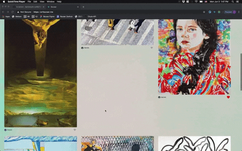
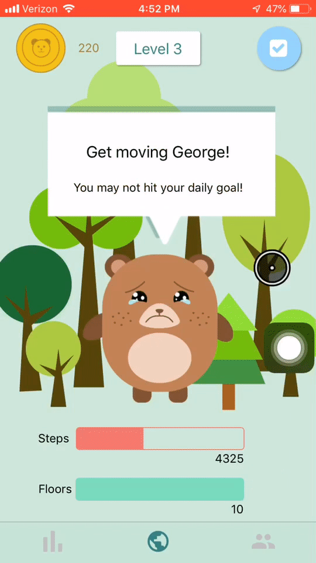
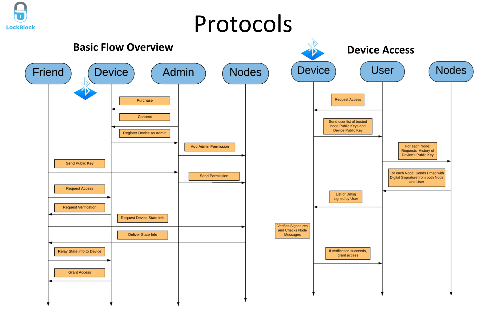
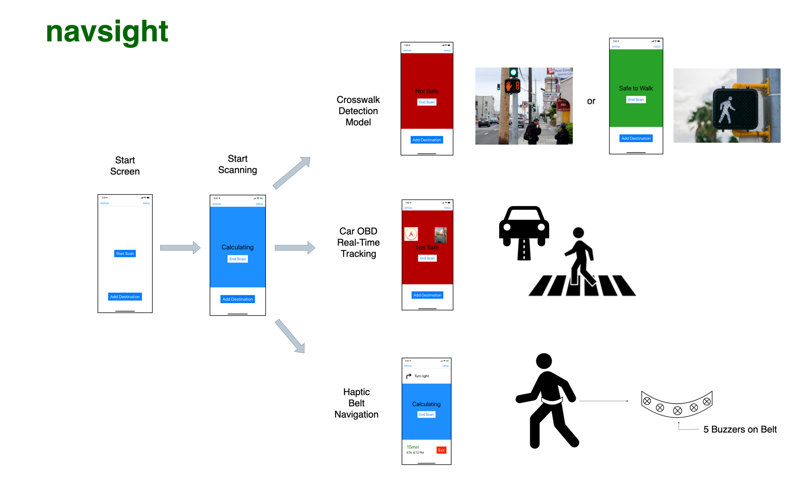
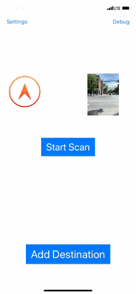
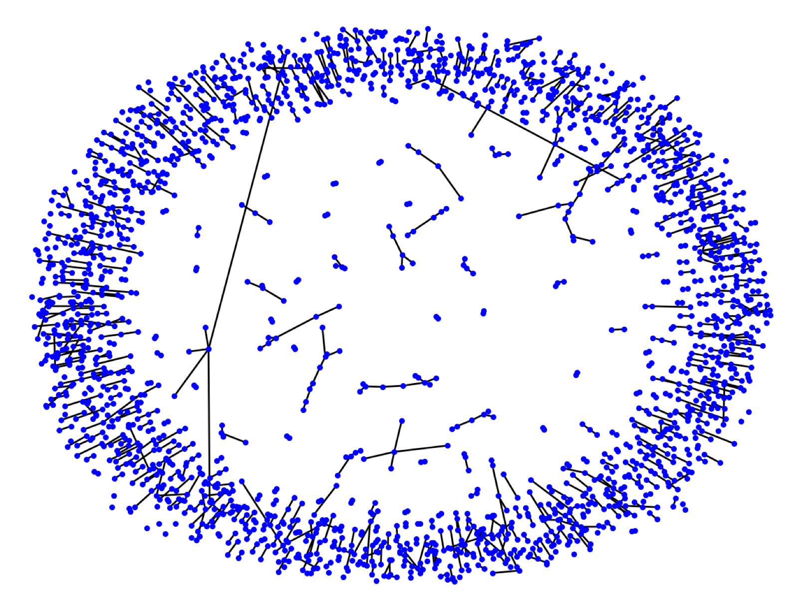

# Afloat 19W-19S #

> An earned wage platform, where users can access their salaries on a daily basis rather than on a fixed payment schedule. This allows users greater financial flexibility. 
>
> * Stack: React Native, node/express/mongo, Stripe, Plaid
> * [github react-native (private)](https://github.com/dartmouth-cs98/quantweb-react-native)
> * [github async payment worker (private)](https://github.com/dartmouth-cs98/quantweb-async-worker)
> * [github api (private)](https://github.com/dartmouth-cs98/19w-quantweb-backend)
> * [github term1 cash advance service (private)](https://github.com/dartmouth-cs98/19w-quantweb)
>
> {: .mini .fancy}
> {: .mini .fancy}
> {: .mini .fancy}

# Bazaart 19W-19S #

> ArtBazaar aims to connect amateur artists and casual art buyers in order to buy and sell cheap but quality art. Artists can post art for discovery, and buyers can buy through there or ask for a certain art piece to be made through a guided commission process.
>
>
> * Stack: React, node/express/postgresql, Amazon S3.
> * [github web (private)](https://github.com/dartmouth-cs98/19w-bazaar-frontend)
> * [github server (private)](https://github.com/dartmouth-cs98/19w-bazaar-backend)
> * [deployed](https://artbazaar.me)
>
> {: .small .fancy} 
> {: .small .fancy}

# BearTrax 19W-19S #

> Bear Trax (formerly WittyCare) is a health/fitness app for IOS that uses a virtual avatar, a bear named Witty, to reward and to motivate users to stay fit. The app integrates with Apple's HealthKit in order to keep track of user's steps and flights of stairs walked each day. The more users walk, the happier Witty is. In addition to keeping Witty happy, users are also rewarded with coins the more they walk. These coins can be used to unlock a story about Witty's adventures. Finally, users can add friends and create challenges with them by betting coins on who can walk the most steps or flights of stairs.
>
> You can download the link to beta test Bear Trax [here](https://testflight.apple.com/join/CEbiTB2v)
>
> * Stack: React-Native, node/express/mongo, HealthKit
> * [github react-native (private)](https://github.com/dartmouth-cs98/19w-witycare-frontend)
> * [github api (private)](https://github.com/dartmouth-cs98/19w-witycare-api)
>
> {: .tiny .fancy}
> {: .tiny .fancy} 
> {: .tiny .fancy}
> {: .tiny .fancy}

# Echo.verse 19W-19S #

> Echoverse is a interactive art piece developed in Unity describing echo chambers in a number of topical landscapes. Everyone is in an echo chamber in some way. The goal of this art is to encourage the user to be more mindful of the echo chambers they are in and the benefits and drawbacks of an echo chamber. 
>
> * Stack: Unity3D, node/express/mongo, Python web scraper
> * [github unity (private)](https://github.com/dartmouth-cs98/19w-pixivity)
> * [github data (private)](https://github.com/dartmouth-cs98/19w-pixivity-data)
> * [github server (private)](https://github.com/dartmouth-cs98/19w-pixivity-server)
>

    <video loop autoplay muted class="small fancy">
    <source src="http://res.cloudinary.com/dali-lab/video/upload/ac_none,w_560,h_315,c_crop/v1546203223/cs98/19w-pixivity.webm" type="video/webm"/>
    <source src="http://res.cloudinary.com/dali-lab/video/upload/ac_none,w_560,h_315,c_crop/v1546203223/cs98/19w-pixivity.mp4" type="video/mp4"/>
    <source src="http://res.cloudinary.com/dali-lab/video/upload/ac_none,w_560,h_315,c_crop/v1546203223/cs98/19w-pixivity.ogv" type="video/ogg"/>
    Your browser does not support HTML5 video tags
    </video>

    <video loop autoplay muted class="small fancy">
    <source src="http://res.cloudinary.com/dali-lab/video/upload/ac_none,w_560,h_315,c_crop/v1546203223/cs98/19w-pixivity-2.webm" type="video/webm"/>
    <source src="http://res.cloudinary.com/dali-lab/video/upload/ac_none,w_560,h_315,c_crop/v1546203223/cs98/19w-pixivity-2.mp4" type="video/mp4"/>
    <source src="http://res.cloudinary.com/dali-lab/video/upload/ac_none,w_560,h_315,c_crop/v1546203223/cs98/19w-pixivity-2.ogv" type="video/ogg"/>
    Your browser does not support HTML5 video tags
    </video>

# LockBlock 19W-19S #

> A system by which users can control the digital permissions to their belongings by interacting with a universal blockchain.
>
> * Stack: ReactNative, node/express/mongo, Bluetooth, C++, Raspberry PI
> * [github mobile and blockchain (private)](https://github.com/dartmouth-cs98/19w-metadesk)
> * [github bluetooth (private)](https://github.com/dartmouth-cs98/lockblock-bt-test)
>
> {: .small .fancy}
> <iframe style="border: none;" width="300" height="500" src="https://www.figma.com/embed?embed_host=share&url=https%3A%2F%2Fwww.figma.com%2Fproto%2FcUTnCPvk2FLSa9Z211GSELYA%2FLockblock-Mockup%3Fnode-id%3D45%253A97%26scaling%3Dscale-down" allowfullscreen></iframe>

# NavSight 19W-19S #

> We are building a proof of concept application using deep learning, car diagnostics technology, and wearable technology to aid the visually impaired in crossing the streets more safely. Our final product consisted of a belt with haptic buzzers for navigation, a working walk signal detection model, and real-time car tracking with an OBD for additional safety, and a mobile app for the end user.
>
> * Stack: iOS/swift, Raspberry PI, Keras, YOLOv2, Particle Electron, Carloop
> * [Medium Post](https://medium.com/@jjanelee97/navsight-3029d4448f2e)
> * [github mobile app (private)](https://github.com/dartmouth-cs98/jukejuke-mobile)
> * [github ML model (private)](https://github.com/dartmouth-cs98/jukejuke-model)
> * [github raspberry pi (private)](https://github.com/dartmouth-cs98/jukejuke-raspberrypi)
> * [github obd integration (private)](https://github.com/dartmouth-cs98/jukejuke-obd)
>
> {: .medium_small .fancy} 
> {: .medium_small .fancy} 
> {: .small .fancy}
> {: .small .fancy}

# OpusMatch 19W-19S #

> Identifying potentially promising academics to recruit is a nontrivial challenge to college recruitment boards. Many extremely talented individuals never consider a career in academia until they are contacted by a recruiter for a college. This suggests that many people who could become great professors never consider the profession due to the difficulty associated with identifying them. With this project we set out to identify certain individuals who would be likely to exhibit high growth in their h-indices over the next few years, based on their position in the network of published academic research by proposing a modified PageRank algorithm as well as through scraping ResearchGate and doing a graphical analysis on the networks of mentors/mentees/contributors.
>
> * Stack: Python
> * [github (private)](https://github.com/dartmouth-cs98/19S-opusmatchscripts)
>
> {: .small .fancy}

