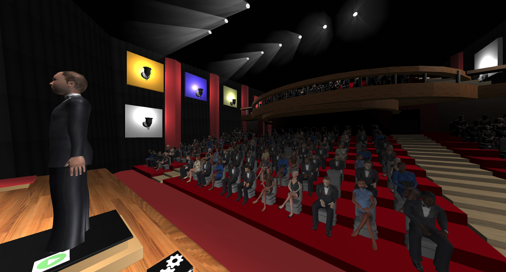
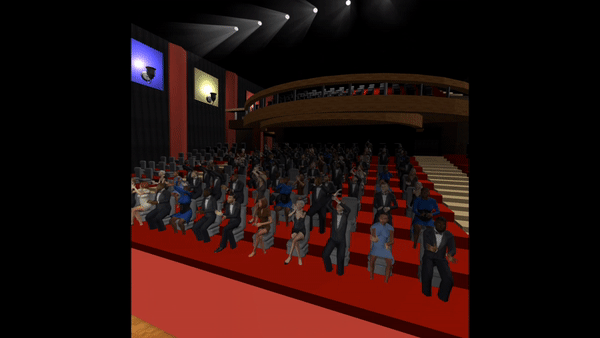
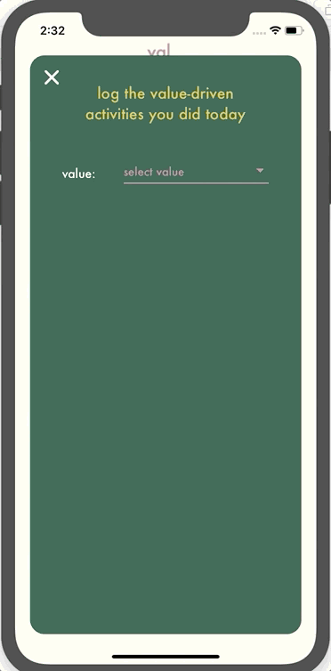
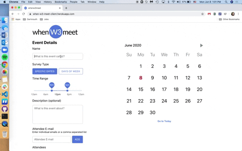
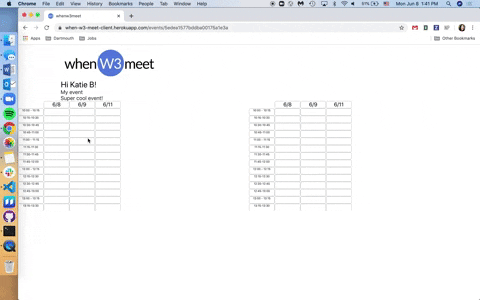
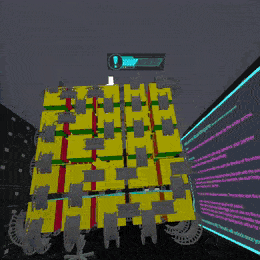
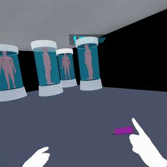
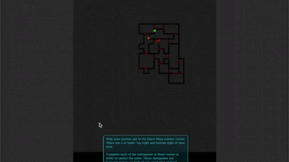

# EnsembleVR 20W-20S #

> A VR experience that places the user in a realistic concert environment with an audience and ensemble. The musician is able to practice performing a piece in front of a simulated audience, to help combat stage fright.
>
> * Stack: Unity3D, Python
> * [Medium Post](https://medium.com/dartmouth-cs98/ensemblevr-overcoming-your-stage-fright-with-virtual-reality-27636ba4a2eb)
> * [github main repo (private)](https://github.com/dartmouth-cs98/20w-ensemble)
> * [github backend (private)](https://github.com/dartmouth-cs98/20w-ensemble-vr-score-following)
> * [github frontend (private)]()
>
> {: .medium .fancy}
> {: .medium .fancy}

# ValYOU 20W-20S #

> Helping you live a more value-driven life.
> 
> * Stack: React-Native,  Node/Express, Mongo
> * [Medium Post](https://medium.com/@tanyaashah/valyou-6cc0ca16d3e5)
> * [github frontend (private)](https://github.com/dartmouth-cs98/20w-lantwb)
> * [github backend (private)](https://github.com/dartmouth-cs98/lantwb-backend)
>
> {: .medium_small .fancy}
> {: .tiny .fancy}

# whenw3meet 20W-20S #

> When-w3-meet is a web application viewable on both desktop and mobile that implements When2Meet features and the ability to import existing calendar events when indicating availability. When-w3-meet was born from the vision of a succinct scheduling platform with an intuitive UI that aims to deliver an expedited, hassle-free scheduling experience.
>
> * Stack: React, Google Calendar, Node/Express, Mongo
> * [Medium Post](https://medium.com/dartmouth-cs98/do-you-use-when2meet-then-youll-love-whenw3meet-511efbf2bbd3)
> * [github main repo (private)](https://github.com/dartmouth-cs98/20w-when-w3-meet)
> * [github backend (private)](https://github.com/dartmouth-cs98/20w-when-w3-meet-server)
> * [live site](http://when-w3-meet-client.herokuapp.com/)
>
> {: .medium .fancy}
> {: .medium .fancy}

# Winged 20W-20S #

> In the age of working from home, why can’t we date from home? All the facilities to do so are available to us, but the idea seemed so BIZARRE only a couple of months ago!
> Virtual dating before the lockdowns were initiated due to the Covid-19 pandemic was basically non-existent, dating apps like Tinder, Bumble, Hinge, and etc. all relied on that physical human connection. Even if some tried to incorporate virtual dating into their existing product, it just DIDN’T WORK!! And so, came along…Winged Dating.
>
> * Stack: 
> * [Medium Post](https://medium.com/dartmouth-cs98/winged-date-from-home-dfh-145311a9fe07)
> * [github main repo (private)](https://github.com/dartmouth-cs98/frontend-winged)
> * [github backend (private)](https://github.com/dartmouth-cs98/backend-winged)
> * [install app](https://apps.apple.com/us/app/winged-dating/id1507607706)
>
> {: .small .fancy}
> {: .small .fancy}

# Operation Cooperative 20W-20S #

> There are not many XR games that push the realm of the XR artform through collaborative games.
>
> * Stack:  Unity3D, Android, iOS
> * [Medium Post](https://medium.com/dartmouth-cs98/making-a-multiplayer-vr-game-with-one-headset-e55a942ebc5d)
> * [github main repo (private)](https://github.com/dartmouth-cs98/op-co-op)
> * [github VR (private)](https://github.com/dartmouth-cs98/op-co-op-VR)
> * [github mobile (private)](https://github.com/dartmouth-cs98/op-co-op-mobile)
>
> {: .medium_small .fancy}
> {: .medium_small .fancy}
> {: .medium_small .fancy}
