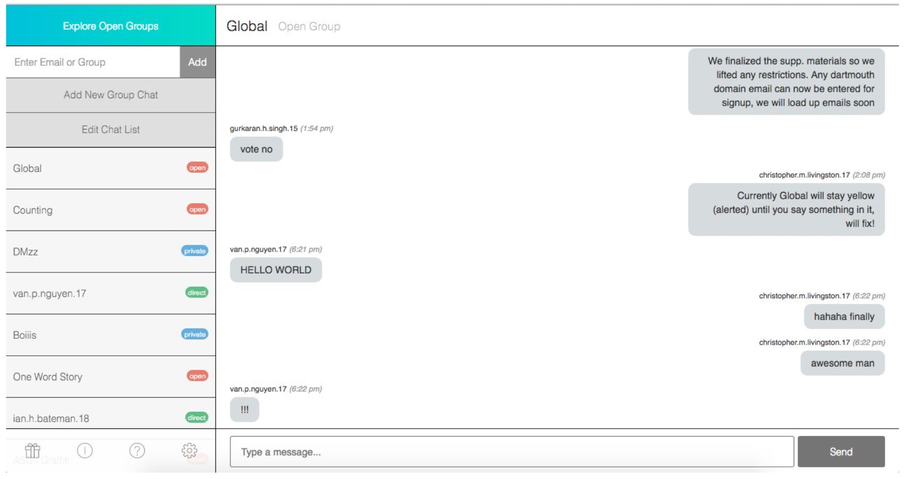
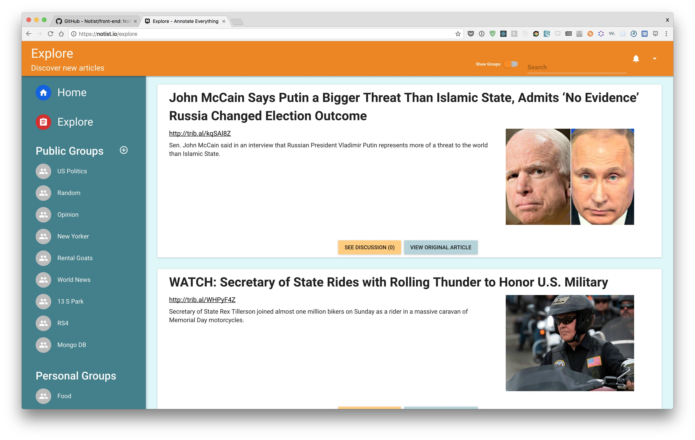
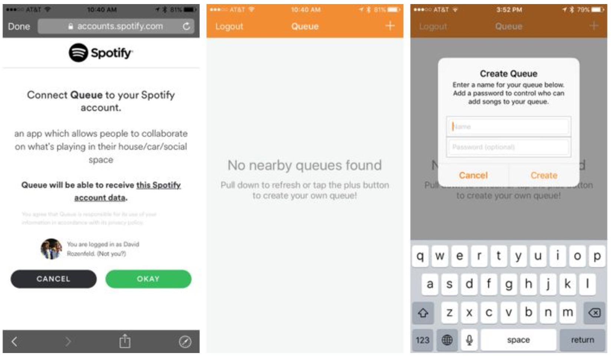

# Agora 16F-17W #

> Web based marketplace for students.
>
> * [demo](http://agora-react.herokuapp.com/)
> * [github project-agora](https://github.com/dartmouth-cs98/project-agora)
>
> {: .medium .fancy}
>
>{: .small .fancy}

# Buzzer 16F-17W #
> Restaurant buzzer system with web management and custom cell hardware.
>
> * [Landing Page](http://restaur-anteater.herokuapp.com/)
> * [github web](https://github.com/dartmouth-cs98/buzzer)
> * [github embedded](https://github.com/dartmouth-cs98/buzzer-embedded)
>
> {: .medium .fancy}
>
> {: .small .fancy}
>

# Climb.AR 16F-17W #
> Augmented reality climbing framework with auto hold detection and skeleton mapping via Kinect.
>
> * [Demo Poster](https://cdn.rawgit.com/dartmouth-cs98/climb.AR/c630b006/readme_imgs/poster.pdf)
> * [github climb.AR](https://github.com/dartmouth-cs98/climb.AR)
>
> {: .medium .fancy}
>
> {: .small .fancy}
>

# EasyTex 16F-17W #
> Mac App for converting written math notes into LaTeX.
>
> * [github project-easytex](https://github.com/dartmouth-cs98/project-easytex)
> * [github EasyTex-Server](https://github.com/dartmouth-cs98/EasyTex-Server)
>
> {: .medium .fancy}
>

# HindSite 16F-17W #
> Chrome extension for full-text browsing history search and visualization.
>
> * [Landing Page](https://dartmouth-cs98.github.io/hindsite/)
> * [github hindsite-backend](https://github.com/dartmouth-cs98/hindsite-backend)
> * [github hindsite-frontend](https://github.com/dartmouth-cs98/hindsite-frontend)
>
> {: .medium .fancy}
>
> {: .small .fancy}
>

# LensFlare 16F-17W #
> Full featured augmented reality HoloLens application and web management interface for adding video and text to > spatially located items in a museum context.
>
> * [github lensflare-server](https://github.com/dartmouth-cs98/lensflare-server)
> * [github lensflare-unityUI](https://github.com/dartmouth-cs98/lensflare-unityUI)
>
> {: .medium .fancy}
>
> {: .small .fancy}
>

# Mappit 16F-17W #

> Mapping platform for events.
>
> * Demo: [https://mappit.me/](https://mappit.me/) (currently offline)
> * [github project-dartmap](https://github.com/dartmouth-cs98/project-dartmap)
> * [github project-dartmap-api](https://github.com/dartmouth-cs98/project-dartmap-api)
>
>{: .small .fancy}
>

# PubMasters 16F-17W #

>Pub crawl social photo taking app.
>
> * [github project-pubmasters](https://github.com/dartmouth-cs98/project-pubmasters/tree/develop)
> * [github pubmasters-backend](https://github.com/dartmouth-cs98/pubmasters-backend)
>
> {: .medium .fancy}
>
> {: .small .fancy}

# Blitz.Chat 17W-17S #

> A Better Blitz
>
> * Stack: Meteor, Mongo, React
> * [blitz.chat](http://blitz.chat)
>
> {: .medium .fancy}

# BorrowIt 17W-17S #

>  iOS App to revolutionize the sharing economy and simplify lend and borrowing items
>
> * Stack: iOS Swift, Firebase PAAS*
>
> {: .medium .fancy}
>

_* BAAS platforms such as Firebase are not allowed in current iteration of CS98_

# Burrowed Time 17W-17S #

> A way to check on your friends and family in a noninvasive, convenient, and accessible way
>
> * Stack: AWS Lambda, AWS RDS, AWS API Gateway, iOS Swift
>
> {: .medium .fancy}
>

# Catch 17W-17S #

> A VR gamification platform for educational content allowing players to 'catch' good/correct content and let bad content fall.
>
> * Stack: Unity3d, GameSparks PAAS*, HTML5
>
> {: .medium .fancy}
>

_* BAAS platforms such as GameSparks are not allowed in current iteration of CS98_

# HOLO 17W-17S #

> A suite of holographic applications /platform utilizing an innovative pyramid projection surface.
>
> * Stack: Unity3d
>
> {: .small .fancy}
>

# Notist 17W-17S #

> Notist’s goal is to facilitate the process of acquiring, synthesizing and annotating online information about any topic, for anyone who is looking for a more interesting and principled way to browse the web.
>
> * Stack: Express, Node, Mongo, Chrome Extension API, HTML5, JS
> * [notist.io](https://notist.io/)
> * [video demo](https://www.youtube.com/watch?v=o2DjriZ_V34)
>
> {: .medium .fancy}
>

# Queue 17W-17S #

> Queue solves a common problem that people face when they are at social gatherings where one person is controlling the music: it allows everybody to contribute to the soundtrack of the party.
>
> * Stack: Node, Mongo, AWS EC2, iOS Swift, Spotify SDK
>
> {: .medium .fancy}
>

# Task Assistant App 17W-17S #

> An app that functions like a personal assistant: given tasks, their deadlines, and some additional information, our app suggests an optimal schedule for completing these tasks.
>
> * Stack: Android
> * [github](https://github.com/kelleylin/Chrono)
>
> {: .medium .fancy}
>
