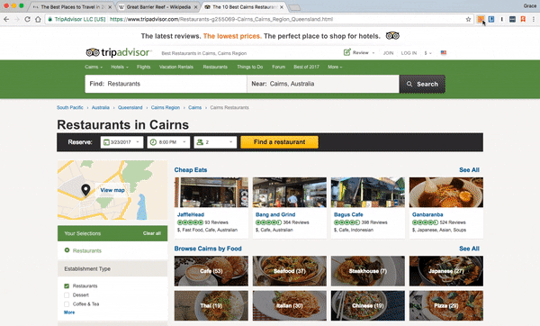
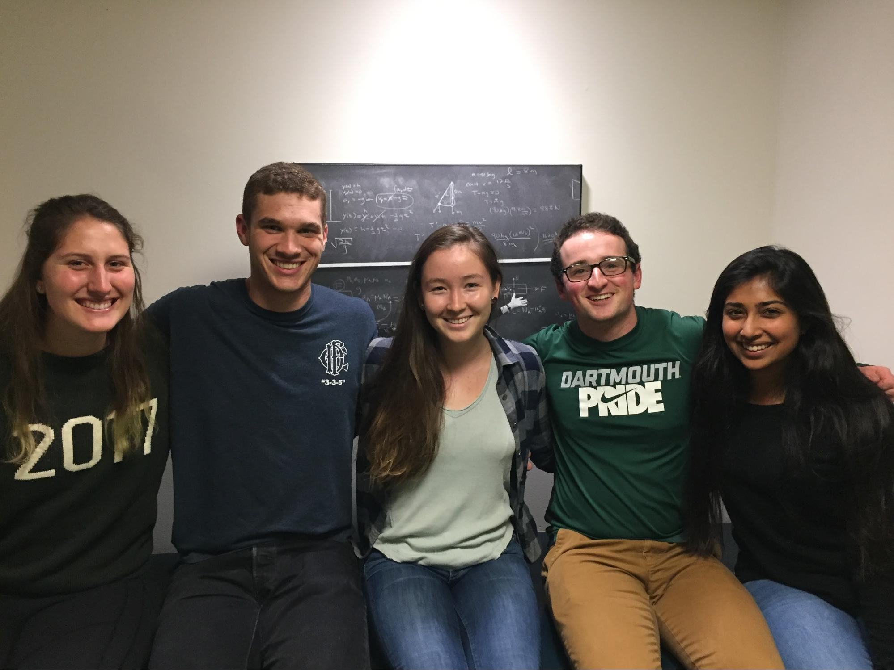
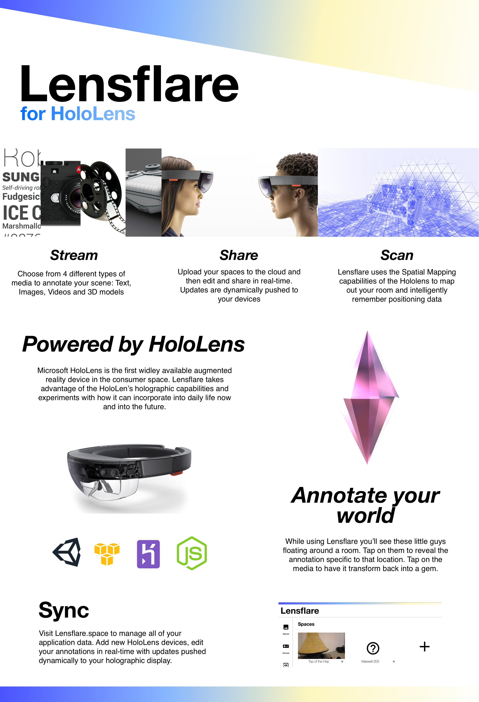
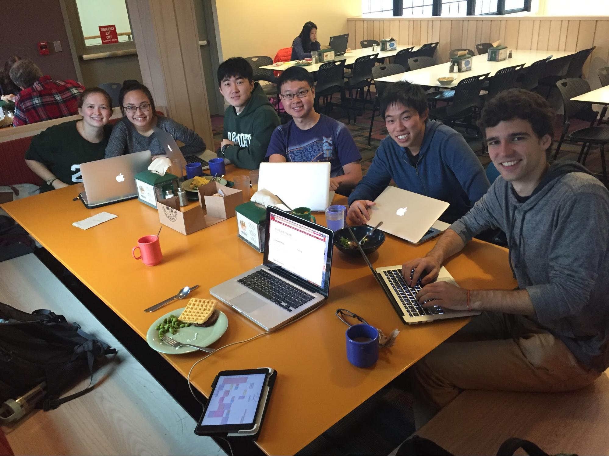

# Agora 17F-17W #

> Web based marketplace for students.
>
> * [demo](http://agora-react.herokuapp.com/)
> * [github project-agora](https://github.com/dartmouth-cs98/project-agora)
>
> {: .medium .fancy}
>
>{: .small .fancy}

# Buzzer 17F-17W #
> Restaurant buzzer system with web management and custom cell hardware.
>
> * [Landing Page](http://restaur-anteater.herokuapp.com/)
> * [github web](https://github.com/dartmouth-cs98/buzzer)
> * [github embedded](https://github.com/dartmouth-cs98/buzzer-embedded)
>
> {: .medium .fancy}
>
> {: .small .fancy}
>

# Climb.AR 17F-17W #
> Augmented reality climbing framework with auto hold detection and skeleton mapping via Kinect.
>
> * [Demo Poster](https://cdn.rawgit.com/dartmouth-cs98/climb.AR/c630b006/readme_imgs/poster.pdf)
> * [github climb.AR](https://github.com/dartmouth-cs98/climb.AR)
>
> {: .medium .fancy}
>
> {: .small .fancy}
>

# EasyTex 17F-17W #
> Mac App for converting written math notes into LaTeX.
>
> * [github project-easytex](https://github.com/dartmouth-cs98/project-easytex)
> * [github EasyTex-Server](https://github.com/dartmouth-cs98/EasyTex-Server)
>
>

# HindSite 17F-17W #
> Chrome extension for full-text browsing history search and visualization.
>
> * [Landing Page](https://dartmouth-cs98.github.io/hindsite/)
> * [github hindsite-backend](https://github.com/dartmouth-cs98/hindsite-backend)
> * [github hindsite-frontend](https://github.com/dartmouth-cs98/hindsite-frontend)
>
> {: .medium .fancy}
>
> {: .small .fancy}
>

# LensFlare 17F-17W #
> Full featured augmented reality HoloLens application and web management interface for adding video and text to > spatially located items in a museum context.
>
> * [https://github.com/dartmouth-cs98/lensflare-server](https://github.com/dartmouth-cs98/lensflare-server)
> * [https://github.com/dartmouth-cs98/lensflare-unityUI](https://github.com/dartmouth-cs98/lensflare-unityUI)
>
> {: .medium .fancy}
>
> {: .small .fancy}
>

# Mappit 17F-17W #

> Mapping platform for events.
>
> * Demo: [https://mappit.me/](https://mappit.me/) (currently offline)
> * [github project-dartmap](https://github.com/dartmouth-cs98/project-dartmap)
> * [github project-dartmap-api](https://github.com/dartmouth-cs98/project-dartmap-api)
>
>{: .small .fancy}
>

# PubMasters 17F-17W #

>Pub crawl social photo taking app.
>
> * [github project-pubmasters](https://github.com/dartmouth-cs98/project-pubmasters/tree/develop)
> * [github pubmasters-backend](https://github.com/dartmouth-cs98/pubmasters-backend)
>
> {: .medium .fancy}
>
> {: .small .fancy}
