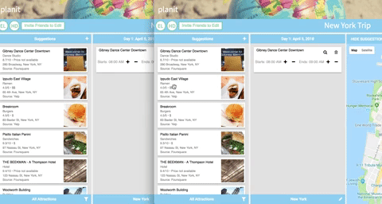
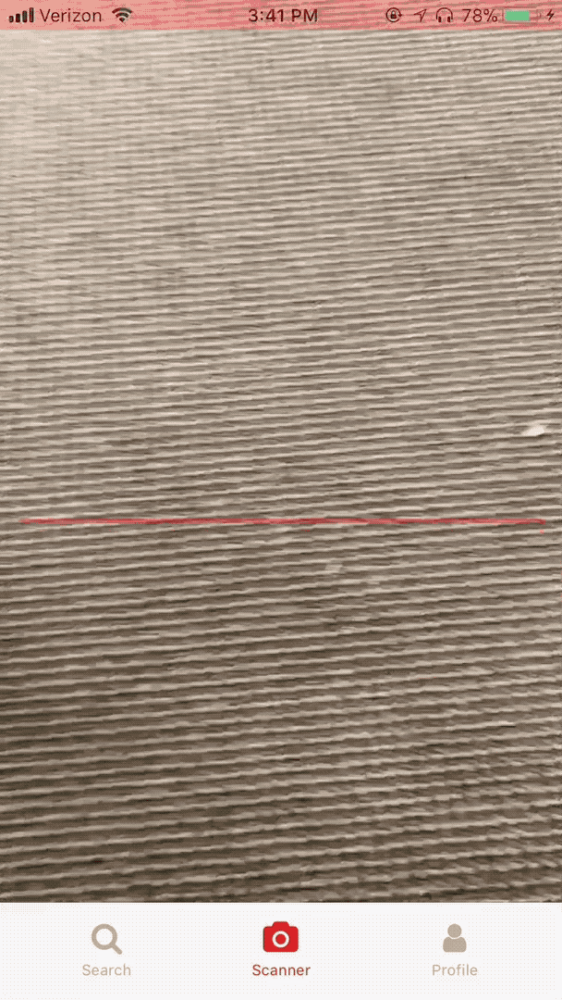
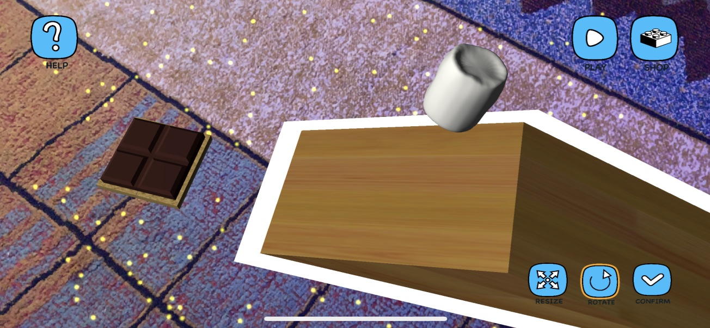
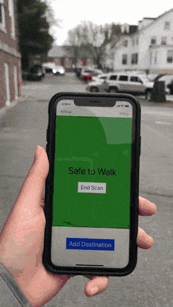

layout: true
class: center, middle
name: pic
background-size: contain

---

layout: true
class: center, top
name: fragment

.title[{{name}}]

---
layout: true
class: center, middle
name: base

.title[{{name}}]

---
name: CS98

## Senior Design and Implementation Project I

#### _the tech startup experience_<br>&nbsp;&nbsp;&nbsp;&nbsp;&nbsp;&nbsp;&nbsp;&nbsp;&nbsp;&nbsp;&nbsp;&nbsp;&nbsp;&nbsp;&nbsp;&nbsp;&nbsp;&nbsp;&nbsp;&nbsp;&nbsp;&nbsp;&nbsp;&nbsp;&nbsp;&nbsp;&nbsp;^<font style="color:grey;font-style:italic;">founder</font>

<br><br><br><br>

*Tim Tregubov*

???
* what does that even mean?
* a lot of you have had internships - working at a company
* academic course project experience
* but probably not a do your own startup experience
* from just an idea - to full product
* will be about you so if you have ideas on how to improve just talk to me


---
name: Course Goals

.medium_small[]

* learn to build from scratch
* solve problems
* software dev best practices
* ship a glorious product
* make bank, or better, change the world

???
* talk about history
* class used to be a layup
* first realized nobody had built stuff
* so added rigor for complexity
* then added rigor for idea - realized people needed to love it
* the general point here is: you have half a year, don't fucking waste it on something you don't care about.
* **in this class you have the freedom to choose to work on something you care about**

---
name: etc

.medium_small[]

<!-- * 3B — 4:30-6:20pm -->
* 3A - Mon 3:30-5:20 and Tues 4:30-6:20, LSC 201
* Mondays, discussion/activities
<!-- * Tuesdays, discussion/activities -->
* Thursdays, meeting time/sharing
* x-hours
  * Mon 5:35 - 6:25pm, as necessary room available

???
* coding together
* activities such as bughunts and testing
* brainstorm and pitch ideas
* inter and intra group collaboration
* will keep time logs - for billing purposes


---
name: Online @


.medium[]


* web: [http://cs98.me](http://cs98.me)
* github: [http://github.com/dartmouth-cs98](http://github.com/dartmouth-98)

???

* administrative stuffs
* using github extensively, get comfortable
* previous projects on github and on the website
* open an issue or PR!


---
name: Code

.small[]

* the internet is full of the codes
* `if (cite) { no penalty }`
* `else { mandatory vacation }`

```javascript
// adapted from: http://stackoverflow.com/someurl
// this method does x and y
```

???
* think of it more like industry intellectual property
* don't use another companies code without it being above board
* internet full of codes is a good thing - we're all archeologists - puzzle solvers
* if copy - just cite it
* sharing is caring (when cited)
* goals is to share your work - have lots of green squares on github
* remember, I am hyper available, just talk to me
* helps me helps your teammates
* sometimes important because maybe there's more reasoning to why something was done some way


---
name: Slack, Canvas

.small[]

* [https://cs98-dartmouth.slack.com](https://cs98-dartmouth.slack.com)!
* **all** course communication
* each team will have a channel
* download mobile, desktop, web apps
* get used to it
* **canvas** for submitting all assignments
  * even if just a link to github


???
* i don't do email well...
* will send out invites later today
* teams that use slack do better - its true - the bestest (and canvas)
* don't use groupme or texting, if issues come up i can't help
* don't worry about me being in channels - i'm friendly and don't bite - here to help
* honestly don't read unless you @mention me
* and if problems come up later there's history and i'm aware of it
* **less of a prof, more of scrum manager (equally useless?) here to help guide you through an awesome building experience**


---
name: this is git

.fancy.medium_small[]

???
* mandatory


---
name: git help

.small[]

* [https://onlywei.github.io/explain-git-with-d3/](https://onlywei.github.io/explain-git-with-d3/)
* [http://www.ndpsoftware.com/git-cheatsheet.html](http://www.ndpsoftware.com/git-cheatsheet.html)

???
* how many people have used pull requests before?  don't worry we'll practice! 


---
name: ZenHub

<div class="blockquote-style">
    <video loop autoplay muted class="medium fancy">
    <source src="http://res.cloudinary.com/dali-lab/video/upload/ac_none,w_560,h_315,c_crop/v1546203223/cs98/zenhub-overview.webm" type="video/webm"/>
    <source src="http://res.cloudinary.com/dali-lab/video/upload/ac_none,w_560,h_315,c_crop/v1546203223/cs98/zenhub-overview.mp4" type="video/mp4"/>
    <source src="http://res.cloudinary.com/dali-lab/video/upload/ac_none,w_560,h_315,c_crop/v1546203223/cs98/zenhub-overview.ogv" type="video/ogg"/>
    Your browser does not support HTML5 video tags
    </video>
</div>

* agile workflow
* similar to products such as Asana/Jira/Basecamp/Trello
* integrated with GitHub - every ticket is an issue
* specific work issues/tickets per person to coordinate work
* mandatory, graded, **helpful**

???
* how many have used a task tracker such as Jira before?

---
name: Grading

.small[]

* Project Milestones — 50%
  * milestone weights will vary
  * late penalty: -12% of milestone per day.
* Weekly Progress: Instructor Checkins + GitHub — 35%
* Attendance/Participation - 15%
* Individual contribution scaling vs Team grade
    * Github pull requests and commits
    * Issue engagement and story points
    * Technical (craft, breadth/depth of work) *
    * Team (communication, attendance, team player) *
    * Growth (curiosity, rigor, improvement over the term) *


???
* grading is somewhat vague at least to start - you get milestones but really its the final product quality that matters - rethinking even using canvas
* will try to have individual meetings with each one of your - details to follow
* may be adjusted slightly
* your grade my vary based on individual contribution (combined metric effort+feedback+participation+github)
* weekly checkins will start once you have teams
* grumpier in my old age
* people have complained that project goals weren't clear and they were penalized about user experience issues
* "didn't realize that there would be a focus on UX and whether the project was usable"
* problem unless researchy or difficult then we can talk about pivoting / progress on solving the problem
* again talk to me if things are unclear - but can't get away with slacking


---
name: Survey

<iframe src="https://dalilab.typeform.com/report/QgAYvm/kS6HWM9RUXiTTMde"  width="900" height="500" frameBorder="0" ></iframe>

???s

---
name: What you want, P1

* I just hope for one more opportunity at Dartmouth to put together what I’ve learned and **end up with a cool product**
* Would ultimately like **to do something which I'm very proud** which sounds corny but is true! 
* whatever my group's **final product is continues to be in use after the spring**
* I am super excited for this course! I really enjoyed our final project in CS52 of coming up with a product idea and quickly implementing it in a few weeks. I feel like CS98 will allow us to really delve into all aspects of our product and **produce something much more polished and fully developed**.
* I **hope to be efficient** on this project
* To have a **solid experience with teamwork and collaboration** while creating an **impactful product**.
* create a **meaningful project that can really benefit those who need help**.


???
* great my whole life my driving motivation has been to build cool things
* my  parents were artists - if i wanted a toy, they told me to make it
* want to help people have the transformative experience of creating something out of nothing.  and idea->reality

---
name: What you want, P2

* I believe a lot of technology today such as instagram filters and what not, improve the quality of our lives, but not so much **solve the necessary problems**. I would love to tackle some of those issues with this culminating experience!
* I'm extremely **excited to have a finished product that we can use and show to others**.
* It's cool to **work on something you're passionate about**.
* I’m going to be a PM after graduation so I’m really **excited to work hands-on** for the last time (for a while).

???
* the question is do you want to graduate having built something cool AND with a good grade?   when i meet with each of you individually - tell me what you want - if you want to pass and don't care, do tell me, i'll try to help make that painless so we're not fighting


---
name: What you want is what I want!

.small[]


* Produce something of significance and impact
* Feel empowered to think of an idea and create it into being
* Be engaged and proactive on your project
* Go beyond the minimum milestone guidelines
* Collaborate with your team in a thoughtful and respectful manner
* Enjoy exploration and creation

???
* we're in this together - yes this is a required class - but it can be enjoyable for all of us


---
name: Your Questions So Far

* How is a two-term course usually structured?
* Do we pick our groups or are they assigned?
* How will we learn new technologies? Are there any class modules?


---
name: Project Complexity


.tiny.fancy[]

* What you set out to do and how far you get is considered
* code full system - minimal platforms as a services
* reasonable complexity - server/client/computation


???
* points for stretching
* some data persistance or computation
* some display of said data or computation that is reasonably complex
* it is two terms so you have time to implement something cool!
* reward for challenge - min complexity - but better grade if challenged
* will give feedback: easy - medium - hard levels
* can negotiate - time converts to complexity at some point
* past -> rigor
* 2 terms == lotta f' time


---
name: Commitment

.tiny.fancy[]

* 10-15hrs a week min (outside of class)
* physically working together is important
* class time (some of which can be coding time)
* the more you put in the more you'll get out in terms of project satisfaction / grade / fame / fortune / impact on the world

???
* figure out what drives you, what is meaningful to you


---
name: thesislyfe -> startuplyfe

.medium_small[]
.medium[]


???
* how many of you have had friends disappear due to doing thesis?
* we are't doing thesis
* buuuut hopefully you'll care abouut enough
* also there is honors available but requires a thesis in addition...
* honestly - the course is designed to be 10-15 hours a week
* if you spend that you'll be happy with the result
* less and your team will eventually be mad at you
* don't need to disappear completely, cause milestones will prevent procrastination


---
name: CS vs Startup

.medium.fancy[]

* What about science?
* What about social entrepreneurship?

???
* last term someone asked CS culminating vs startup
* it can definitely be more experimental or not have a clear consumer
* but we're humans, so everything is a problem to solve
* if you want to do something algorithmic or a software library or dev tool thats fine, all the steps we take can be made to fit. 
* or a social e-ship project
* but this is NOT a research thesis - if you want hardcore research - do that


---
name: Monies

.medium[]

* some funding available for stuff

???
* hosting
* hardware if necessary
* assets etc
* discounts or credits available
* hindsite story: aws x-large instances racked up 300$ in a day
  * elastic search clsuter tutorial

---
name: Tech Stacks


.large[]
*(remixed from [brianfalls.com](http://brianfalls.com/))*

???
* common question and every developers first dilemma - what tools to use
* (one person on team django but really maybe not best tool) all groups hate it eventually
* how data is stored (persistance)
* how it is served
* how it is displayed
* client - mobile, web, game, IoT etc
* first couple of weeks trying out some different things - warm up


---
name: Potential Stacks

* no BAAS/PAAS allowed
* client-side:
  * web: HTML5, _react_, etc
  * desktop: native, _electron_, etc
  * mobile: native, _react-native_, etc
  * game/vr: _unity3d_, unreal, etc
  * IoT: _arduino_, raspberry pi, wearables, etc
* server-side:
  * _node_, _express_, rails, elixir, _flask_, django*
* hosting:
  * _Heroku_, _GitHub pages_, AWS, etc
* databases:
  * _MongoDB_, sqlite, RDS, MySQL, Postgres
* hardware:
  * buttons, eye tracking, vr, cameras, sensors!
  * hololens, kinect, oculus, cardboard

And much much more

???
* can't use firebase and call it done
* hack-a-thing is exactly so you can play with some
* \*hate
* we're actually gonna learn some shit
* let me know if you want to try some cool hardware - we can try working that out


---
name: Potential Hardware


<iframe width="560" height="315" src="https://www.youtube.com/embed/H713WDWTUDo?rel=0&amp;showinfo=0" frameborder="0" allow="autoplay; encrypted-media" allowfullscreen></iframe>


  * buttons, eye tracking, vr, cameras, sensors!
  * hololens, magic leap, kinect, oculus quest, google cardboard, actual cardboard
  * raspberry Pi IoT kits, haptic gloves
  * iphones for AR

??? 
* we have some devices available to play with
* not today but if you are interested in any of these slack me

---
name: From Scratch?!?

.medium.fancy[]


* from blank terminal to full project
* worktime during most classtime
* can use libraries and frameworks

???
* we have 2 terms to build an awesome thing
* and learn how to do it right
* learning from past experiences so i can help avoid pitfalls from the past
* this will be the best cs98 to date
* starter projects can be helpful but also dangerous, too complex sometimes (eval starter projects)
* having that **experience and confidence that you too** can be a startup founder
* a builder of worlds


---
name: How do we get there?


.medium.fancy[]

* hack-a-thing to get us warmed up
* then milestones to guide us
* github to keep us on track

???
* we'll just follow a simple recipe for success - weekly progress
* never had a team not have a successful working project
* caveat last spring a couple teams had last minute breaking changes during demos... broke my heart to see it


---
name: At a glance

* Week 1: Interviews, Hack-a-thing 1
* Week 2: Share Papers, Pitch Ideas, Form groups
* Week 3: Hack-a-thing 2, Define project and scope and technologies
* Week 4: Mockups, data models, codes started
* Week 5: Code wired together, rudimentary functionality
* Week 6: Code reviews
* Week 7: Focus on critical/testable features
* Week 8: MVP Demo Celebration


???
* expectations:  you have a working testable thing at the end of t1 that you enjoy working on and are excited to get feedback on. 


---
name: What is at the end?

## Project Demos!

The goal: a project you are super proud of!

### also Fame and Fortune* / a better world

.left[]

.right[]


???
* how many have been to the technigala demos?
* together with DALI, previous 98, some other classes
* 500+ people
* not presentations (science fair style)
* what to work towards
* show off your work!
* invite your friends!
* the goal is for you to be proud of your work
* but you should also want me to be proud of your work
* at the END OF T2!  will ship a glorious product


---
name: Problems to Solve

.small.fancy[]

* Considerations
  * Novelty: explore something new(ish)
  * Impact: bigger than here
  * Format: game, web, mobile, iot, wearable, etc

* There are [lots of fascinating apis](https://www.programmableweb.com/) out there: from beer reviews to machine learning, and vision apis, to fictional datasets. Could you integrate some of these to enhance your idea?

???
* some of you have ideas, don't worry but take a step back and do some more ideating
* Think outside of what is useful to Dartmouth students
* startup advice is wrong - don't always have to solve a problem you yourself face
  * we have all the same problems - finding out events/parties, waiting in line for the pong game, buying stuff
* event apps, social network clones, and marketplaces have been attempted before and you might find it more rewarding to build something that challenges you.
* sometimes can't be solved - event planning for instance - just needs everybody to use the same platform


---
name: Outside the Box?

.small.fancy[]

* if you had half a year to build anything you want?
* why build something boring?

???
* with a team of cool people
* consider improvements on existing things - or games
* Games, could you take some known game and make it a site or mobile app?
* Is there an existing product that you want to clone but with a special take.  Uber for puppies, airbnb for breakfast sandwiches, cryptocurrencies for goldfish?
* Your ideas can be serious, world changing, or completely silly.  The point is to enjoy building something cool.


---
name: Previous Project: Hindsite 16f-17w


.large[]

???
* better history chrome extension
* full text search of every page you've visited - previews
* was in the chrome store for a little while
* cost a lot in hosting - they all had jobs
* but they applied to ycombinator
* and worked on it for an extra term too
* sam altman kept it installed and logged in for a few months
* cool problems to solve like scalability and security


---
name: Previous Project: Climb.AR 16f-17w


.large[]

???
* climbing game platform
* uses kinect and camera to identify holds, and provide a unity library for event based game building


---
name: Previous Project: Lensflare 16f-17w


.small[]

???
* HoloLens app to allow spatial annotations with text, video and 3D animated assets
* has a backend and management interface to allow easily adding/customizing assets
* production quality could have been a product

---
name: Previous Project: MiAM 17f-18w
.tiny[]
.tiny[]


???
* react-native app that allows people to create / stack different gifs and stickers together and remix others
* also meme battle
* published but didn't get the PR push at the end


---
name: Previous: Planit '17, Wanderlust '18

.left[]

.right.medium_small[]


???
* travel planning and journalling 
* built a nice complex system (phoenix elixir/ react)
* didn't really do much user testing so in the end the product wasn't ready for prime time
* travel is hard... crowded space


---
name: Previous Project: Scannible 17f-18w
.tiny[]

???
* food allergen database and detector


---
name: Previous Project: CoinDuel 18W-18S
.tiny[]

???
* fanduel with crypto - in app store, was oddly fun
* a bit simple but they made their own currency


---
name: Previous Project: Monad 18W-18S
.medium[]

???
* playmonad
* learn to code ai bots online
* built a really complex deployment platform
* docker, react, python, mongo


---
name: Previous Project: Tasssel 18F-19W

> <iframe style="border: none;" width="500" height="450" src="https://www.figma.com/embed?embed_host=share&url=https%3A%2F%2Fwww.figma.com%2Fproto%2FaUwZCUORxAAuT7YZ1Eiq0dbv%2FHome%3Fnode-id%3D2%253A2%26scaling%3Dscale-down" allowfullscreen></iframe>


???
* fly out to YC - was pretty full featured product


---
name: Previous Project: Smores 18F-19W

.medium[]


???
* collaborative physics puzzles - help the marshmallow get to the graham cracker
* 2 iphones at the same time


---
name: Previous Project: NavSight 19W-19S

.tiny[]

???
* multipart experiment, had OBD car adapter, had ML model for traffic lights, had a haptic belt (lots of soldering) for direction control

---
name: Previous Project: Echo.Verse 19W-19S

<div class="blockquote-style">
    <video loop autoplay muted class="small fancy">
    <source src="http://res.cloudinary.com/dali-lab/video/upload/ac_none,w_560,h_315,c_crop/v1546203223/cs98/19w-pixivity-2.webm" type="video/webm"/>
    <source src="http://res.cloudinary.com/dali-lab/video/upload/ac_none,w_560,h_315,c_crop/v1546203223/cs98/19w-pixivity-2.mp4" type="video/mp4"/>
    <source src="http://res.cloudinary.com/dali-lab/video/upload/ac_none,w_560,h_315,c_crop/v1546203223/cs98/19w-pixivity-2.ogv" type="video/ogg"/>
    Your browser does not support HTML5 video tags
    </video>
</div>

???
* art installation, reddit scraping, sentiment analysis, unity3d for displaying echo chambers

---
name: Previous Project: BearTrax 19W-19S

.tiny[]
.tiny[]


???
* art installation


---
name: The Tale Of Pretty Music Maker


.medium[]

???
* web loop music creator
* a 2 week cs52 project
* regretted their project in 98
* and wished they had worked on something more engaging like prettymusicmaker
* was almost like they were completely different people when they enjoyed the project


---
name: The Tale Of OrderOrchard


.medium[]

???
* student project
* kept at it
* initially online food ordering
* but pivoted when they identified a bigger pain point for restaurants
* big enough pain point that they've signed some big customers
* also tale of collegepulse but you're all probably tired of hearing that one
* recently they've had some successes that i'm not allowed to talk about - but suffice to say in 4 years they've done better than they would have as valley engineers and are living the entrepreneurial dream. 
* this isn't an e-ship course, i just want you to have fun building stuff, but cool things can happen


---
name: what is the point?

.medium.fancy[]

* build something to solve a problem
* build it to make a better world
* topics: education, wellbeing, accessibility, poverty, health, etc

???
* bit of a soap box issue for me
* you get all this knowledge and amazing experience
* but the point of this education is to also help you care
* care for making a better world
* the existential responsiblity to create the world as you want it to be
* you may feel powerless, but every action you do in the world matters
* i'm not inspirational, but i want to try through this class to empower you all to care about what you do and to change the world for the better
* if you want to talk philosophy, i have office hours
* collegepulse wants to solve societal pressures and misconceptions - less people drink and have sex then people might feel pressured into believing - greater potential impact past american schools - what does it mean to black out in cultures where nobody drinks? or where drinking ages are different?

---
name: just breathe

.medium.fancy[]
.medium.fancy[]

???

* You can do it!  Some of the groups in the past had no experience with what they were building
* no kinect or hololens exp, or react-native etc
* you can learn and build a lot in 6 months


---
name: start with: Interviews

* [Interviews Milestone](../projects/milestones/interviews)

.left-small.fancy[]
.right-large.fancy[]
.right-large.fancy[]


???
* talk to at least 1 person who is not a student
* they can be professor you find inspiring, a mentor, a parent, a co-worker from an internship etc
* ask about a problem or idea for something they would like improved/fixed/made
* record: target audience, what the problem is,  what the proposed solution might look like
* idea is to get our thoughts percolating about ideas that might be outside dartmouth
* who knows prof: Misha Gronas?
* he always has crazy ideas - his last was outsourcing streaming videos of talks/events  
* will send out assignment on canvas


---
name: Inspo

* Start an idea inspiration board.
* **find a cool article or paper on tech/software/cs/problems in the world, that you want to share with the class (for next week)**
* **interview some people (for this week)**

.left[]
.right[]


???
* keep track of things you see online that are interesting
* clip pictures / urls / etc
* we'll compile then for an upcoming milestone


---
name: next up: Hack-A-Thing

.medium_small[]

* [Hack-a-thing-1](../projects/milestones/hack-a-thing-1)
  * individually or in pairs
  * choose some technology based on interesting
  * hack something together
  * plan to spend **10 hours** (min) learning/exploring

???
* idea is to broaden your horizons
* choose something you'd like to learn
* potentially could be related to an idea you have
  * but don't get tooo attached
* follow a tutorial
* plan to spend at least 10 hours on this


---
name:

.medium[]

.left[
* 10 Min - brainstorm
* 20 Min - BUILD a prototype
* 10 Min - Prep Pitches
* 2 Min - Pitch It!
]

.right[
1. each person write down a random word
1. form teams
1. swap words with another team
1. brainstorm and create a product that ties together all words
1. can be a digital or physical product
1. create a presentation and show it
]

???
