layout: true
class: center, middle
name: pic
background-size: contain

---

layout: true
class: center, top
name: fragment

.title[{{name}}]

---
layout: true
class: center, middle
name: base

.title[{{name}}]

---
name: CS98

## Senior Design and Implementation Project I

#### _the tech startup experience_<br>&nbsp;&nbsp;&nbsp;&nbsp;&nbsp;&nbsp;&nbsp;&nbsp;&nbsp;&nbsp;&nbsp;&nbsp;&nbsp;&nbsp;&nbsp;&nbsp;&nbsp;&nbsp;&nbsp;&nbsp;&nbsp;&nbsp;&nbsp;&nbsp;&nbsp;&nbsp;&nbsp;^<font style="color:grey;font-style:italic;">founder</font>

<br><br><br><br>

*Tim Tregubov*

???
* what does that even mean?
* a lot of you have had internships - working at a company
* academic course project experience
* but probably not a do your own startup experience
* from just an idea - to full product
* will be about you so if you have ideas on how to improve just talk to me


---
name: Course Goals

.medium_small[]

* learn to build from scratch
* solve problems
* software dev best practices
* ship a glorious product
* make bank, or better, change the world

???
* talk about history
* class used to be a layup
* first realized few had built stuff from scratch
* so added rigor for complexity
* then added rigor for idea - realized people needed to love it
* the general point here is: you have half a year, don't fucking waste it on something you don't care about.
* ill talk about htis a lot throughout the next couple of weeks
* **in this class you have the freedom to choose to work on something you care about**
* it is less a formal class and more a cool opportunity to do that


---
name: Who am I to be teaching this class?

.medium_small[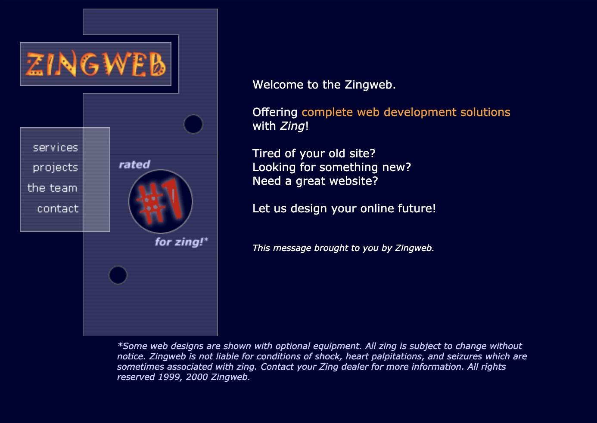]

* webdev since the late 90s
* love building stuff and helping empower people to build their visions of the world
* almost always online
* have been in your shoes


???
* who me? usually don't intro myself as i get to know you **informally around sudikoff**, but remote is more challenging - **please do stop in/ don't be afraid to chat**
* worked in webdev when **perl** was a popular language and **tables were how you did layout**
* **love building stuff and helping empower people to build their visions of the world**
* my  parents were artists - if i wanted a toy, they told me to make it - and i've since realized not everyone has had that experience - out of nothing->something
* been in your shoes - been a student here. loved all my projects classes,  made my best friends for life in projects classes, hated how they were structured, watched teams crash and burn, wanted to create a structure that support and empowers students to build cool things (dali was born out of that). 
* this class and dali were built out of what i wished i had had when i was an undergrad
* i'm here to **help**, i may **not always know the answer** and theres plenty i don't know, but i always have **opinions** and am here to support you as you take what you've learned and build something cool - anything!
* while yes, since i also teach fulsltack - i can help the most with webdev stuff/react based stuff like react-native, don't think your project has to be that, if i dont' know something - i'll try to connect you to someone who does
* my mission for a long time has been to help people have the transformative experience of creating something out of nothing.  and idea->impact


---
name: etc

.medium_small[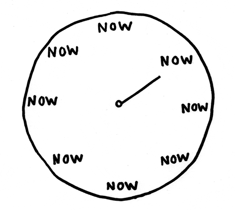]

<!-- * 3B — 4:30-6:20pm -->
<!-- * 3A - Mon 3:30-5:20 and Tues 4:30-6:20, LSC 201 -->
* L - Tuesdays/Thursdays 5-6:50pm ET. 
<!-- * Mondays, discussion/activities -->
* Tuesdays, discussion/activities
* Thursdays, meeting time/sharing
* x-hours, Fridays 6:20-7:10 optional team meeting time

???
* coding together
* activities such as bughunts and testing
* brainstorm and pitch ideas
* inter and intra group collaboration
* in the past we kept time logs - like for for billing purposes not sure if i'll do that this time around


---
name: Online @


.medium[]


* web: [http://cs98.me](http://cs98.me)
* github: [http://github.com/dartmouth-cs98](http://github.com/dartmouth-98)

???

* administrative stuffs
* using github extensively, get comfortable
* previous projects on github and on the website
* open an issue or PR! communicate with me about what you'd like this class to be


---
name: Code

.small[]

* the internet is full of the codes
* `if (cite) { no penalty }`
* `else { mandatory vacation }`

```javascript
// adapted from: http://stackoverflow.com/someurl
// this method does x and y
```

???
* non standard academic honesty disclaimer - if you've taken 52 you've heard this before
* internet full of codes is a good thing - we're all archeologists - glue together pot shards of code
* if copy - just cite it
* sharing is caring (when cited)
* goals is to share your work - have lots of green squares on github
* helps me helps your teammates
* important because maybe there's more reasoning to why something was done some way
  * in industry you want readable code with explanations of why you are doing something - if you copy/paste from stackoverflow - link to it - someone later might thank you - that someone might be you! if there comes along a better answer or that code had bugs for instance


---
name: Slack, Canvas

.small[]

* [https://cs98-dartmouth.slack.com](https://cs98-dartmouth.slack.com)!
* **all** course communication
* each team will have a channel
* download mobile, desktop, web apps
* get used to it
* **canvas** for submitting all assignments
  * even if just a link to github


???
* i don't do email well...
* will send out invites later today
* teams that use slack do better - its true - the bestest (and canvas)
* don't use groupme or texting, if issues come up i can't help
* don't worry about me being in channels - i'm friendly and don't bite - here to help
* honestly don't read unless you @mention me
* and if problems come up later there's history and i'm aware of it
* **less of a prof, more of scrum manager (equally useless?) here to help guide you through an awesome building experience**


---
name: this is git

.fancy.medium_small[]

???
* git feature flow is mandatory
* part of grade is pull requests


---
name: git help

.small[]

* [https://onlywei.github.io/explain-git-with-d3/](https://onlywei.github.io/explain-git-with-d3/)
* [http://www.ndpsoftware.com/git-cheatsheet.html](http://www.ndpsoftware.com/git-cheatsheet.html)

???
* how many people have used pull requests before?  don't worry we'll practice! 


---
name: Project Management

<div class="blockquote-style">
    <video loop autoplay muted class="medium fancy">
    <source src="http://res.cloudinary.com/dali-lab/video/upload/ac_none,w_560,h_315,c_crop/v1546203223/cs98/zenhub-overview.webm" type="video/webm"/>
    <source src="http://res.cloudinary.com/dali-lab/video/upload/ac_none,w_560,h_315,c_crop/v1546203223/cs98/zenhub-overview.mp4" type="video/mp4"/>
    <source src="http://res.cloudinary.com/dali-lab/video/upload/ac_none,w_560,h_315,c_crop/v1546203223/cs98/zenhub-overview.ogv" type="video/ogg"/>
    Your browser does not support HTML5 video tags
    </video>
</div>

* agile workflow - github projects
* similar to Asana/Jira/Basecamp/Trello/ZenHub
* integrated with GitHub - every ticket is an issue
* specific work issues/tickets per person to coordinate work
* mandatory, graded!, **helpful**

???
* how many have used a task tracker such as Jira before? - should be a way to raise your hand in remo

---
name: Grading

.small[]

* Project Milestones — 50%
  * milestone weights will vary
  * late penalty: -12% of milestone per day.
* Weekly Progress: Instructor Checkins + GitHub — 35%
* Attendance/Participation - 15%
* Individual contribution scaling vs Team grade
    * Github pull requests and commits
    * Issue engagement and story points
    * Technical (craft, breadth/depth of work)
    * Team (communication, attendance, team player)
    * Growth (curiosity, rigor, improvement over the term)


???
* grading is somewhat vague at least to start - you get milestones but really its the final product quality that matters - rethinking even using canvas
* your grade my vary based on individual contribution (combined metric effort+feedback+participation+github)
* weekly checkins will start once you have teams
* grumpier in my old age
* "didn't realize that there would be a focus on UX and whether the project was usable"
* **each milestone is a minimum / more what you should be doing during that week - if you do the minimum you probably won't end up with a good project at the end**
* check /check minus / check plus
* again talk to me if things are unclear - but can't get away with slacking
* the question is do you want to graduate having built something cool AND with a good grade?  tell me what you want - if you want to pass and don't care, do tell me, i'll try to help make that painless so we're not fighting

---
name: Survey

<iframe src="https://dalilab.typeform.com/report/fOJUbuwP/Muj6riUJCSJtvPIv"  width="900" height="500" frameBorder="0" ></iframe>

???
* sent out a survey to get a sense of your goals
* good stuff in here
* **a little surprised that making the world a better place wasn't a bit more popular** given how it is all going to shit right now - but we'll have a couple weeks to explore some possibilities here.
* i'll probably rant a bit in the next weeks about how you have the talent to make a real positive impact - so bear with me

---
name: What you want, P1

* excited to get to work and **build something cool**! I want to finally **feel like a real coder**
* would love to **build something very impressive** from the ground up.
* a project which could be eventually built into a **full-scale product** with a company built around it
* build a **deeper understanding/empathy for product**
* make something that can realistically **be used by many people**. **grow** in new coding skills
* mostly just want to be involved in a team of equals working toward a singular goal
* Hope to **build a complete product** I can pitch to VC's
* really want to come up with / **find an idea I love**, then I think the rest will be great.
* think of an idea that allows me to **learn a lot** and that I am passionate about
* work on an idea that I find **meaningful**.
* make something that functions as a **portfolio piece**. come away with a much more polished project

???
* 

---
name: What you want, P2

* I am really excited to take this course. I hope that I can finish the winter with a **project that I am truly proud of**. I think this course could be the single most useful course that I take at the college i**f the work is put in and done right**
* really excited to work with others on a cool project!
* I hope to create something awesome that **helps the world and solves a need**. I want to take this opportunity to **make something special**. I'm excited to have the ability to build something awesome for a college class. I'm hopeful team dynamics and stuff go well and every one carries equal weight.
* I would really love to be able to ship whatever I am working on. I also hope that my project has a **positive and tangible impact** on my users. *My biggest worry going into software development is that I might be working on products that don’t really matter to people (they could live without them) and I love tech because of the opportunity to improve people’s quality of life.*
* **This seems like a daunting task, but I'm up for the challenge!**

???
* 
* 


---
name: What you want is what I want!

.small[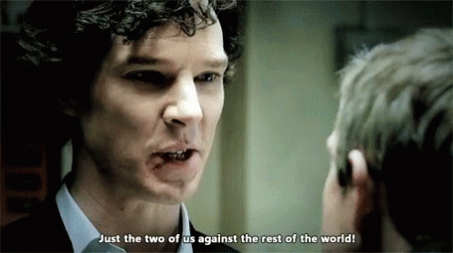]


* Produce something of significance and impact
* Feel empowered to think of an idea and create it into being
* Be engaged and proactive on your project
* Go beyond the minimum milestone guidelines
* Collaborate with your team in a thoughtful and respectful manner
* Enjoy exploration and creation

???
* we're in this together - yes this is a required class - but it can be enjoyable for all of us


---
name: Your Questions/Worries So Far P1


* The remote nature of the course makes me concerned that it will be difficult to get help if needed.
* I'm worried about balancing the time commitment between school while also trying to figure out what to do after graduation
* am worried because I don't have a group and I don't think I'm going to be able to come up with a good/impactful idea
* worried that I won't be passionate about the project I'm placed on or that my vision for its impact won't align with my teams. It would be horrible to spend 6 months on a project that matters little to me or that my groupmates aren't passionate about.
* I'm a little concerned my skills are too narrow
* How will we learn new technologies? Are there any class modules?

???
* i'm very approachable for help, some of the course is about figuring stuff out with your team, but i can help work around things
* this class helps built a great project that you could either turn into your thing after graduation or helps have sharable code that you can talk through with potential employers
* don't worry about having a group - we'll work on ideas and figuring out groups in the first 3.5 weeks :-) 
* hopefully the project/team selection process will help make sure everyone cares - but if you are ever stuck feeling this way, talk to me
* for new technologies we'll spend the next two weeks exploring ideas and tech - you'll do a few short hackathons to brush up on skills and explore things you haven't tried before.

---
name: Your Questions/Worries So Far P2


* in teams of 5 there will necessarily be huge gaps in skill and, as in most group projects, there will be 1-3 people who have to carry most of the workload. I'd like the work to be balanced but also want a quality product (i.e. want the best people working on it) which makes that outcome seem like an inevitability. Curious about what solutions you've developed in the past for free-riders and mismatched skillsets.
* How will these remote terms affect group work and ability to get stuff done?
* I hope being virtual does not effect enthusiasm with projects
* How is a two-term course usually structured?
* Do we pick our groups or are they assigned?


???
* great question - firstly the grade is scaled based on how much work you put in, so while the project might get an A because it was carried by a couple of super dedicated members, a slacker who didn't put in code or effort could get a D. 
* for mismatched skillsets, the best thing is that we have 6 months, and that we'll start off with some hackathons to try to level the playing field.
* ended last year with a term of remote cs98 and it generally worked pretty well, the biggest thing to do is make sure your team meets and works together a lot. 
* i hope so too - virtual is tough - this summer 52 projects (much shorter) were pretty awesome though and people were excited and motivated to work on them.  if you feel unmotivated tell me,  i love sharing my excitement for projects
* first term is learning, defining, making MVP that tests essential functionality
* term 2 is learning from feedback, iterating, polishing, shipping
* groups are formed by pitching ideas and then we form groups around those ideas based on ranking of idea, who you want to work, who you don't want to work with.  


---
name: Project Complexity


.tiny.fancy[]

* What you set out to do and how far you get is considered
* code full system - minimal platforms as a services
* reasonable complexity - server/client/computation


???
* points for stretching
* some data persistance or computation
* some display of said data or computation that is reasonably complex
* it is two terms so you have time to implement something cool!
* reward for challenge - min complexity - but better grade if challenged
* will give feedback: easy - medium - hard levels
* can negotiate - time converts to complexity at some point
* past -> rigor
* 2 terms == lotta f' time


---
name: Commitment

.tiny.fancy[]

* ~15hrs a week (outside of class)
* working together/at the same time is important
* class time (some of which can be coding time)
* the more you put in the more you'll get out in terms of project satisfaction / grade / fame / fortune / impact on the world

???
* figure out what drives you, what is meaningful to you


---
name: thesislyfe -> startuplyfe

.medium_small[]
.medium[]


???
* how many of you have had friends disappear due to doing thesis?
* we are't doing thesis
* buuuut hopefully you'll care abouut enough
* also there is honors available but requires a thesis in addition...
* honestly - the course is designed to be 10-15 hours a week
* if you spend that you'll be happy with the result
* less and your team will eventually be mad at you
* don't need to disappear completely, cause milestones will prevent procrastination


---
name: CS vs Startup

.medium.fancy[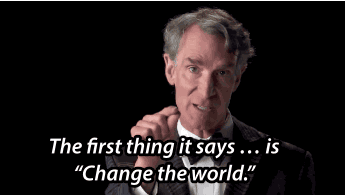]

* What about science?
* What about social entrepreneurship?
* What about **R**esearch?

???
* is this a CS culminating or a startup founding class? 
* it can definitely be more experimental or not have a clear consumer
* but we're humans, so everything is a problem to solve
* if you want to do something algorithmic or a software library or dev tool thats fine, all the steps we take can be made to fit. 
* or a social e-ship project
* but this is NOT a research thesis - if you want hardcore research - do that


---
name: Monies

.medium[]

* some funding available for stuff

???
* hosting
* hardware if necessary
* assets etc
* discounts or credits available
* hindsite story: aws x-large instances racked up 300$ in a day
  * elastic search clsuter tutorial

---
name: Tech Stacks


.large[]
*(remixed from [brianfalls.com](http://brianfalls.com/))*

???
* common question and every developers first dilemma - what tools to use
* (one person on team django but really maybe not best tool) all groups hate it eventually
* how data is stored (persistance)
* how it is served
* how it is displayed
* client - mobile, web, game, IoT etc
* first couple of weeks trying out some different things - warm up


---
name: Potential Stacks

* no BAAS/PAAS allowed
* client-side:
  * web: HTML5, __react__, etc
  * mobile: native, __react-native__, etc
  * desktop: native, __electron__, etc
  * game/vr: __unity3d__, unreal, etc
  * IoT: __arduino__, raspberry pi, wearables, etc
* server-side:
  * __node__, __express__, rails, elixir, __flask__, django*
* hosting:
  * __Heroku__, __Netlify__, AWS, etc
* databases:
  * __MongoDB__, sqlite, RDS, MySQL, Postgres

And much much more

???
* can't use firebase and call it done
* hack-a-thing is exactly so you can play with some
* \*hate
* we're actually gonna learn some shit
* let me know if you want to try some cool hardware - we can try working that out
* bolded are things i like and recommend


---
name: Potential Hardware


<iframe width="560" height="315" src="https://www.youtube.com/embed/H713WDWTUDo?rel=0&amp;showinfo=0" frameborder="0" allow="autoplay; encrypted-media" allowfullscreen></iframe>

  * buttons, eye tracking, vr, cameras, sensors!
  * magic leap, kinect, oculus quest, google cardboard, actual cardboard
  * raspberry Pi IoT kits, haptic gloves
  * iphones for AR

???
* we have some devices available to play with
* not today but if you are interested in any of these slack me

---
name: From Scratch?!?

.medium.fancy[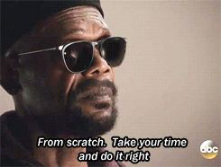]


* from blank terminal to full project
* worktime during most classtime
* can use libraries and frameworks

???
* we have 2 terms to build an awesome thing
* and learn how to do it right
* learning from past experiences so i can help avoid pitfalls from the past
* this will be the best cs98 to date
* starter projects can be helpful but also dangerous, too complex sometimes (eval starter projects)
* having that **experience and confidence that you too** can be a startup founder
* a builder of worlds


---
name: How do we get there?


.medium.fancy[]

* hack-a-things to get us warmed up
* then milestones to guide us
* github to keep us on track

???
* we'll just follow a simple recipe for success - **weekly progress**
* never had a team not have a successful working project
* caveat once a team had last minute breaking changes during demos... broke my heart to see it


---
name: At a glance

* Term 1 (learning, defining, making MVP that tests essential functionality)
    * Week 1: Interviews, Hack-a-thing 1
    * Week 2: Share Papers, Pitch Ideas, Form groups
    * Week 3: Hack-a-thing 2, Define project and scope and technologies
    * Week 4: Mockups, data models, codes started
    * Week 5: Code wired together, rudimentary functionality
    * Week 6: Code reviews
    * Week 7: Focus on critical/testable features
    * Week 8: MVP Demo Celebration
* Term 2  (learning from feedback, iterating, polishing, shipping)

???
* expectations:  you have a working testable thing at the end of t1 that you enjoy working on and are excited to get feedback on. 
* you implemented the core most interesting functionality so you could get feedback on it


---
name: What is at the end?

## Project Demos!

The goal: a project you are super proud of!

### also Fame and Fortune* / a better world

<!-- .left[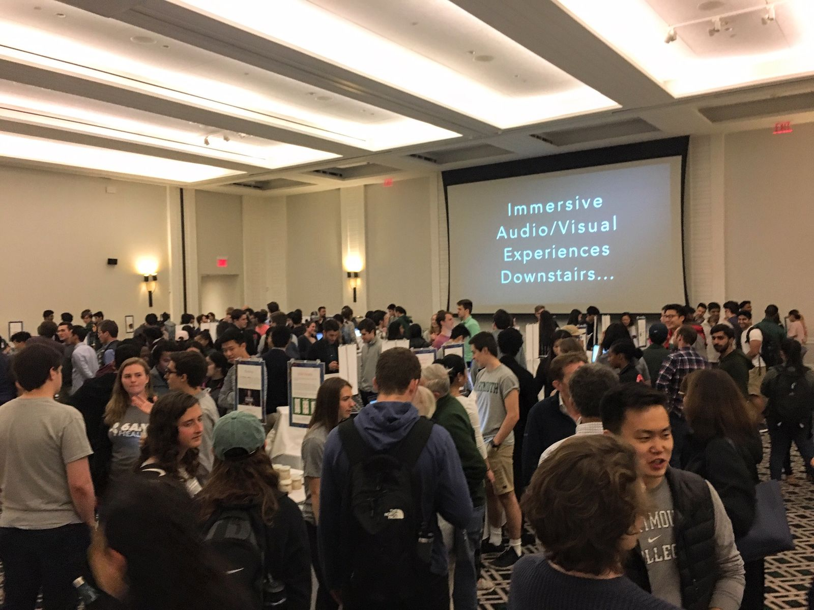] -->
<!-- .right[] -->
.medium_small[]


???
* how many have been to the technigala demos?
* together with DALI, previous 98, some other classes
* 500+ people
* not presentations (science fair style)
* what to work towards
* show off your work!
* invite your friends!
* the goal is for you to be proud of your work
* but you should also want me to be proud of your work
* at the END OF T2!  will ship a glorious product


---
name: Problems to Solve

.small.fancy[]

* Considerations
  * Novelty: explore something new(ish)
  * Impact: bigger than here
  * Format: game, web, mobile, iot, wearable, etc

* There are [lots of fascinating apis](https://www.programmableweb.com/) out there: from beer reviews to machine learning, and vision apis, to fictional datasets. Could you integrate some of these to enhance your idea?

???
* some of you have ideas, don't worry but take a step back and do some more ideating
* Think outside of what is useful to Dartmouth students
* startup advice is wrong - don't always have to solve a problem you yourself face
  * we have all the same problems - finding out events/parties, waiting in line for the pong game, buying stuff
* event apps, social network clones, and marketplaces have been attempted before and you might find it more rewarding to build something that challenges you.
* sometimes can't be solved - event planning for instance - just needs everybody to use the same platform


---
name: Outside the Box?

.small.fancy[]

* if you had half a year to build anything you want?
* why build something boring?

???
* with a team of cool people
* consider improvements on existing things - or games
* Games, could you take some known game and make it a site or mobile app?
* Is there an existing product that you want to clone but with a special take.  Uber for puppies, airbnb for breakfast sandwiches, cryptocurrencies for goldfish?
* Your ideas can be serious, world changing, or completely silly.  The point is to enjoy building something cool.


---
name: Let's See Some Previous Projects


* [http://cs98.me/projects/previous/](http://cs98.me/projects/previous/)
* look through these for inspo!


---
name: The Tale Of Pretty Music Maker


.medium[]

???
* web loop music creator
* a 2 week cs52 project
* regretted their project in 98
* and wished they had worked on something more engaging like prettymusicmaker
* was almost like they were completely different people when they enjoyed the project


---
name: The Tale Of OrderOrchard


.medium[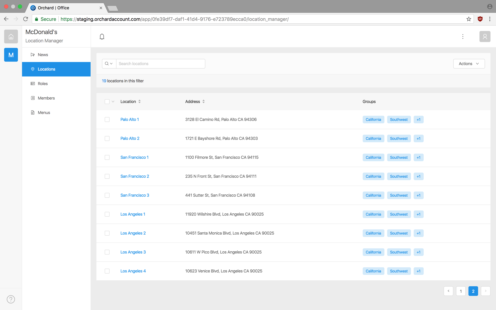]

???
* student project
* kept at it
* initially online food ordering
* but pivoted when they identified a bigger pain point for restaurants
* big enough pain point that they've signed some big customers
* also tale of collegepulse but you're all probably tired of hearing that one
* recently they've had some successes that i'm not allowed to talk about - but suffice to say in 4 years they've done better than they would have as valley engineers and are living the entrepreneurial dream. 
* this isn't an e-ship course, i just want you to have fun building stuff, but cool things can happen


---
name: what is the point?

.medium.fancy[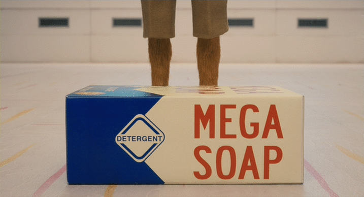]

* build something to solve a problem
* build it to make a better world
* topics: education, wellbeing, accessibility, poverty, health, etc

???
* bit of a soap box issue for me
* you get all this knowledge and amazing experience
* but the point of this education is to also help you care
* care for making a better world
* the existential responsiblity to create the world as you want it to be
* you may feel powerless, but every action you do in the world matters
* i want to try through this class to empower you all to care about what you do and to change the world for the better
* if you want to talk philosophy, i have office hours
* collegepulse wants to solve societal pressures and misconceptions - less people drink and have sex then people might feel pressured into believing

---
name: just breathe

.medium.fancy[]
.medium.fancy[]

???

* You can do it!  Some of the groups in the past had no experience with what they were building
* no kinect or hololens exp, or react-native etc
* you can learn and build a lot in 6 months

---
name: start with: Interviews

* [Interviews Milestone](../projects/milestones/interviews)

.left-small.fancy[]
.right-large.fancy[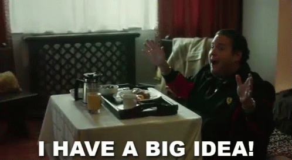]
.right-large.fancy[]


???
* talk to at least 1 person who is not a student
* they can be professor you find inspiring, a mentor, a parent, a co-worker from an internship etc
* ask about a problem or idea for something they would like improved/fixed/made
* record: target audience, what the problem is,  what the proposed solution might look like
* idea is to get our thoughts percolating about ideas that might be outside dartmouth
* who knows prof: Misha Gronas?
* he always has crazy ideas - his last was outsourcing streaming videos of talks/events  
* will send out assignment on canvas
* broader the potential problem space and broaden the technology space as  well thorugh the first couple of weeks of exploration - goal is to be fun


---
name: Inspo

* Start an idea inspiration board.
* **find a cool article or paper on tech/software/cs/problems in the world, that you want to share with the class (for next week)**
* **interview some people (for this week)**

.left[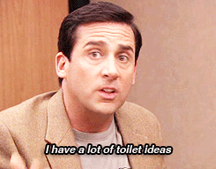]
.right[]


???
* keep track of things you see online that are interesting
* clip pictures / urls / etc
* we'll compile then for an upcoming milestone


---
name: next up: Hack-A-Thing

.medium_small[]

* [Hack-a-thing-1](/projects/milestones/hack-a-thing-1)
  * individually or in pairs
  * choose some technology based on interest
  * find a tutorial or two
  * hack something together
  * plan to spend **10 hours** min learning/exploring


???
* idea is to broaden your horizons
* choose something you'd like to learn
* potentially could be related to an idea you have
  * but don't get tooo attached
* follow a tutorial
* plan to spend at least 10 hours on this
* my favs: unity3d, react, react-native
* plenty of good tutorials out there, if you start one and don't like it you can drop and try out a few small ones etc. 


---
name:

.medium[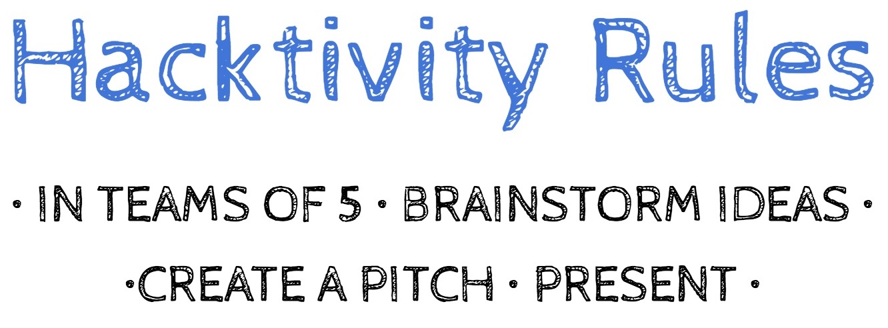]

.left[
* 10 Min - brainstorm
* 20 Min - BUILD a prototype
* 10 Min - Prep Pitches
* 2 Min - Pitch It!
]

.right[
1. spread out to 5 people per table - be brave and move around
1. as a team write down 5 random words in the [figma words page](https://www.figma.com/file/bwTuttjwGi2INJOK7oHxvc/Hacktivity-%231-20F?node-id=0%3A1)
1. swap words with another team
1. brainstorm and create some visuals for a product that ties together the words
1. can be a digital/physical product
1. prep pitch and show it
]

???
