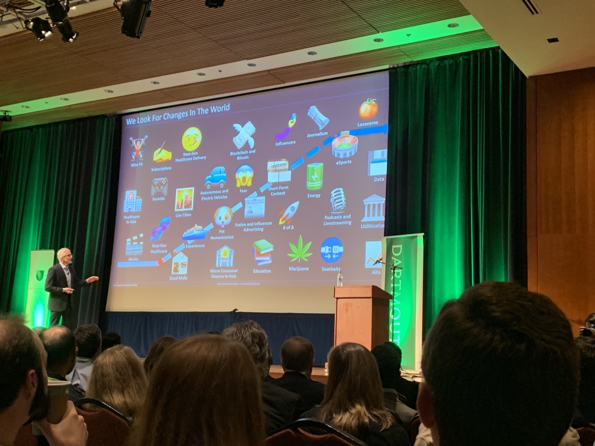
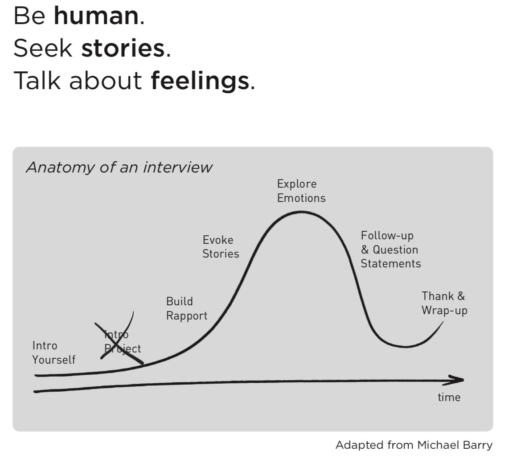
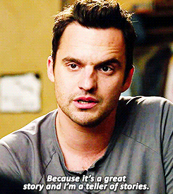
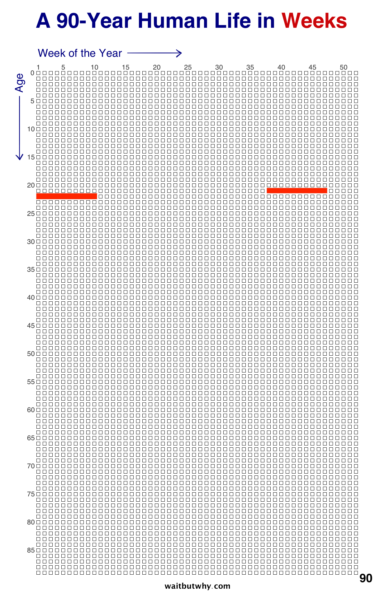
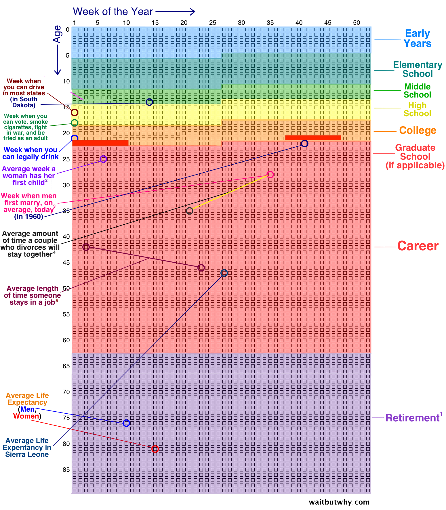
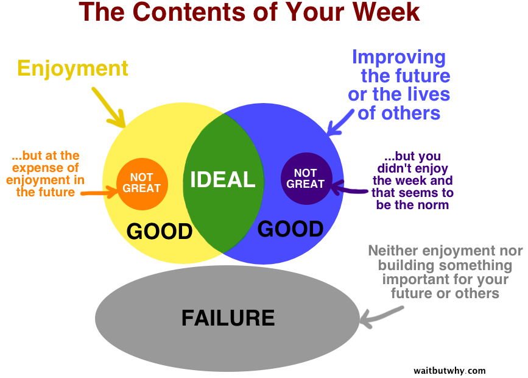

layout: true
class: center, middle
name: pic
background-size: contain

---

layout: true
class: center, top
name: fragment

.title[{{name}}]

---
layout: true
class: center, middle
name: base

.title[{{name}}]

---
name: CS98: Today

* Topics
* Broaden our problem scope
* Hack-a-thing1

???
* today talk about ideas and workshop out some of the interviews
* I generally dislike formal brainstorming - some of you might feel that way too
  - but hopefully this will be fun and fruitful
* goal is to broaden our scope

---
name: Hack-a-thing-1

.fancy.medium[]

* what to hack on?
* anybody started?

???
* anybody choose a thing to hack on?   what?
* anybody need ideas?
* anybody need a partner? 

---
name: Technologies

.fancy.medium_small[]

* hearables
* mobile sensors
* ar/vr
* wearables
* IoT

???
* some thoughts on state of the art
* using our hearing a lot
* marc andreessen 
* hearables
* lots of cool sensors from the stuff on your phone to cheap eeg for brainwaves and heartrate monitors
* some of these are harder than others to work with during remote times, but sensors or hearing tech might still be workable

---
name: WTF hearable?

.fancy.medium[]

* has additional sensors
* hearing or comprehension enhancement
* various assistants

???
* hearing is just as valuable an input
* i listen to audiobooks a lot - while walking or driving especially - crank through a book a week, hate modulating what i'm listening to based on context - my headphones try?
* anyway - audio interactions - predicted to be big
* stigma of talking to oneself / hearing aid though is a thing to combat
* close to brain - eeg?
* not sure how to build off of this - prototyping something larger

---
name: AR/VR
<iframe width="660" height="415" src="https://www.youtube.com/embed/dO1NpT2SSX4?start=7" frameborder="0" allow="accelerometer; autoplay; encrypted-media; gyroscope; picture-in-picture" allowfullscreen></iframe>

* shared worlds
* collaborative vs combative
* before pokemon go came ingress

???
* niantic is doing some cool stuff - i emailed them asking about access to platform maybe 
* before pokemon go they had a game called ingress
* sent people on missions to take pictures of landmarks
* used that for pokemon go
* now they have all the walking paths that exist in the world... what will they do with that? 
* also an interesting technique - crowdsourcing the data you need by providing rewards for it

---
name: AR/VR

<iframe width="660" height="415" src="https://www.youtube.com/embed/aPWkmLJmVKA?start=21" frameborder="0" allow="accelerometer; autoplay; encrypted-media; gyroscope; picture-in-picture" allowfullscreen></iframe>

<!-- 
name: Spatial Computing?

stoopid magic leap

<iframe width="560" height="315" src="https://www.youtube.com/embed/HD9jeo9M8vo?rel=0&amp;showinfo=0" frameborder="0" allow="autoplay; encrypted-media" allowfullscreen></iframe>

* lots of work left to do -->

---
name: VR

<iframe width="560" height="315" src="https://www.youtube.com/embed/H713WDWTUDo?rel=0&amp;showinfo=0" frameborder="0" allow="autoplay; encrypted-media" allowfullscreen></iframe>

* can be more than just people wearing headsets

???
* mixed reality mini golf?
* mixed reality escape the room?

---
name: VR

<iframe width="760" height="515" src="https://www.youtube.com/embed/WeVJIuyJq08?vq=hd1080" frameborder="0" allow="accelerometer; autoplay; encrypted-media; gyroscope; picture-in-picture" allowfullscreen></iframe>

???
* not sure what the killer app here is
* but this is a beautiful realtime demo from unity
* imagine a study space / vr office though - where would it be? would it have a table? 
* studies show that context to where you remember things is important in helping recall / put you in the right mood

---
name: change in the nature of change

[.fancy.large[]](https://www.youtube.com/embed/AwXzt2CV7is?start=230)

* Jim Coulter ’82 Founding Partner and Co-CEO, TPG Capital

???
* last year went to a cool talk from this alum
* he talked about how they look for industries where there was a bunch of change happening - in particular change that was maybe slowing but not decided
* but he's looking for good investments not necessarily things to fix that are broken
* https://www.youtube.com/embed/AwXzt2CV7is?start=230

---
name: distributed economies

.medium[]

* example: education
  * ancient Greece (plato/socrates)
  * dark ages (celibate living in monastery)
  * medieval Europe (tutors living in home)
  * 18th century (oxford or apprenticeships)
  * 19th century (assembly line education)
  * Now 21st century - what are we doing better?

???
* industries disrupted by the distributed economy
* healthcare: not monolithic hospitals -> distributed care
* computing:  not mainframe or even personal computer -> but distributed devices
* shopping:  many online stores or at least sellers
* experiences:  not tour agencies but individuals via airbnb
* education: not industrial buildings with thousands of students ->  supplemental materials 
* media:  not blockbuster or cable, many streaming services
* this enables a few things ->  distributed solutions are easier!
* you don't need a ton of money to build a factory floor -> you can solve smaller problems -> this is cascading - increasing the speed of innovation

---
name: Some Broad Topics

.fancy.small[]

* education
* games
* behavior change (health, happiness, security)
* mobile sensors
* opensource

???
* do we think education is optimal?
* queue soap box - turns out giving students a giant textbook to read and talking at them for an hour isn't the way the brain works.  we are amazing learners - you learn language mostly just by listening - an infants brain learns phonemes and words by analyzing the distribution of sounds. probabilistic statistical learning
* pre-tty _ ba-by (transitional probabilities, that a syllable will occur given a previous) oral speach has no real boundaries
* we do this automatically.
* at 11 months old babies can distinguish grammatical from non-grammatical sentences

---
name: Find and Share Topics

.small[]

* Next assignment: find and share an interesting paper or article
* can be about tech or problems in the world
* will present these next week
* feel free to post in slack `#inspiration` as you go

???
* this is just a little starter
* find more and post them
* then next week we'll share them out - will send more info about this later

---
name: Interviews

.medium_small[]

* [Interviews Milestone](../projects/milestones/interviews)

???
* another way we'll gather more inputs is via the interviews assignmnet
* when you interview - come prepared with some canned questions
* ones i like are around what are some things you hate?  how about annoying?
* Don’t suggest answers to your questions: Even if they
pause before answering,
* Don’t be afraid of silence: Often if you allow there to be
silence, a person will reflect on what they’ve just said
and say something deeper.
* Be aware of nonverbal cues: Consider body language
and emotions. this can show points of weakness to attack. I mean shows an affect that might be helpful, is this awkward for them? do they want to say more? 

---
name: Stories

.fancy.tiny[]

* What are we but a collection of stories that we tell?
* What is the problem?
* Story hook / why it matters?

???
* but why is story important?
* what are we but a collection of stories that we tell?  real deep.
* at this stage you are trying to find peoples stories
* but soon you'll build a story of your product that you'll pitch
* and it'll be based on a story of the problem you are solving
* i love telling stories

---
name: Stories -> Pitches

.fancy.medium[]

* choose initial started ideas via pitching
* the story of what your product does

???

---
name: Project Teams

.fancy.medium[]

* more teams+ideas next week
* based on idea pitches + friendship + foeship
* more discussion about tech and problems

???
* working with friends can be great
* or not
* your preferences
* but working on theme/idea you like more important

---
name: Ideas

.fancy.medium[]

???
* hard to generate
* hence we'll take a little time on this, gather more input first

---
name: Some Inspiration Sources

* https://80000hours.org/career-guide/world-problems/
* https://80000hours.org/problem-profiles/#potentially_promising
* http://www.ycombinator.com/resources/
* https://www.startupschool.org/library
* http://www.paulgraham.com/startupideas.html
* https://www.producthunt.com
* https://www.ycombinator.com/rfs/
* https://www.npr.org/podcasts/510313/how-i-built-this
* https://dribbble.com/
* http://abc.go.com/shows/shark-tank

???
* how i built this is a cool interview series
* anybody listen to it?
* world problems
* how to think about problems and scale

<!-- name: QUICK BREAK

.fancy.medium[] -->

---
name: Choose your own adventure

.fancy.medium[]

* https://waitbutwhy.com/2014/05/life-weeks.html

???
* tools to visualize your life
* blog by tim urban 
* this is cs98

---
name: Choose your own adventure

.fancy.small[]

???
* how about in weeks? 
* all this is to say that we're spending a decent amount of time together
* lets make the best of it

---
name: Choose your own adventure

.fancy.medium_small[]

???
* transitioning into a new phase 

---
name: Build Things That Matter

.medium[]

???
* another image from the same waitbywhy blog - a lot has been written about what makes a good life
* this guy summarizes it:  working to improve the future or the lives of others is what makes for a good week. 
*  with or without this class - you have the tools to make an impact
* **hopefully in the upcoming weeks we spend together we can have all good weeks, improving the future for ourselves, each other, and maybe even the world**

---
name: Software Solutions @scale

* Challenges:
  * WhatsApp: "irresponsible and explosive messages"
  * Facebook: please regulate us before we hurt someone, nvm all your clicks are belong to us
  * Slack: noise over knowledge
  * Attention Economy: competing for your attention with garbage, selling your time and data for what?
* Many Opportunities:
  * resource sharing
  * health
  * education
  * society

???
* as soon as you start thinking in terms of scale - everything gets more interesting, more opportunities and challenges
* when you set out to build a platform that lets you rate your friends (fb) or send messages to groups (whatsapp)- you think you're doing a good thing, but at scale lots more issues to consider.
* **whatsapp** - theoretically brings people together - but also promotes mob killings.
* **facebook** - zuckerberg in the congressional hearings last year asked for new laws, but has since dug in on freedom of expression and allowing political advertising on the platform
* **slack**: productivity tool but also makes people feel productive when they are asking and answering questions that should have been documented better - millions of hours of productivity lost - people spending online instead of with their families
* be mindful 
    * **lots of industries where scale will bring change**
    * health - small monitoring and motivation improvements can extend lifespans, increase happiness
    * society - bringing people actually closer rather than dividing them - maybe VR

---
name: In Class Interviews!

.medium_small[]

* [Interviews Milestone](/projects/milestones/interviews)
* interview someone you don't know well (paired)
* tell stories, stir the pot, get inspired
* talk about things you hate, ideas you have, cool technologies you want to try or have tried
* 15 min or so then switch

???
* this will help find an interview partner, or you can use student interview as your second interview
* idea is to STIR THE POT, inject some randomness into our thinking
* i'm happy to talk about some big topic problems i see that need solving
  * homelessness
  * universal income
  * education

---
name: Coming Next

* Tues: Share out Interviews/ Hacks
* Thurs: Share out interesting papers
