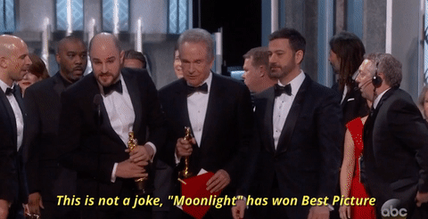
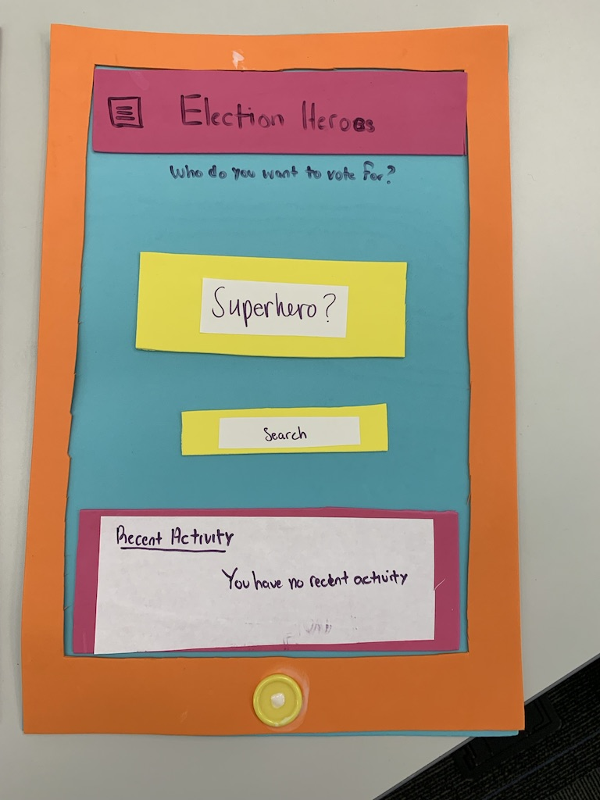
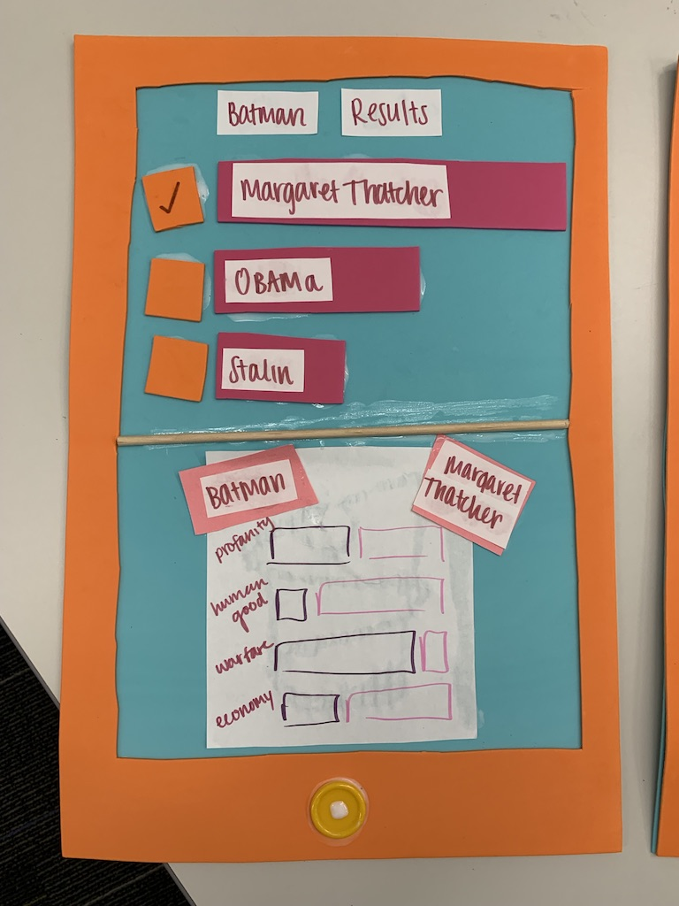

layout: true
class: center, middle
name: pic
background-size: contain

---

layout: true
class: center, top
name: fragment

.title[{{name}}]

---
layout: true
class: center, middle
name: base

.title[{{name}}]

---
name: CS98: Today

<!-- * ### Part 1) Project Sharing (next door)
* ask questions
* give feedback
* eat cookies
* ### Part 2) Interview
* gather back here for rest of class -->

* notion for class
* share hackathings
* discuss interviews

???
* first question - how many people would like to have a second freeform hackathing for next week  - or should we do project idea pitches starting next week
* looks like starting pitches next week!  will post how to create pitch slides
* for notion - let's use this to supplement any sharing in class - so we'll post activities in here
* also make yourself exist in the class directory - even if you think you have your team all set, still good to get to know some of your classmates - we'll use that database in the projects database as well.
* might just port the entire class website over to notion for simplicity.

---
name:  Speed Hack Sharing

* 8 minute random pairings to share what you built with someone. 
* share screen and just talk about it informally
    * what you liked
    * what you didn't
    * what you got stuck on, etc

???
* also don't forget to post on the notion what you did so people can explore it a little and ask questions

---
name: Interview Hacktivity 

<!-- ## Sit at tables in groups of ~5
* don't sit with your Interview partner if you had one!
* mix it up and try not to sit with friends! -->

* 5 people per team
* share your interviews with each other
* make a small figma prototype
    * can upload paper sketches to figma if easier 

---
name: Story Time - 30 min

.fancy.medium[]

* at your table, tell each other your interview **story**
* embellishment is ok
* share and discuss your HowMightWe's
* as a table choose a story/HMW you'd like to do a deeper dive on today

???
* lets create 5 person or so tables -  sit at a different table from your interview partner
* 30 minutes to do this

---
name: Deeper Take

.fancy.medium[]

* Discuss the chosen idea as a team
* Hear from everybody to identify:
  * **platform** (vr, product, mobile, web, text, etc)
  * **topic/problem statement** (hmw from interviews)
  * **audience** (4 year olds with missing teeth, single parents, stressed teens, mail delivery people in their 70s)

???
* oh god not another activity!
* platform like Vr
* topics: like healthcare, problem
* audience: like kindergartners, or  stressed  parents, etc

<!-- 
name: Mix em up

.fancy.medium[]

* 10 MIN:
  * choose 2 sets of 4
  * brainstorm on how to solve the set
* 10 MIN:
  * then as table discuss options and consolidate on 1 idea

???
* idea here is to just insert a bit of randomness, stochastic hill climbing - just in case one of these ideas can be improved a bit with some lateral thinking.
 -->

---
name: Identify and Sketch Features

.fancy.left[]
.fancy.right[]

 
* figma in [Interview Hacktivity](https://www.figma.com/files/project/15348186/Interview-Hacktivity) project.
 
* Name your file after your breakout room number.

<!-- * use digital tools like [Figma](https://www.figma.com)
* or paper or foam! -->

???

---
name: Identify and Sketch Features

* split up your idea into main features
  * collaboratively build it
  * paper -> scan photos (Scannable App) || [Figma](https://www.figma.com)
  * show user flows
* prep a **short pitch**
  * problem statement /**story**
  * who is it for?
  * what is your special insight
* pitch it at end of class

???

---
name: next class: Share A Paper

.small[]

* For Thurs: find and share an interesting paper or article
    * can be about tech or problems in the world
    * add a couple of slides about it the google slide deck on canvas
* next Tues: Pitches Start!
* and then: Team Formation!

???
* this is just a little starter
* find more and post them
* add slides to shared slide deck on canvas
