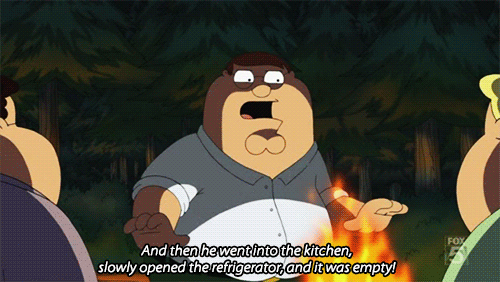

layout: true
class: center, middle
name: pic
background-size: contain

---

layout: true
class: center, top
name: fragment

.title[{{name}}]

---
layout: true
class: center, middle
name: base

.title[{{name}}]

---
name: Today

## sit with your Interview partner if you had one!

---
name: Today

<iframe width="600" height="400" src="https://www.youtube.com/embed/J-GVd_HLlps?rel=0&amp;showinfo=0" frameborder="0" allowfullscreen></iframe>

* Interviews
* Thoughts on pitching
* Ideas++

???
* today talk about pitching ideas and do a idea workshop thing
* I generally dislike formal brainstorming - some of you might feel that way too
  - but hopefully this will be fun and fruitful

---
name: Hack-a-thing-1

<iframe src="https://giphy.com/embed/tQ8uT9t0uK92M" width="480" height="270" frameBorder="0" class="giphy-embed" allowFullScreen></iframe>

* is coming along?

???
* anybody choose a thing to hack on?   what?

---
name: Stories

<iframe src="https://giphy.com/embed/IoQETeY2ue5bi" width="308" height="360" frameBorder="0" class="giphy-embed" allowFullScreen></iframe>

* What are we but a collection of stories that we tell?

* oorrr What is the problem?
  * Story hook / why it matters?

???
* but why is story important?
* what are we but a collection of stories that we tell?  real deep.
* if you ever want story time in class just ask me something
* and then:
* What are you doing / your solution?
* How are you special?

---
name: Ok but like, why?

<iframe src="https://giphy.com/embed/113udJYmASs3qE" width="480" height="282" frameBorder="0" class="giphy-embed" allowFullScreen></iframe>

* generally useful
* for class will be part of how we choose projects

???
* get roommate to cleanup
* go on a date
* get a job
* anytime present what you care about

* last term we had a pitching activity
* where people pitched their favorite food and then we got that food later in term
* we can do that or move on to an ideation workshop?

---
name: Project Teams

.fancy.medium[]

* more teams+ideas next week
* based on ideas + friendship + foeship
* pitching sesh on Tuesday!

???
* more relevant to this class - how to settle on your initial idea
* working with friends can be great
* or not
* your preferences
* but working on idea you like more important
* how to get people to work on your idea?  stories

---
name: Ideas

.fancy.medium[]

???
* hard to generate
* today we'll do some brainstorming
* today will be different
* queue smoke machine

---
name: Some Inspiration Sources

* http://www.ycombinator.com/resources/
* https://www.startupschool.org/
* http://www.paulgraham.com/startupideas.html
* https://www.ycombinator.com/rfs/
* https://www.npr.org/podcasts/510313/how-i-built-this
* https://dribbble.com/
* http://abc.go.com/shows/shark-tank

???
* how i built this is a cool interview series
* anybody listen to it?
* if at the end of class you in a place where you want to apply to ycombinator - that is ultimate stretch goal

---
name: Practice Story Telling

.fancy.medium[]

* at your table, tell each other your interview **story**
* embellish as needed
* parse out:
  * what is the problem
  * who is the audience
  * what would be a delivery mechanism/platform for a potential solution?
* select best story from your table to share

???
* lets practice in tables -  sit at the same table as your interview partner
* 15 minutes to do this - then we'll share out one story from each table to class

---
name: QUICK BREAK

.fancy.medium[]

---
name: Idea-tivity!

.fancy.medium[]

* Write down:
  * **1 platform** (vr, product, mobile, web, text, etc)
  * **1 topic/problem** (from interviews)
  * **1 audience** (4 year olds with missing teeth, single parents, stressed teens, mail delivery people in their 70s)
  * **1 animal** (kittens, lions, etc)
* on separate cards
* put in trays up front

???
* oh god not another activity!
* platform like Vr
* topics: like healthcare, problem
* audience: like kindergartners, or married stressed  parents, etc

---
name: Mix em up

.fancy.medium[]

* 5 MIN:
  * choose 1 set of 4 per 2 person team
  * brainstorm on how to solve the set
* 5 MIN:
  * then as table discuss options and choose 1 set of 4
  * allowed to swap 1 word

---
name: Identify and Sketch Features - 30MIN

* split up your idea into main features
  * collaboratively build it
  * show user flows
* prep a **short pitch deck**
  * problem statement /story
  * who is it for?
  * share some thoughts on your solution
  * what is your special insight?

???

---
name: Pitch It!
