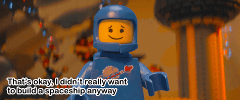

layout: true
class: center, middle
name: pic
background-size: contain

---

layout: true
class: center, top
name: fragment

.title[{{name}}]

---
layout: true
class: center, middle
name: base

.title[{{name}}]

---
name: CS98 Teams

.medium.fancy[]

???
* teams have been formed - lots of complex spreadsheets 

---
name: What is it we are building?!

.medium.fancy[]

<!-- .medium.fancy[] -->

???
* refining our plans!

---
name: Team Meeting

.medium.fancy[]

???
* get to know your team
* compare ideas and thoughts
* write a team contract - how you'll resolve conflicts etc
* do a little bit more research into the idea - talk to me

---
name: Seed Idea

.medium.fancy[]

???
* the point today and over the weekend when you get a chance to meet - sunday night
* work on the idea today, ask yourselves the existential question
* can you create the meaning you want to see in the world?

---
name: Don't be afraid to

.medium.fancy[]

???
* the point today and over the weekend when you get a chance to meet - sunday night
* work on the idea today, ask yourselves the existential question
* can you create the meaning you want to see in the world?

---
name: TODOs:

* 1: [First Team Meeting Worksheet](../../projects/milestones/first-meeting)
* 2: [Group Dynamics Worksheet](../../projects/milestones/group-dynamics-worksheet)
* next: [State of the Art Research](../../projects/milestones/project-research)

???
* get to know your team
* compare ideas and thoughts
* write a team contract - how you'll resolve conflicts etc
* do a little bit more research into the idea - talk to me

