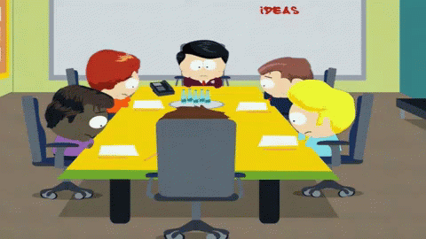

layout: true
class: center, middle
name: pic
background-size: contain

---

layout: true
class: center, top
name: fragment

.title[{{name}}]

---
layout: true
class: center, middle
name: base

.title[{{name}}]

---
name: What is it we are building?!

.medium.fancy[]

<!-- .medium.fancy[] -->

???
* refining our plans!
* OH late penalty for assignments -.5% at my discretion

---
name: ~~Buddy Teams~~

.medium.fancy[]

* no more ~~buddy teams~~
* just ~~plain ol' buddies~~
* actually QA/user personas
* not for today, but next week

???
* buddy teams weren't super helpful but we'll have tester

---
name: User Personas and Stories

.medium.fancy[]

* short and sweet
* have names
* have personalities
* have needs
* inform the features we want

???
* how many of you have used user personas / stories before?
* user stories and personas
* commonly used in industry to determine feature_spec
* will lead us to a list of features
* you can label primary / secondary

---
name: Purpose

.medium_small.fancy[]

* what do people want from your product
* who are the **stakeholders** / value prop
* what are their limitations
* what is in it for "me"?

???

* purpose is to get to know the produce from a users perspective - what do people want from it
* this exercise will help you figure some of that
* often teams have important realizations
* things like limitations of the target audience, children who can't read yet,  the value props for the various stakeholders, what is in it for them, what reward systems can you put in place to get higher engagement?
* stakeholders could include: investors, founders, end users, admins, the scientific community
* there are always stakeholders - people who would care about what you are building

---
name: Today

.medium_small.fancy[]

* share your ideas / short storytime
    1. what is the problem
    1. who benefits
    1. challenges
* then get started on [http://cs98.me/projects/milestones/user-personas](http://cs98.me/projects/milestones/user-personas)

???

<!-- ---
name: Acting-out Session

.small[]
.small[]

* Introduction to who
* Set the scene for how/when
* Have prompts / act out user interaction
* Ask questions! (how will this, why do you, etc)

???
* why moriarty? -->
