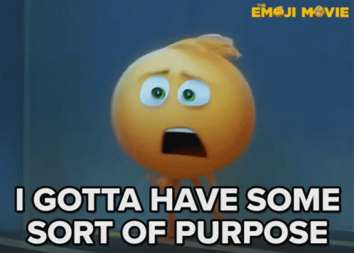
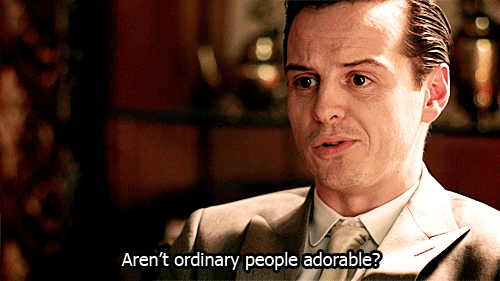
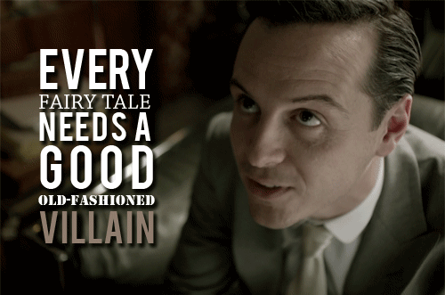

layout: true
class: center, middle
name: pic
background-size: contain

---

layout: true
class: center, top
name: fragment

.title[{{name}}]

---
layout: true
class: center, middle
name: base

.title[{{name}}]

---
name: CS98 - This Week!

.medium.fancy[]

* Mon, Thurs:
  1. User Personas
  1. Project Proposal
  1. Feature Spec -> ZenHub
  1. (getting started on sketches)

* Thurs-Next Tues:
  1. Mockups and Data Models
  1. Scaffolding!

???
* refining our plans!
* don't worry, we'll crank through these

<!-- name: ~~Buddy Teams~~

.medium.fancy[]

* no more ~~buddy teams~~
* just ~~plain ol' buddies~~
* actually QA/user personas
* not for today, but next week

???
* buddy teams weren't super helpful but we'll have tester
 -->

---
name: User Personas and Stories

.medium.fancy[]

* short and sweet
* have nicknames/gamertags/trailname
* have personalities
* have needs
* inform the features we want

???
* how many of you have used user personas / stories before?
* user stories and personas
* commonly used in industry to determine feature_spec
* will lead us to a list of features
* you can label primary / secondary
* use memorable nick names related to their usage of the product - theResistance,  think gamer username/tags/trailnames 

---
name: Purpose

.medium_small.fancy[]

* what do people want from your product
* who are the **stakeholders** / value prop
* what are their limitations
* what is in it for "me"?

???

* purpose is to get to know the produce from a users perspective - what do people want from it
* often teams have important realizations
* things like limitations of the target audience, children who can't read yet,  the value props for the various stakeholders, what is in it for them, what reward systems can you put in place to get higher engagement?
* stakeholders could include: investors, founders, end users, admins, the scientific community
* there are always stakeholders - people who would care about what you are building

---
name: Persona Deets

  * _Nickname_
  * _Demographics_
  * _Overheard quote_
  * _Narrative_
  * _Goals and Motivations_
  * _Tasks_
  * _Pain Points, Concerns, and Challenges_
  * _User Flow_

???
* __Nickname__ 
  *forget real names, pick a caricature nickname that is memorable*
* __Demographics__ 
  *relates to your target audience*
* __Overheard quote__
  *a complaint or use case of why this product is for them*
* __Goals and Motivations:__
  *(goals should directly relate to product/service,*
  *what are they trying to accomplish)*
* __Tasks:__
  *(break goals down into tasks — what does the user need to do to accomplish a particular goal)*
* __Pain Points, Concerns, and Challenges:__
  *(what are they worried about? what do they have trouble with?)*
* __User Flow__
  *(describe a typical scenario of the user interacting with your product – this is a short ordered list of actions)*

---
name: Channel/Adopt

.medium[]

* 1 persona per team member

???
* create 1 persona per person on your team - then assign yourselves to one
* you'll be responsible for channeling that persona during team meetings and when prioritizing features
* why does grandma need sorting profiles alphabetically - she doesn't give a shit about that feature, what she wants is the meme feed

---
name: Today

.medium_small.fancy[]

* create some personas! (1 per teammember) [http://cs98.me/projects/milestones/user-personas](http://cs98.me/projects/milestones/user-personas)
* then: 
  1. [project proposal](http://cs98.me/projects/milestones/project-proposal)
  1. [feature spec](http://cs98.me/projects/milestones/feature-spec)
  1. [designs](http://cs98.me/projects/milestones/mockups-models)!

???

<!-- ---
name: Acting-out Session

.small[]
.small[]

* Introduction to who
* Set the scene for how/when
* Have prompts / act out user interaction
* Ask questions! (how will this, why do you, etc)

???
* why moriarty? -->
