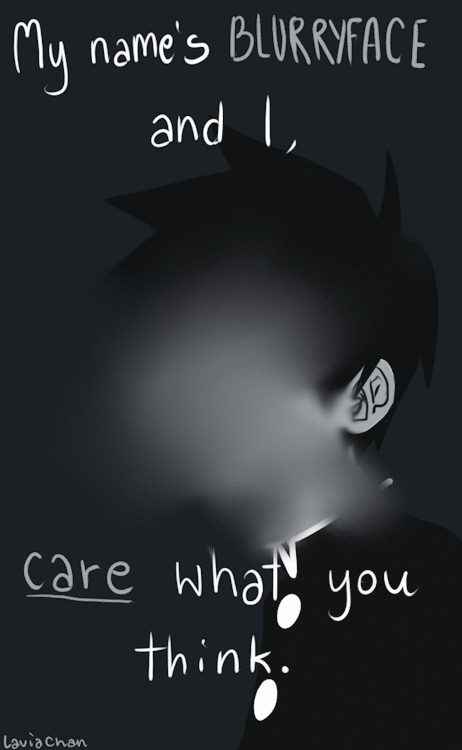

layout: true
class: center, middle
name: pic
background-size: contain

---

layout: true
class: center, top
name: fragment

.title[{{name}}]

---
layout: true
class: center, middle
name: base

.title[{{name}}]

---
name: Design Feedback

.fancy.medium[]

---
name: Design Feedback

.fancy.medium_small[]

???
*

---
name: Heart

.fancy.medium_small[]

???
* the biggest success predictor is caring
* if you care - then you think about the project
* if you care - then you are mentally engaged
* if you care - then you can change the world

---
name: Heart

.fancy.medium_small[]

???
* also care about what your buddy teams user persona actors think?

---
name: Heart

.fancy.medium[]

???
* also care about what your buddy teams user persona actors think?
* also - onboarding flow

---
name: In Buddy Teams

.fancy.medium[]

* walk through your figma/sketches/flow designs
* after some discussion, ask questions
* each buddy needs to provide >=2 constructive comments
    * as figma comments or github issues
    * try to formulate your comments from the perspective of your persona!
    * submit links on canvas (link to figma, or individual github issue)

???
*

---
name: NEXT Scaffolding

.fancy.medium[]

* initial code scaffolding
* tools and frameworks chosen
* team has local dev environment set up

???
* Thursday
* Initial code scaffolding started
* component plan
* tools and frameworks chosen
* everybody has local dev environment set up
