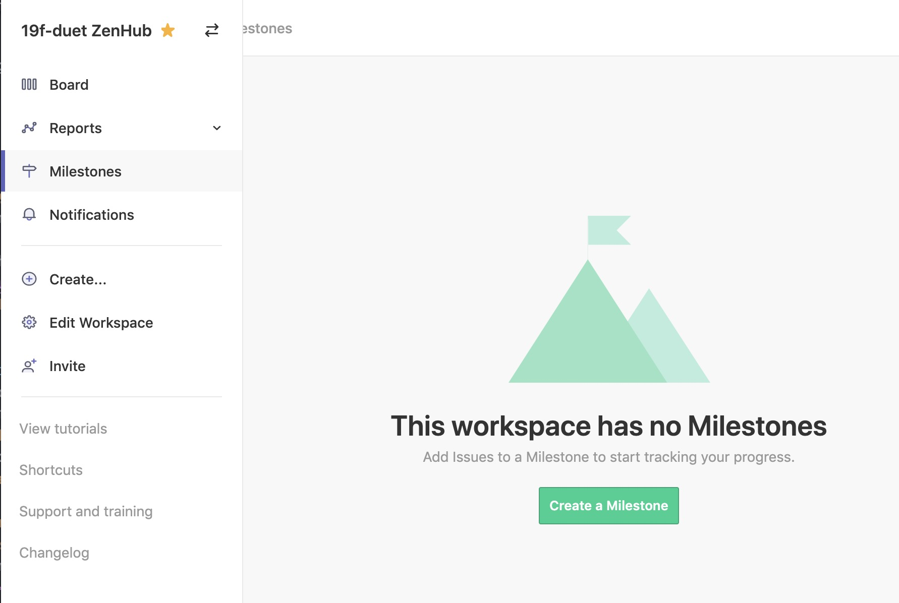
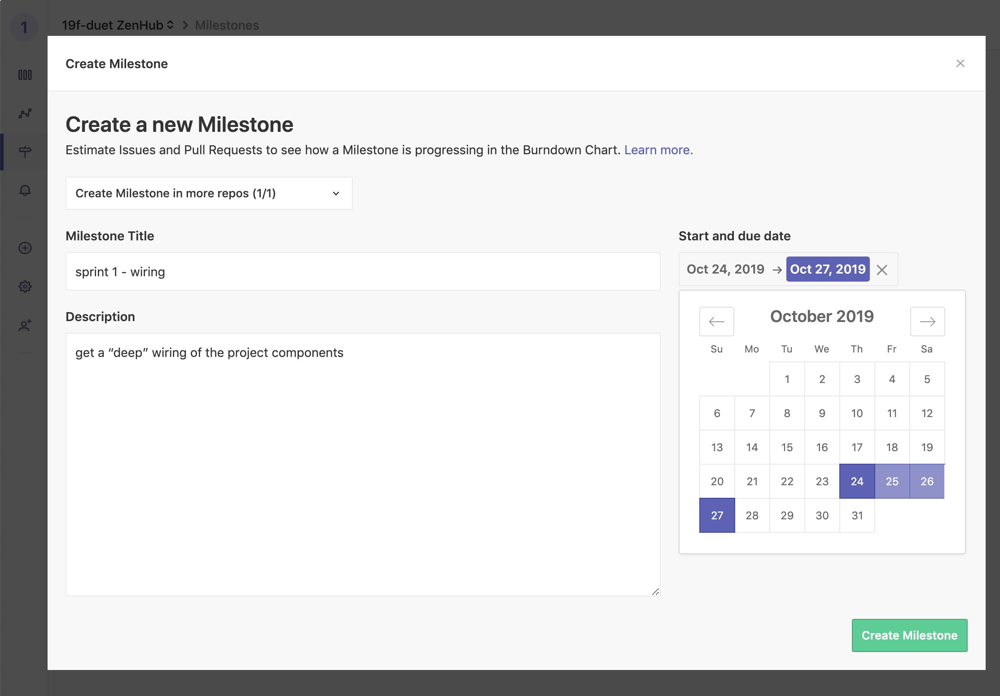
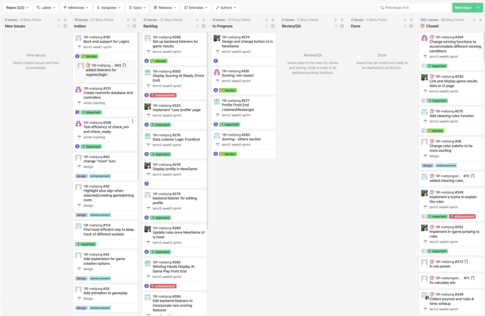
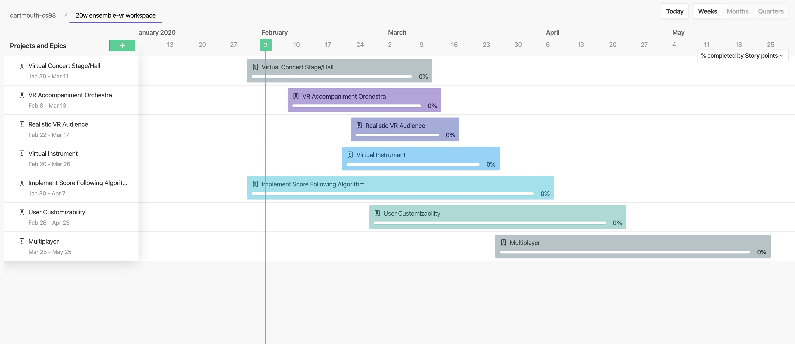
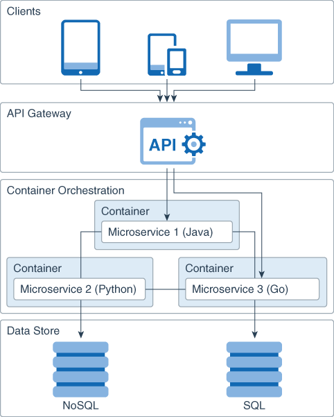
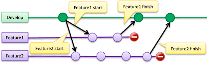

layout: true
class: center, middle
name: pic
background-size: contain

---

layout: true
class: center, top
name: fragment

.title[{{name}}]

---
layout: true
class: center, middle
name: base

.title[{{name}}]

---
name: Planning our first sprint

.fancy.small[]

* Sprint retrospectives are due every Monday night
* Idea for this first one is to connect your components (client <-> server <-> db)

???
*

---
name: Sprint Retrospectives Every Week

* Sprint #_ Retrospective: 
    * members in attendance:
        

        - [x] Jasmine
        - [ ] Alladin
    * what worked well
        * we made progress
    * what didn't
        * we didn't make much progress
    * self assessment on progress
        * how is your progress? 
        * tentative plan for upcoming weeks
          * current week: goals
          * week #: goals
          * week #: goals, etc
    * briefly summarize any other topics/discussions

---
name: Create a Milestone

.fancy.left[]
.fancy.right[]

???
* milestones are by time - weeks
* epics are by subject - features

---
name: Rake Your ZenHub Garden 🌻

1. **Create a new sprint milestone**
1. **New Bugs**
1. **Enter Feedback**
1. **Update Epics/Roadmap**
1. **New Subtasks**
    * create new issues
    * label them
    * assign a time estimate
1.  **Process All Issues**
    * **Later** *(Icebox)*
    * **Next** *(Backlog)*
    * **In Progress**
    * no unsorted **Unsorted** *(New Issues)*.
    * update time estimates
1. **Assign Subtasks**

???
* i know there's a lot of text in the milestone... but its not rocket science - you just have to maintain a current sprint and issues that are sorted
* as the week goes you can add issues into the new issues pile and wait until the retrospective to sort them out
* each subtask is one code session or thereabouts
* using milestones will give you a way to group your weekly tasks even when the are just parts of epics - remember epics are for long feature - milestones group tasks by week - so you can see the progress you are making 

---
name: Your Zenhub Board

???

---
name: Your Epics

???

---
name: Scaffolding

.fancy.left[]
.fancy.right[]

.right[
* readme.md
* starter code for every part of project
* hello world from client, server, etc
* github pull request flow -> zenhub issue
]

???
* due thurs

---
name: Deep Wiring

.fancy.left[]
.fancy.right[]

???
* connect database to server to client
* try out some difficult component
* deep connection