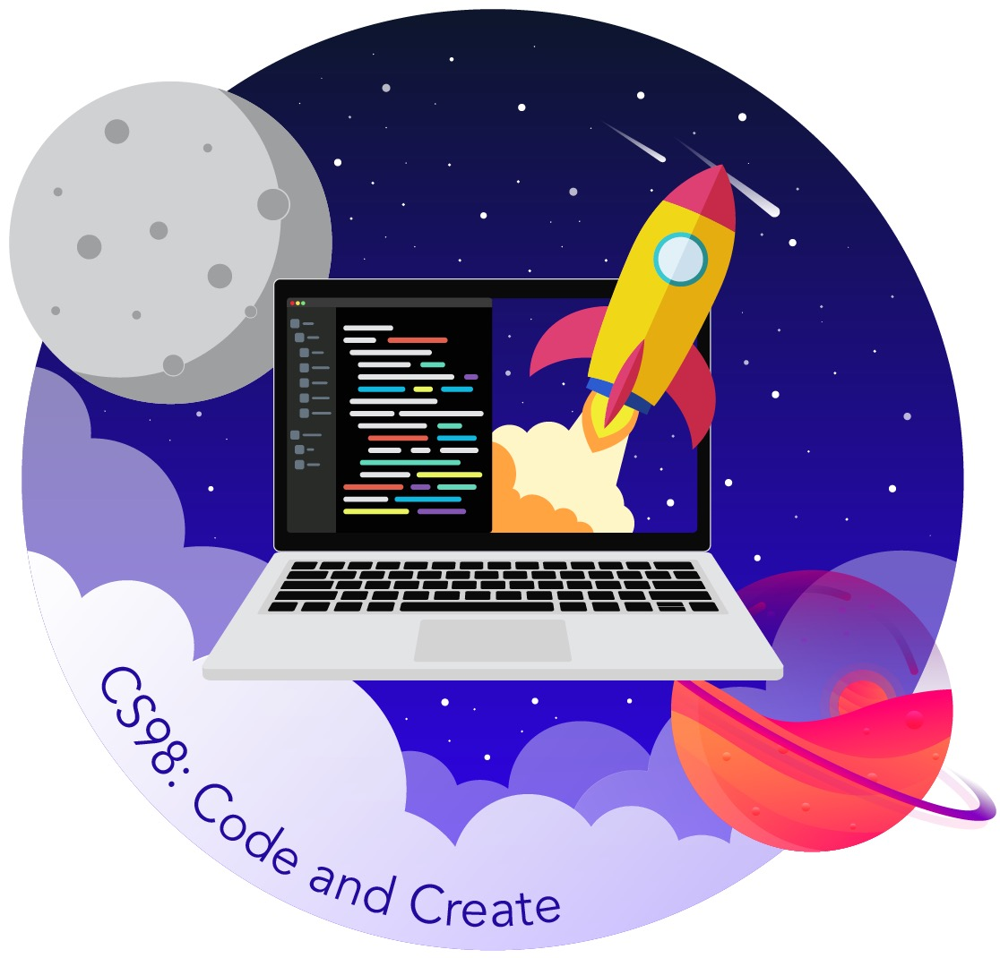
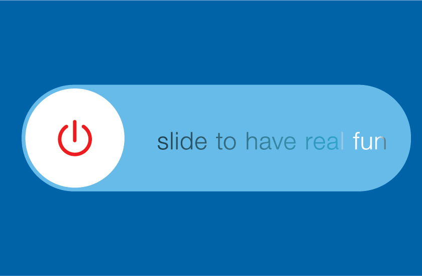

layout: true
class: center, middle
name: pic
background-size: contain

---

layout: true
class: center, top
name: fragment

.title[{{name}}]

---
layout: true
class: center, middle
name: base

.title[{{name}}]

---
name: 

.medium_small[]

<!-- .medium[] -->
<!-- .medium_small[] -->

???
* hope everybody is well and safe!

* anybody work on their project over break?  want to share what you makeds?  
* side projects?

* So this term.  Fewer general milestones and more feedback and numbers on canvas and we get to be remote!  and do it all pass/fail!

---
name: Administrative Stuff

.medium_small[]
<!-- *gif removed* -->

* Remo mostly
* Tuesdays & Thursdays: team checkins and work time
* Tips:
  * Use Slack lots, better to overcommunicate with your team
  * Use ZenHub - last term was.. ok

<!--
* Thursdays: team meeting and work time
* x-hours
  * Mon 5:35 - 6:25pm
-->

???
* some of your team members may be separated by timezones - so finding meeting times will be tricky - but hopefully not impossible! 

---
name:  Constructive Feedback Summary

* a bit more **clarity on grading** and more updates on grading
* **closer oversight** throughout the 10 weeks vs. checking in after week 10
* go back to the powerpoint format, easier to follow
* would recommend decreasing the number of different platforms on which we met.
* sometimes the remo **lectures went on a little long**
* **more feedback/comments on sprints and code**
* one more round of hack-a-things would be great
* wish we got into project groups earlier in the class.
* need more time or knowledge of different tech stacks available
* the organization is not super clear from the website.
* we weren't given any direction for the best way to learn our chosen tech stack. It seems like CS52 should be a prereq.
* wish we got started on coding sooner and spent less time coming up with project ideas.

???
* closer oversight - you want it, you got it. this isn't a traditional class  - it is basically an experience where you as a team define what you want to build and do it, i just help a little with the structure, happy to be as handsoff or handson as you want!
* more feedback - got it will do! please do also feel free to tag me in PR's if there is something specific you want feedback on
* for when/where/platform for class meets, i wish there was on platform that did it all
* closer oversight - you want it, you got it. 
* all these are good - and why the second term will help - now you're all more comfortable with the stacks and done with learning curve can really start making progress
* i'll try to clarify any structure issues - but this term is much simpler, pretty much just sprints, and i'll try to help keep you on track

---
name:  Constructive Feedback Summary

* group projects are hard
* Remo can be a bit buggy
* timing of the class is difficult given remote learning
* zoom fatigue, but that's not specific to this course
* why there aren't grad TAs or some guidance from dali 

???
* this stuff is all very real - zoom fatigue, people fatigue, remote learning and all whatever is happening in our nations capitol.  i think what i'd like to do to help with this is basically foster more personal connections - have been thinking a lot about how to help us all stay afloat and happy.  in class zoom games i don't think are the solution, although if you have ones that are fun please tell me!  i'd rather try to schedule a time to meet each of you individually, just a short chat about your hopes and dreams in general and for this class. i'll send out deets. 
* happy to provide guidance - but also want to give you creative freedom - so reach out to me please if you want more

---
name:  Positive Feedback Selections

* Allowing students a great degree of freedom
* Everything.
* gave us autonomy, extreme passion for the class and was a very valuable resource
* always available to answer questions.
* did a good job gradually loosening the leash, so to speak. gave us more and more freedom to self determine as time progressed.
* passionate lectures
* always available on Slack for help and genuinely wants everyone to succeed.
* popping in to check on each group
* empathy for product, felt like a strong culminating experience
* **teamwork** (**teaching each other** what we've learned)
* like how wide open it is and how flexible it is.
* cool opportunity to **apply the learnings from the CS major to whatever context or project we want.**
* will hopefully allow me to **graduate** so that's cool!

---
name:  Positive Feedback Selections

* I'm very **happy to be learning something new and creating a very intricate project for my culminating major experience**
* positively. I've **learned a lot** about developing as part of a team.
* **group time** is helpful for everyone.
* It is very much **self enforced** but it was good having check ins to show progress and weekly sprint to keep us on top of things
* hack-a-things were great for determining a tech stack, **great to learn without too much pressure**
* forces good git flow
* Remo is really nice/fun for meeting up as teams; Working for a remote team was great
* Remo was very good for communicating with my team while also being able to easily communicate with professor Tregubov.
* The professor integrated the various online meeting platforms into the class quite well.
* well organized meeting times

???
* collaboration, team, ownership, fun
* key takeaways:
   * pros/cons for platforms, and timing issues
   * more feedback though
   * battling zoom fatigue

---
name: This Week

* today: [project self reflection](/projects/milestones/t2-project-self-reflection)
* tomorrow: [plan mini sprint 1](/projects/milestones/t2-starting-sprint)
* end of week: [personal success](/projects/milestones/t2-personal-success)
* all the time: update designs!!

???
* the idea here is to gather all your thoughts from demos and feedback and figure out where you collectively want to go to next
*  updating designs so you know what you're buidling is helpful.  also there are design starter packs for figma that might help with look and feel if you want - i can share one
* also figure out how you're going to optimize working remote - i'll send out some tips on that

---
name:  This term generally 

<!-- .medium[] -->

* figure out revised direction
* focus on: 
  * polished experience
  * any shortcuts are hidden (no user workarounds)
  * taking pride in your work
  * commitment to the project from everyone on the team
  * **deployed by week 7 - some plan for validation**
  * medium article written and published
  * visible care taken:
      * thinking through use cases
      * no bugs

???
* what makes you proud might be different, hence the assignment for your personal success goals
* last year a couple projects experiences traction - **3 projects had their medium posts picked up by professional publications** - 1 project had a paying customer - and some others saw some real usage numbers after sending it out online - you wouldn't believe how exited they were - the goal is for all of you to have that experience - being excited about seeing some impact - we'll talk more about this
* quantum, cooking, and sprout, ftg had a bunch of people download
* questions concerns? 

---
name: Time For ACTIVITY!

.fancy.medium_small[]
.fancy.medium_small[]

???
* more arts and crafts time!
* kidding,  lets just catch up

