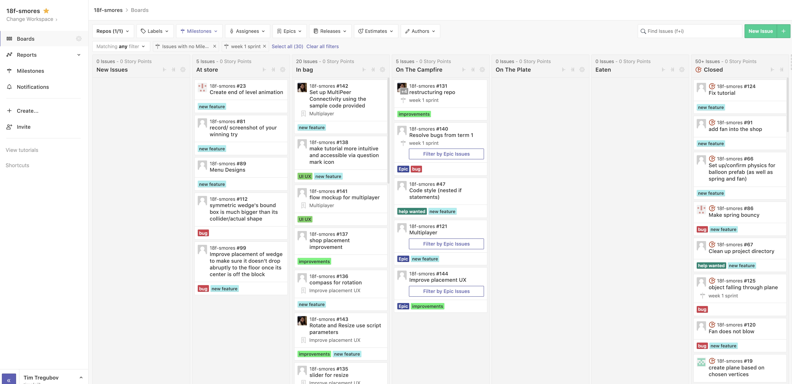

layout: true
class: center, middle
name: pic
background-size: contain

---

layout: true
class: center, top
name: fragment

.title[{{name}}]

---
layout: true
class: center, middle
name: base

.title[{{name}}]

---
name: CS98

.medium[]
<!-- .medium_small[] -->

???
* hope everybody had good break! missed you all!

* anybody work on their project over break?  want to share what you makeds?  
* side projects?

* So this term.  Fewer general milestones and more feedback and numbers on canvas!  

---
name: Administrative Stuff

<!-- .medium_small[] -->
*gif removed*

* LSC200
* Tuesdays: team checkins and work time
* Thursdays: team meeting and work time
* x-hours
  * Mon 5:35 - 6:25pm
  * coding, help, snack time

???
* there was a complaint in course assessments about gifs, i'm all for improving the class 

---
name:  Critical Feedback Summary

* more critical feedback +10
* more frequent in-person check ins / in class consultation time +5
* fewer activities / start on project earlier +6
* more hackathings +4
* fewer hackathings +4
* clearer due dates / office hours +3
* more code time 💻 +5
* more food 🍕 +1
* read papers / project work instead of arts and crafts +5
* idea generation activies at the beginning ended up being really helpful for the final project. +4
* buddy teams not useful +3
* make attendance mandatory +5 ❗️

???
* fewer activities this term
* and will keep on top of grading with Kate's help!
* also introduce Kate Salesin - CS grad ta - who will help with critical feedback and is another resource for you all
* i love arts and crafts - today we have some options of what to do
* attendance is now mandatory - please sign in - both tues and thursdays, even if it is just team work time

---
name:  Pace Feedback Summary

* perfect / flawless
* too slow in beginning
* too fast at end

???
* duly noted will push harder earlier

---
name:  Positive Feedback Selections

* Phenomenal capstone experience
* this course is a blessing. 
* So far I'm having a blast, love to have a project that I feel is my own!
* I love working with my team and truly appreciate the ability to pick a project and go with it.
* The part where we could play with new technologies really helped us see the different kinds of products we could design.
* This has been one of my favorite classes at Dartmouth.
* I really loved working with my team and building a project that has real-word applications
* Classes were fun/less bureaucratic(?) than other classes
* I have enjoyed all of it  The exercises we went through were helpful in aiding me to think of outside of the box ideas.
* The collaborative environment
* I worked to teach myself a lot and learn from my teammates

???
* collaboration, team, ownership, fun
* there were lots of other great ideas - which i won't go into detail, but suffice to say there changes in term1 and some in term2 also!  if your idea wasn't mentioned don't worry i'm going through all of them

---
name:  This term

.medium[]

* Per team milestones in ZENHUB - with due dates and accountability
* sprints will be graded
* Individual Code Reviews with meee!
* More clarification and feedback along the way
* Pride

???
* how did the first pass at ZenHub go - shall we discuss more?
* generally i've realized that i'm more lenient in the beginning (for all classes)
* when people are learning and such
* but then get stricter/harsher as time goes on
* it is more optimal to go the other way, but i'm bad at that
* so full disclaimer
* what makes me proud:
  * polished experience
  * any shortcuts are hidden (no user workarounds)
  * you taking pride in your work
  * commitment to the project from everyone on the team
  * visible care taken:
    * documentation
    * thinking through use cases
    * no bugs
  * beauty - this is a tricky one - 

---
name: Time For ACTIVITY!

.fancy.medium_small[]
.fancy.medium_small[]

???
* more arts and crafts time!
* kidding - per request we'll spend more time talking individually
* we'll do some sharing activities with the new kids on thursday

---
name: This Week

.fancy.large[]

* checkins
* use zenhub and finish sprint 1
* next: plan sprint 2
* update designs
* now: share a quick update with everybody of main takeaways from last term

???
*  share out where you are to the class - main takeaways pivots etc. also ask questions if you need help prioritizing
*  updating designs so you know what you're buidling is helpful.  also there are design starter packs for figma that might help with look and feel if you want - i can share one

