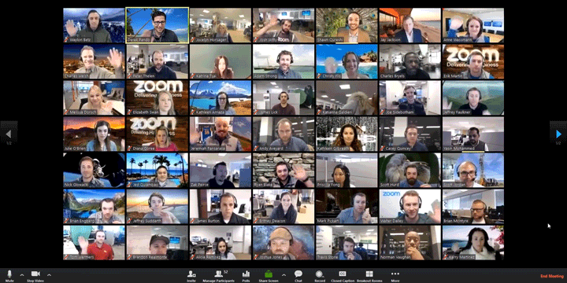

layout: true
class: center, middle
name: pic
background-size: contain

---

layout: true
class: center, top
name: fragment

.title[{{name}}]

---
layout: true
class: center, middle
name: base

.title[{{name}}]

---
name: 

.medium_small[]

<!-- .medium[] -->
<!-- .medium_small[] -->

???
* hope everybody is well and safe!

* anybody work on their project over break?  want to share what you makeds?  
* side projects?

* So this term.  Fewer general milestones and more feedback and numbers on canvas and we get to be remote!  and do it all pass/fail!

---
name: Administrative Stuff

.medium_small[]
<!-- *gif removed* -->

* ZOOM & Tandem
* Tuesdays & Thursdays: team checkins and work time
* Tips:
  * video on for community /feedback
  * Tandem while you work - quick and easy impromptu meetings especially during class work time
  * Check Slack lots
  * Use ZenHub - last term was.. ok

<!--
* Thursdays: team meeting and work time
* x-hours
  * Mon 5:35 - 6:25pm
-->

???
* some of your team members may be separated by timezones - so finding meeting times will be tricky - but hopefully not impossible! 

---
name:  New Grading!

* Grading : 🔥👍👎
* You'll want to trend towards more thumbs up and oks, and fewer thumbsdown.
* Will fix on canvas and release 
* No news yet on C/NC for last term vs grade - preference? 

???
* as luck have it currently you're all passing
* but i know grade isn't hte motivator here but making an impressive product is

---
name:  Constructive Feedback Summary

* Yeah just **more resources**/ more class approved resources for common Tech Stacks
* The timeline of the first few assignments before group formation could be tighter.
* Proactive check-in on students' progress more often
* **Check in with each group each class**
* Grade assignments in a more timely manner / **getting feedback on Sprints** to see if we are doing things at a good pace.
* Better introduction for people who haven’t taken 52
* I think **more time could be spent on the pre-development phase** and more with students getting their hands dirty.

???
* now that grading is simpler - will be easier - and i'm looking forward to spending more time with each team with the new remote structure. 
* more time on pre-dev?

---
name:  Constructive Feedback Summary

* Maybe **laying out what requirements needed** to be specifically completed by Technigala. I know we had a baseline of requirements but maybe in class towards the beginning of the term explicitly laying out what needed to be done by technigala.
* Not always clear **what/when things are due**, due to the combination of the class website and Canvas both giving stimuli on that front.
* A little more **proactive guidance**

???
* more checkins got it!
* let me think a bit more in terms of each of your teams and will get back to you with specific guidance of expectation
* happy to provide guidance - but also want to give you creative freedom - so reach out to me please if you want more

---
name:  Positive Feedback Selections

* Great. I thought the **weekly checkpoints** were enough to keep us organized and set a roadmap for the week. It was the perfect amount of time to elapse for us to work on our issues, before meeting and creating more.
* The focus on the project grade is a good choice.
* I think the **energy and tone** is really good for the class
* managed to clear the stressful atmosphere.
* he set up an awesome and **engaging** course for us. **we loved it and learned a ton**
* Again, not much to change!
* Great way to end my CS major!

---
name:  Positive Feedback Selections

* It was good! Definitely a lot of work, but I learned a lot, thought our **group worked well together**, and am **glad we have another term of it**! **I can't wait to keep working on my project.**
* I’ve really enjoyed it, happy to have been a cs major.
* Awesome idea for a course, I was **very motivated to work hard**.
* I really like the way the **class prepares you to do your own thing**
* the small activities in the beginning like the presentations and pitches were really helpful. [...]very organized and structured which I appreciated.
* Loved the work times in class

???
* collaboration, team, ownership, fun
* there were lots of other great ideas - which i won't go into detail, but suffice to say there changes in term1 and some in term2 also!  if your idea wasn't mentioned don't worry i'm going through all of them
* tricky part is balancing out all the requirements and backgrounds

---
name: This Week

* today: [project self reflection](/projects/milestones/t2-project-self-reflection)
* thursday: [plan sprint 1](/projects/milestones/t2-starting-sprint)
* end of week: [personal success](/projects/milestones/t2-personal-success)
* all the time: update designs!!

???
* the idea here is to gather all your thoughts from demos and feedback and figure out where you collectively want to go to next
*  updating designs so you know what you're buidling is helpful.  also there are design starter packs for figma that might help with look and feel if you want - i can share one
* also figure out how you're going to optimize working remote - i'll send out some tips on that

---
name:  This term generally 

<!-- .medium[] -->

* figure out revised direction
* focus on: 
  * polished experience
  * any shortcuts are hidden (no user workarounds)
  * taking pride in your work
  * commitment to the project from everyone on the team
  * **deployed by week 7 - some plan for validation**
  * medium article written and published
  * visible care taken:
      * thinking through use cases
      * no bugs

???
* what makes you proud might be different, hence the assignment for your personal success goals
* last term a couple projects experiences traction - 2 projects had their medium posts picked up by professional publications - 1 project has a paying customer - and some others saw some real usage numbers after sending it out online - you wouldn't believe how exited they were - the goal is for all of you to have that experience - being excited about seeing some impact - we'll talk more about this
* quantum, cooking, and sprout, ftg had a bunch of people download
* questions concerns? 

---
name: Time For ACTIVITY!

.fancy.medium_small[]
.fancy.medium_small[]

???
* more arts and crafts time!
* kidding,  lets just catch up

---
name: Time for TANDEM

.right[
* close out zoom
* sign onto tandem
* join your team room
* work on project reflection
* i'll drop in to catch up
]
.left.large[]

???
* more arts and crafts time!
* kidding,  lets just catch up

