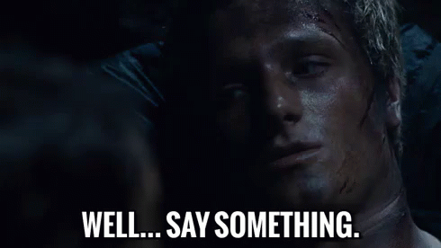
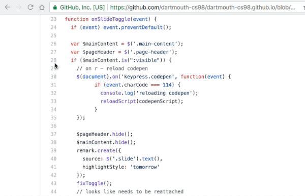

layout: true
class: center, middle
name: pic
background-size: contain

---

layout: true
class: center, top
name: fragment

.title[{{name}}]

---
layout: true
class: center, middle
name: base

.title[{{name}}]

---
name: Buddy Team Code Reviews

.fancy[]

???
* gonna do buddy code reviews
* who has had official code reviews at in internship or something?
* how did they go?

---
name: Walk through your code

.fancy.medium[]

* don't stress it - start high level
* brief demo of product
* then walk through frontend code (main views)
* then show server and any data models
* share what works and doesn't with current architecture

???
* consider it like onboarding a new person to the project
* what do you want them to know

---
name: Ask questions

.fancy.medium[]

* how do you store that?
* did you consider?
* do you handle the case that?
* what is best practice?
* what does thaaat function do?

???
* if you see something say something

---
name:  Comment on GitHub

.fancy.medium[]

* make comments on the github
* 2 issues from each of you
* at least 1 must be on a specific line or range of code
* can be a question - doesn't have to be an insightful criticism
* plz to engage with them afterwards

???
* 2 issues from each of you
* at least 1 must be on a specific line or range of code
* can be a question - doesn't have to be an insightful criticism.

---
name:  Example

* https://github.com/timofei7/boomsync2

???

---
name:  Ok go!

<iframe width="600" height="355" src="https://www.youtube.com/embed/u1ZB_rGFyeU?rel=0&amp;showinfo=0" frameborder="0" allow="autoplay; encrypted-media" allowfullscreen></iframe>
