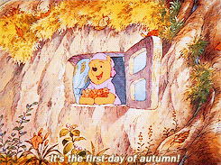

layout: true
class: center, middle
name: pic
background-size: contain

---

layout: true
class: center, top
name: fragment

.title[{{name}}]

---
layout: true
class: center, middle
name: base

.title[{{name}}]

---
name: CS98 All Together!

.fancy.medium[]

* thursdays - mostly team and checkin time
* today a bit of a mix
* Fall term projects sit by whiteboards please!

???
* this is an experiment, mostly will be productive team time
* but a couple times we'll do some sharing/testing/etc

---
name: Next Up

.fancy.medium[]

* **FallWinter**:
    * close out sprint 1 (due Sunday night)
    * evaluate and plan sprint 2 (due Monday night)
* **WinterSpring**:
    * hack-a-thing2 (due Thursday before class)
    * present a paper/article (due Monday before class)
    * will send out team form

???
* should this be a project? 
* will send out details about the present a paper thing tonight
* hack-a-thing2 - get some ideas from your peers - ask me on slack if you want some advice on cool tech.  i recommend ar or vr with unity, mobile with react-native, something with voice, maybe alexa
* we have some extra alexa funding for a team, but alexa is pretty limited so it could be part of a solution

---
name: FallWinter Sharing Is Caring

.fancy.medium[]

* share a bit about projects
* tips and tricks for success
* expo style 30 minutes

???
* share what you've learned
* inspire the next generation

---
name: WinterSpring Hack-a-thing-1

<iframe src="https://giphy.com/embed/tQ8uT9t0uK92M" width="480" height="270" frameBorder="0" class="giphy-embed" allowFullScreen></iframe>

* lets see what we all built!
* [timer](http://www.intervaltimer.com/timers/8195593-share-a-hack/fullscreen)
* hack speed dating
* 5 min to compare notes and share in pairs
* then move

???
* not a complete graph but get a variety
* ask questions - the idea here is to see what you would like to try next
* and share experiences with what you built - i want to see also

