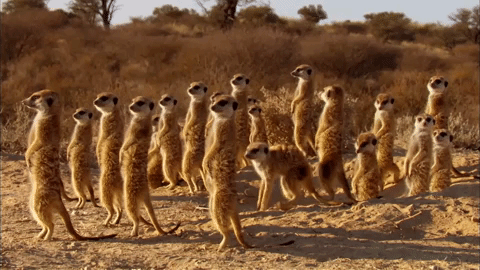
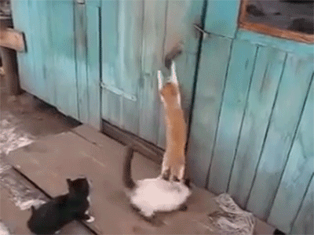

layout: true
class: center, middle
name: pic
background-size: contain

---

layout: true
class: center, top
name: fragment

.title[{{name}}]

---
layout: true
class: center, middle
name: base

.title[{{name}}]

---
name: CS98 Snow Storm!

.fancy.large[]

* WinterSpring ➡️ sit with your team

???
* skiing or working with team?  do both! 
* go skiing with your team first, then work together in the lodge by a fireplace

---
name: Next Up

.fancy.medium_small[]

* **FallWinter**:
    * close out sprint 2 (due Sunday night)
    * evaluate and plan sprint 3 (due Sunday night)
* **WinterSpring**:
    * have a team brainstorming meeting or 3
    * preliminary project proposal

???
* How did sprint 1 go?
* reorganizing milestones a bit so there will be something to do over the weekend - but not quite project proposal 

---
name: Today 

.fancy.medium_small[]

* **FallWinter**:
    * sprint 2, push code
* **WinterSpring**:
    1. Meet your team and share your hack-a-things with your new teammates!
    1. Do [Group Dynamics Worksheet](http://cs98.me/projects/milestones/group-dynamics-worksheet)
    1. Do [First Team Meeting](http://cs98.me/projects/milestones/first-meeting)

???

